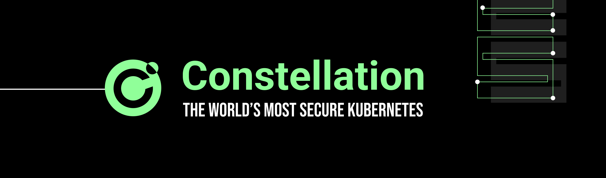
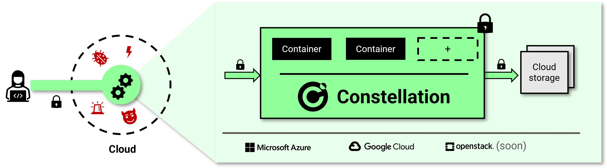

    <b>⭐ Star us on GitHub — it motivates us a lot!</b>

<h1 align="center">Welcome to Constellation!</h1>

    <a href="https://www.edgeless.systems/products/constellation/">Constellation</a> is the first Confidential Kubernetes platform. It leverages <a href="https://www.edgeless.systems/resources/confidential-computing/">confidential computing</a> to isolate entire Kubernetes clusters and all workloads from the rest of the cloud infrastructure.

    
    
    
    
    
    

## Table of contents <!-- omit in toc -->

- [✨ What is Constellation?](#-what-is-constellation)
- [🛠 Features](#-features)
  - [Everything always encrypted](#everything-always-encrypted)
  - [Everything verifiable](#everything-verifiable)
  - [Performance and scale](#performance-and-scale)
  - [100% compatibility](#100-compatibility)
- [🚀 Getting started](#-getting-started)
- [📖 Documentation](#-documentation)
- [👥 Community](#-community)
- [🤝 Contributing](#-contributing)
- [🗺 Roadmap](#-roadmap)
- [❓ Support & Enterprise Support](#-support--enterprise-support)
- [📃 License](#-license)

## ✨ What is Constellation?

From the inside, it's a fully featured, [certified] Kubernetes engine. From the outside, it's an end to end isolated, always encrypted stronghold. A Confidential Cloud in the public cloud.
Constellation is open source and enterprise-ready, tailored for unleashing the power of confidential computing for all your workloads at scale.

<picture>
  <source media="(prefers-color-scheme: dark)" srcset="docs/docs/_media/product-overview-dark.png">
  <source media="(prefers-color-scheme: light)" srcset="docs/docs/_media/product-overview.png">
  
</picture>

For a brief introduction to the Confidential Kubernetes concept, read the [introduction][confidential-kubernetes].
For more elaborate overviews of Constellation, see the [architecture] documentation.

## 🛠 Features

### Everything always encrypted

- Memory runtime encryption of all Kubernetes nodes
- [Transparent network encryption][network-encryption] provided by [Cilium]. Application independent, no sidecar required
- [Persistent volume](https://kubernetes.io/docs/concepts/storage/persistent-volumes/) encryption for block storage. [Encrypted in the confidential Kubernetes context][storage-encryption], keys and plaintext data never leave the cluster. No trust in the cloud storage backend required
- [Key management][key-management] for transparent network and storage encryption

### Everything verifiable

- [Verifiable][cluster-attestation] integrity and confidentiality of the entire Kubernetes cluster
- Kubernetes node attestation based on confidential computing. Nodes are [verified][node-attestation] on their integrity and identity with a hardware-based remote attestation procedure before joining the cluster
- [Supply chain protection][supply-chain] with [sigstore](https://www.sigstore.dev/)
- [Confidential computing-optimized][images], fully measured, and integrity-protected node OS

### Performance and scale

- High-available, enterprise-ready Kubernetes engine
- Multi-master architecture
- [Stacked etcd topology][etcd-stacked]
- Dynamic cluster autoscaling

### 100% compatibility

- [Certified][certified] Kubernetes engine
- Works with all your existing containers and tools
- The only cloud-agnostic Confidential Kubernetes platform
- Aligned to the [version support policy of Kubernetes][k8s-version-support]
- [Cilium][Cilium] networking

## 🚀 Getting started

Sounds great, how can I try this?

Constellation can be deployed in minutes to your favorite infrastructure provider:

:wrench: [Install][install]

:lock: [Deploy][deploy]

:white_check_mark: [Profit][examples]

## 📖 Documentation

* [Concept][confidential-kubernetes]
* [Threat model][threat-model]
* [Architecture][architecture]
* [Installing the CLI][install]
* [Creating a Constellation cluster][deploy]

## 👥 Community

* Got a question? Please get in touch via [Discord][discord] or file an [issue][github-issues].
* If you see an error message or run into an issue, please make sure to create a [bug report][github-issues].
* Get the latest news and announcements on [Twitter][twitter], [LinkedIn][linkedin] or sign up for our monthly [newsletter][newsletter].
* Visit our [blog](https://blog.edgeless.systems/) for technical deep-dives and tutorials.

## 🤝 Contributing

* Read [`CONTRIBUTING.md`](CONTRIBUTING.md) for information on issue reporting, code guidelines, and how to work in this repository.
* Pull requests are welcome! You need to agree to our [Contributor License Agreement][cla-assistant].
* This project and everyone participating in it are governed by the [Code of Conduct](/CODE_OF_CONDUCT.md). By participating, you are expected to uphold this code.
* To report a security issue, write to security@edgeless.systems.

## 🗺 Roadmap

Constellation maintains a [public roadmap][TODO]. It gives a high-level view of the main priorities for the project, the maturity of different features, and how to influence the project direction.

## ❓ Support & Enterprise Support

If you require a cluster with more than 8 vCPUs or need other services such as enterprise support: [Contact us][contact] or find more information on the [Constellation product page][constellation-product].

## 📃 License

TODO

<!-- refs -->
[architecture]: https://docs.edgeless.systems/constellation/architecture/overview
[certified]: https://www.cncf.io/certification/software-conformance/
[Cilium]: https://cilium.io/
[cla-assistant]: https://cla-assistant.io/edgelesssys/constellation
[cluster-attestation]: https://docs.edgeless.systems/constellation/architecture/attestation#cluster-attestation
[community-license]: https://docs.edgeless.systems/constellation/overview/license
[confidential-computing]: https://www.edgeless.systems/resources/confidential-computing/
[confidential-kubernetes]: https://docs.edgeless.systems/constellation/overview/confidential-kubernetes
[Constellation]: https://www.edgeless.systems/products/constellation/
[constellation-product]: https://www.edgeless.systems/products/constellation/
[contact]: https://www.edgeless.systems/contact/
[deploy]: https://docs.edgeless.systems/constellation/workflows/create
[discord]: https://discord.gg/rH8QTH56JN
[discord-badge]: https://img.shields.io/badge/chat-on%20Discord-blue
[documentation]: https://docs.edgeless.systems/constellation/latest
[e2eTestAzure]: https://github.com/edgelesssys/constellation/actions/workflows/e2e-test-azure.yml/badge.svg?branch=main
[e2eTestGCP]: https://github.com/edgelesssys/constellation/actions/workflows/e2e-test-gcp.yml/badge.svg?branch=main
[etcd-stacked]: https://kubernetes.io/docs/setup/production-environment/tools/kubeadm/ha-topology/#stacked-etcd-topology
[examples]: https://docs.edgeless.systems/constellation/getting-started/examples
[getting-started]: https://docs.edgeless.systems/constellation/getting-started
[github-issues]: https://github.com/edgelesssys/constellation/issues/new/choose
[go-report-card]: https://goreportcard.com/report/github.com/edgelesssys/constellation
[go-report-card-badge]: https://goreportcard.com/badge/github.com/edgelesssys/constellation
[images]: https://docs.edgeless.systems/constellation/architecture/images#constellation-images
[install]: https://docs.edgeless.systems/constellation/getting-started/install
[join-service]: https://docs.edgeless.systems/constellation/architecture/components#joinservice
[k8s-version-support]: https://docs.edgeless.systems/constellation/architecture/versions#kubernetes-support-policy
[key-management]: https://docs.edgeless.systems/constellation/architecture/keys#constellation-managed-key-management
[license]: https://github.com/edgelesssys/constellation/blob/master/LICENSE
[license-badge]: https://img.shields.io/github/license/edgelesssys/constellation
[linkedin]: https://www.linkedin.com/company/edgeless-systems/
[network-encryption]: https://docs.edgeless.systems/constellation/architecture/keys#network-encryption
[newsletter]: https://www.edgeless.systems/#newsletter-signup
[node-attestation]: https://docs.edgeless.systems/constellation/architecture/attestation#node-attestation
[storage-encryption]: https://docs.edgeless.systems/constellation/architecture/keys#storage-encryption
[supply-chain]: https://docs.edgeless.systems/constellation/architecture/attestation#chain-of-trust
[troubleshooting]: https://docs.edgeless.systems/constellation/workflows/troubleshooting
[threat-model]: https://docs.edgeless.systems/constellation/overview/security-benefits
[twitter]: https://twitter.com/EdgelessSystems
