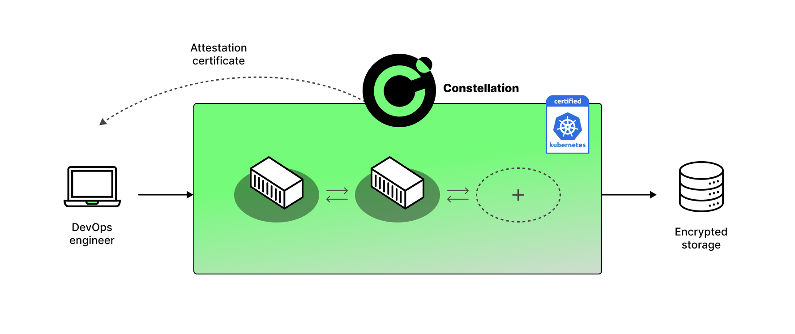

# Always Encrypted Kubernetes

    
    
    
    
    

Constellation is a Kubernetes engine that aims to provide the best possible data security. It wraps your K8s cluster into a single *confidential context* that is shielded from the underlying cloud infrastructure. Everything inside is always encrypted, including at runtime in memory. For this, Constellation leverages confidential computing (see the [whitepaper]) and more specifically Confidential VMs.

## Goals

From a security perspective, Constellation is designed to keep all data always encrypted and to prevent access from the infrastructure layer. This includes access from datacenter employees, privileged cloud admins, and attackers coming through the infrastructure ,e.g., malicious co-tenants escalating their privileges.

From a DevOps perspective, Constellation is designed to work just like what you would expect from a modern K8s engine.

## Use cases

Encrypting your K8s is good for:

* Increasing the overall security of your clusters
* Increasing the trustworthiness of your SaaS offerings
* Moving sensitive workloads from on-prem to the cloud
* Meeting regulatory requirements

## Features

### 🔒 Everything always encrypted

* Runtime encryption: All nodes run inside AMD SEV-based Confidential VMs (CVMs). Support for Intel TDX will be added in the future.
* Transparent encryption of network and storage: All pod-to-pod traffic and all writes to persistent storage are [automatically encrypted][network-encryption]
* Transparent key management: All cryptographic [keys are managed within the confidential context][key-management]

### 🔍 Everything verifiable

* "Whole cluster" [attestation][cluster-attestation] based on the remote-attestation feature of CVMs
* Confidential computing-optimized [node images][images]; fully measured and integrity-protected
* [Supply chain protection][supply-chain] with [sigstore](https://www.sigstore.dev/) and [SLSA Level 3](https://slsa.dev/spec/v0.1/#security-levels).

### 🚀 Performance and scale

* High availability with multi-master architecture and stacked etcd topology
* Dynamic cluster autoscaling with verification and secure bootstrapping of new nodes
* Competitive performance ([see K-Bench comparison with AKS and GKE][performance])

### 🧩 Easy to use and integrate

* Constellation is a [CNCF-certified][certified] Kubernetes. It's aligned to Kubernetes' [version support policy][k8s-version-support] and will likely work with your existing workloads and tools.
* Support for Azure, GCP, and AWS.
* Support for local installations with [MiniConstellation][first-steps-local].

## Getting started

If you're already familiar with Kubernetes, it's easy to get started with Constellation:

1. 📦 [Install the CLI][install]
2. ⌨️ Create a Constellation cluster in the [cloud][first-steps] or [locally][first-steps-local]
3. 🏎️ [Run your app][examples]

## Live demos

We're running public instances of popular software on Constellation: 
* Rocket.Chat: https://rocket.edgeless.systems/ ([blog post](https://dev.to/flxflx/rocketchat-constellation-most-secure-chat-server-ever--50oa))
* GitLab: https://gitlab.edgeless.systems/ ([blog post](https://dev.to/flxflx/setting-up-a-confidential-gitlab-333h))

These instances run on CVMs in Azure and Constellation keeps them end-to-end confidential.

## Documentation

To learn more, see the [documentation](https://docs.edgeless.systems/constellation).
You may want to start with one of the following sections.

* [Confidential Kubernetes][confidential-kubernetes] (Constellation vs. AKS/GKE + CVMs)
* [Security benefits][security-benefits]
* [Architecture][architecture]

## Support

* Please file an [issue][github-issues] to get help or report a bug.
* Join the [Discord] to have a chat on confidential computing and Constellation.
* Visit our [blog](https://blog.edgeless.systems/) for technical deep-dives and tutorials and follow us on [Twitter] for news.
* Edgeless Systems also offers [Enterprise Support][enterprise-support].

## Contributing

Refer to [`CONTRIBUTING.md`](CONTRIBUTING.md) on how to contribute. The most important points:

* Pull requests are welcome! You need to agree to our [Contributor License Agreement][cla-assistant].
* Please follow the [Code of Conduct](/CODE_OF_CONDUCT.md).
* ⚠️ Please report any security issue via a [private GitHub vulnerability report](https://github.com/edgelesssys/constellation/security/advisories/new) or write to security@edgeless.systems.

## License

The Constellation source code is licensed under the [GNU Affero General Public License v3.0](LICENSE). Edgeless Systems provides pre-built and signed binaries and images for Constellation. You may use these free of charge to create and run services for internal consumption, evaluation purposes, or non-commercial use. You can find more information in the [license] section of the docs.

<!-- refs -->
[architecture]: https://docs.edgeless.systems/constellation/architecture/overview
[certified]: https://www.cncf.io/certification/software-conformance/
[cla-assistant]: https://cla-assistant.io/edgelesssys/constellation
[cluster-attestation]: https://docs.edgeless.systems/constellation/architecture/attestation#cluster-attestation
[confidential-kubernetes]: https://docs.edgeless.systems/constellation/overview/confidential-kubernetes
[discord]: https://discord.gg/rH8QTH56JN
[enterprise-support]: https://www.edgeless.systems/products/constellation/
[first-steps]: https://docs.edgeless.systems/constellation/getting-started/first-steps
[first-steps-local]: https://docs.edgeless.systems/constellation/getting-started/first-steps-local
[examples]: https://docs.edgeless.systems/constellation/getting-started/examples
[github-issues]: https://github.com/edgelesssys/constellation/issues
[images]: https://docs.edgeless.systems/constellation/architecture/images
[install]: https://docs.edgeless.systems/constellation/getting-started/install
[k8s-version-support]: https://docs.edgeless.systems/constellation/architecture/versions#kubernetes-support-policy
[key-management]: https://docs.edgeless.systems/constellation/architecture/keys
[license]: https://docs.edgeless.systems/constellation/overview/license
[network-encryption]: https://docs.edgeless.systems/constellation/architecture/keys#network-encryption
[supply-chain]: https://docs.edgeless.systems/constellation/architecture/attestation#chain-of-trust
[security-benefits]: https://docs.edgeless.systems/constellation/overview/security-benefits
[twitter]: https://twitter.com/EdgelessSystems
[whitepaper]: https://content.edgeless.systems/hubfs/Confidential%20Computing%20Whitepaper.pdf
[performance]: https://docs.edgeless.systems/constellation/overview/performance
