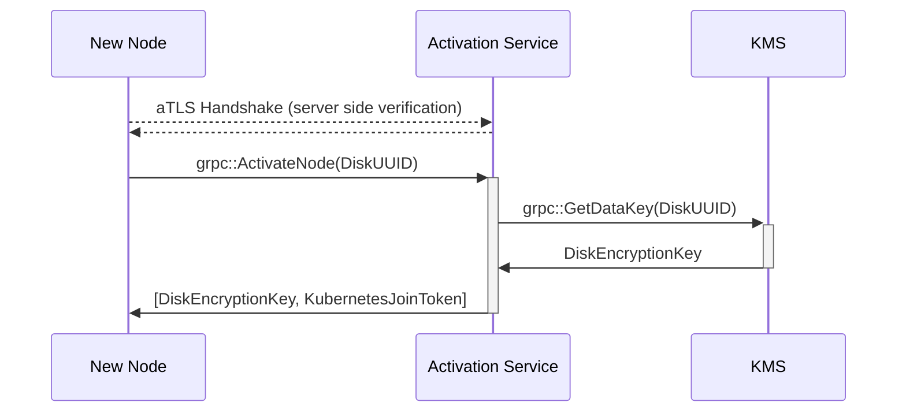

# Activation

Implementation for Constellation's node activation flow.

The activation service runs on each control-plane node of the Kubernetes cluster.
New nodes (at cluster start, or later through autoscaling) send an activation request to the service over [aTLS](../coordinator/atls/).
The activation service verifies the new nodes certificate and attestation statement.
If attestation is successful, the new node is supplied with a disk encryption key for its state disk, and a Kubernetes bootstrap token, so it may join the cluster.

The activation service uses klog v2 for logging.
Use the `-v` flag to set the log verbosity level.
Use different verbosity levels during development depending on the information:

* 2 for information that should always be logged. Examples: server starting, new gRPC request.

* 4 for general logging. If you are unsure what log level to use, use 4.

* 6 for low level information logging. Example: values of new expected measurements

* Potentially sensitive information, such as return values of functions should never be logged.

## Packages

### [activationproto](./activationproto/)

Proto definitions for the activation service.

### [server](./server/)

The `server` implements gRPC endpoints for joining the cluster and holds the main application logic.

Connections between the activation service and joining nodes are secured using [aTLS](../internal/atls/README.md)

Worker nodes call the `ActivateNode` endpoint.



Control-plane nodes call the `ActivateCoordinator` endpoint.

### [kms](./kms/)

Implements interaction with Constellation's key management service.
This is needed for fetching data encryption keys for joining nodes.

### [kubeadm](./kubeadm/)

Implements interaction with the Kubernetes API to create join tokens for new nodes.

### [validator](./validator/)

A wrapper for the more generic `atls.Validator`, allowing for updates to the underlying validator without having to restart the service.

### [watcher](./watcher/)

Uses fsnotify to wait for expected measurement updates, and updates the validator if any occur.

## [Dockerfile](./Dockerfile)

```shell
DOCKER_BUILDKIT=1 docker build --build-arg PROJECT_VERSION="v1.0.0" -t ghcr.io/edgelesssys/activation-service:v1.0.0 -f activation/Dockerfile .
```
