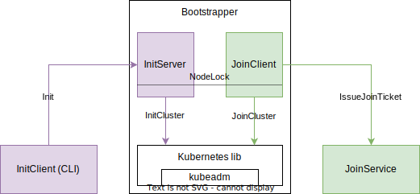

# Bootstrapper

The bootstrapper integrates the instance it is running on as node into the Kubernetes
cluster. It is running on every new instance that is created.

The bootstrapper has two active components:

## Init Flow

The InitServer is a gRPC server that is listening for initialization requests.
The first instance needs to be initialized by the user, see the [initproto](./initproto)
for a description of the initialization protocol. The client that talks to this server
is part of Constellation's CLI.

On an initialization request, the InitServer initializes a new Kubernetes cluster, essentially
calling the InitCluster function of our Kubernetes library, which does a `kubeadm init`.

## Join Flow

The JoinClient is a gRPC client that tries to connect to a JoinService of an already existing cluster.
The JoinService validates the instance using [aTLS](./../internal/atls/README.md).
For details on the used protocol, see the [joinservice](./../joinservice) package.

If the JoinService successfully verifies the instance, it issues a join ticket. The JoinClient then
joins the cluster by calling the `kubeadm join` command, using the token and other needed information
from the join ticket.

## Synchronization, state machine, lifetime

The bootstrapper is automatically started on every new instance. Both InitServer and JoinClient are
started and running in parallel. At some point during either the initialization or the join, a shared
lock between the two components is acquired. This lock is used as point of no return. It is a state
machine with two states (unlocked, locked) and a single transition from unlocked to locked. There is no
way to unlock the node afterward (see [nodelock](./internal/nodelock) package).

After the bootstrapping, the bootstrapper is stopped.
