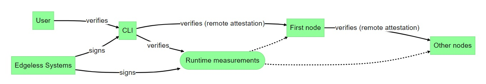

# Constellation - Security Protocols Overview

The security of Constellation is based on a set of protocols.
The protocols are outlined in the following.
The following diagram sketches the basic trust relationships between the entities in a Constellation cluster.


## Software components

Abstractly, the Constellation software comprises three core components:
1. The command-line interface (CLI) executable, which is run by the cluster administrator on their local machine.
2. The node images, which are run inside Confidential VMs (CVMs).
Among other, each node image contains a Linux kernel and a user mode program called Bootstrapper.
3. The Constellation service containers, which are run on Kubernetes.
There are three core services: KeyService, JoinService, and VerificationService.

## CLI: root of trust
The CLI executable is signed by Edgeless Systems.
To ensure non-repudiability for CLI releases, Edgeless Systems publishes corresponding signatures to the public ledger of the [Sigstore project](https://www.sigstore.dev/).
There's a [step-by-step guide](https://docs.edgeless.systems/constellation/workflows/verify-cli) on how to verify CLI signatures based on Sigstore.

The CLI contains the [measurements](https://github.com/edgelesssys/constellation/blob/edc0c7068ef4527efeaf584a2a35e0f51f58c426/internal/attestation/measurements/measurements_enterprise.go#L21) of the latest Constellation node image for all supported cloud platforms.
The CLI writes these measurements as part of the *attestation config* to a cluster's config file with the ["config generate" command](https://docs.edgeless.systems/constellation/workflows/config).
Note that Constellation currently uses 16 TPM-based runtime measurements for each cloud platform.
The purpose and source of the measurements are described in the [next section](#remote-attestation-of-nodes).
In addition to the measurements, the attestation config contains expected patch levels for the CPU microcode and the X.509 certificate of the CPU vendor's remote attestation infrastructure.
An example of an attestation config is given [below](#attestation-config).

In case a different version of the node image is to be used, the corresponding measurements can be fetched using the CLI's ["config fetch-measurements" command](https://docs.edgeless.systems/constellation/reference/cli#constellation-config-fetch-measurements).
This command downloads the measurements and the corresponding signature from Edgeless Systems from https://cdn.confidential.cloud.
See for example the following files corresponding to node image v2.16.3:
* [Measurements](https://cdn.confidential.cloud/constellation/v2/ref/-/stream/stable/v2.16.3/image/measurements.json)
* [Signature](https://cdn.confidential.cloud/constellation/v2/ref/-/stream/stable/v2.16.3/image/measurements.json.sig)

In addition to the attestation config, the CLI contains the following data in hardcoded form:
* The [long-term public key of Edgeless Systems](https://github.com/edgelesssys/constellation/blob/edc0c7068ef4527efeaf584a2a35e0f51f58c426/internal/constants/constants.go#L264) to verify the signature of downloaded measurements.
* The [hashes of the expected Kubernetes binaries](https://github.com/edgelesssys/constellation/blob/edc0c7068ef4527efeaf584a2a35e0f51f58c426/internal/versions/versions.go#L199).
* The [Helm charts used for the installation of services](https://github.com/edgelesssys/constellation/tree/main/internal/constellation/helm/charts), which include hashes of the respective containers.
Note that the Helm charts and the hashes are [generated at build time](https://github.com/edgelesssys/constellation/blob/main/internal/constellation/helm/imageversion/imageversion.go).
A future version of the CLI will provide a command to print the Helm charts.

## Cluster creation

When a cluster is [created](https://docs.edgeless.systems/constellation/workflows/create), the CLI interacts with the API of the respective infrastructure provider, for example Azure, and launches CVMs with the applicable node image.
These CVMs are called *nodes*.
On each node, the Bootstrapper is launched.

The CLI automatically selects one of the nodes as *first node*.
The CLI automatically verifies the first node's remote-attestation statement using the attestation config.
Details on remote attestation are given in the [next section](#remote-attestation-of-nodes).

Based on the remote-attestation statement, the CLI and the Bootstrapper running on the first node set up a temporary TLS connection between them.
We refer to this type of connection as "attested TLS" (aTLS).
This connection is mainly used for three things (see the the [interface definition](https://github.com/edgelesssys/constellation/blob/main/bootstrapper/initproto/init.proto) for a comprehensive list of exchanged data):
1. The CLI sends the hashes of the expected Kubernetes binaries to the first node.
2. The CLI generates the [master secret](https://docs.edgeless.systems/constellation/architecture/keys#master-secret) of the to-be-created cluster and sends it to the first node.
3. The first node generates a [kubeconfig file](https://www.redhat.com/sysadmin/kubeconfig) and sends it to the CLI.
The kubeconfig file contains Kubernetes credentials for the CLI and the Kubernetes cluster's public key, among others.

After this, the aTLS connection is closed and the Bootstrapper marks the node irrevocably as "initialized".
This mechanism prevents a node from accidentally or maliciously joining different clusters.
On all supported CVM platforms this is currently implemented by *extending* TPM register 15 with the unique ID of the cluster (`clusterID`).
More information can be found in the [Constellation documentation](https://docs.edgeless.systems/constellation/architecture/keys#cluster-identity).

For [launch digest-based attestation](#remote-attestation-of-nodes) on future CVM platforms, an alternative would be to extend `clusterID` to the so called RTMR registers of Intel TDX.
TDX provides four RTMRs, which are automatically included in the `auxiliary data` part of a remote-attestation statement.
For AMD SEV-SNP, a different solution exists.

## Remote attestation of nodes

To identify themselves, nodes use the remote-attestation functionality of the underlying CVM platform.
Constellation supports Intel TDX and AMD SEV-SNP based platforms.
Abstractly, Intel TDX and AMD SEV-SNP hash the initial memory contents of the CVMs.
This hash is also called `launch digest`.
The launch digest is reflected in each remote-attestation statement that is requested by the software inside the CVM.
Abstractly, a remote-attestation statement `R` from a CVM looks as follows: 

```
R = Sig-CPU(<launch digest>, <auxiliary data>, <payload>)
```

The `payload` is controlled by the software running inside the CVM.
In the case of a Constellation node, the `payload` is always the public key of the respective Bootstrapper running inside the CVM.
Thus, `R` can be seen as a certificate for that public key issued by the CPU.
Based on this, nodes establish attested TLS (aTLS) connections.
aTLS is used during [cluster creation](#cluster-creation) and when [growing a cluster](#cluster-growth).

### Measurements

In the ideal case, the underlying CVM platform does not inject any of its own software into a CVM.
In that case, a Constellation node image can contain its own firmware/UEFI.
This allows for the creation of node images for which the launch digest covers all defining parts of a node, including the firmware, the kernel, the kernel command line, and the disk image.
In this case, the launch digest is the only measurement that's required to verify the identity and integrity of a node.

### Measured Boot as fallback

However, currently, all supported CVM platforms (AWS, Azure, and GCP) inject custom firmware into CVMs.
Thus, in practice, Constellation relies on conventional [measured boot](https://docs.edgeless.systems/constellation/architecture/images#measured-boot) to reflect the identity and integrity of nodes.

In measured boot, in general, the software components involved in the boot process of a system are "measured" into the 16 registers of a Trusted Platform Module (TPM).
The values of these registers are also called "runtime measurements".
All supported CVM platforms provide TPMs to CVMs.
Constellation nodes use these to measure their boot process.
They include the 16 runtime measurements as `auxiliary data` in `R`.
On each CVM platform, runtime measurements are taken differently.
Details on this are given in the [Constellation documentation](https://docs.edgeless.systems/constellation/architecture/attestation#runtime-measurements).

With measured boot, Constellation only checks the 16 runtime measurements during the verification of a node's remote-attestation statement.
The launch digest is not considered, because it only covers the firmware injected by the CVM platform and may change whenever the CVM platform is updated.
Currently, on AWS and GCP the TPM implementation resides outside the CVM.
On Azure, the TPM implementation is part of the injected firmware and resides inside the CVM.
More information can be found in the [Constellation documentation](https://docs.edgeless.systems/constellation/overview/clouds).

## Kubernetes bootstrapping on the first node

The Bootstrapper on the first node downloads and verifies the Kubernetes binaries, using the hashes it received from the CLI.
These binaries include for example [kubelet](https://kubernetes.io/docs/reference/command-line-tools-reference/kubelet/), [kube-apiserver](https://kubernetes.io/docs/reference/command-line-tools-reference/kube-apiserver/), and [etcd](https://kubernetes.io/docs/tasks/administer-cluster/configure-upgrade-etcd/).
With these, the Bootstrapper creates a single-node Kubernetes cluster.
Etcd is a distributed key-value store that Kubernetes uses to store configuration data for services.
The etcd agent runs on each control-plane node of a cluster.
The agents use mTLS for communication between them.
Etcd uses the Raft protocol (over mTLS) to distribute state between nodes.
All essential configuration data of a cluster is kept in etcd.

Initially, the Bootstrapper on the first node [writes](https://github.com/edgelesssys/constellation/blob/d65987cb15cf9ebdbbd2975f177937c1acbc90f8/bootstrapper/internal/kubernetes/kubernetes.go#L173) the hashes of the expected Kubernetes binaries to a specific key in etcd.
 
Next, the CLI the connects to the Kubernetes API server (kube-apiserver) using the kubeconfig file it received from the Bootstrapper.
This results in an mTLS connection between the CLI and the Kubernetes API server.
The CLI uses this connection for two essential operations at the Kubernetes level:

1. It writes the attestation config to a specific key in etcd.
1. It executes the [hardcoded Helm charts](#cli-root-of-trust), which, most notably, install the three core services KeyService, JoinService, and VerificationService, the [constellation-node-operator](https://github.com/edgelesssys/constellation/tree/main/operators/constellation-node-operator), and a small number of standard services like Cilium and cert-manager.

The latter causes the first node to download, verify, and run the containers defined in the Helm charts.
The containers that are specific to  Constellation are hosted at `ghcr.io/edgelesssys`.

After this, the Constellation cluster is operational on the first node.

## Cluster growth

Additional nodes can now join the cluster - either as control-plane nodes or as worker nodes.
For both, the process for joining the cluster is identical.
First, the Bootstrapper running on a *new node* contacts the JoinService of the existing cluster.
The JoinService verifies the remote-attestation statement of the new node using the attestation config stored in etcd.
On success, an aTLS connection between the two is created, which is used mainly for the following (see the the [interface definition](https://github.com/edgelesssys/constellation/blob/main/joinservice/joinproto/join.proto) for a comprehensive list of exchanged data):

1. The new node sends a certificate signing request (CSR) for its *node certificate* to the JoinService.
1. The JoinService issues a corresponding certificate with a lifetime of one year and sends it to the new node.
The JoinService uses the signing key of the Kubernetes cluster for this, which is [generated by kubeadm](https://kubernetes.io/docs/setup/best-practices/certificates/). Note that the lifetime of the node certificate is a best practice only, as Constellation relies on the untrusted infrastructure to provide time when validating certificates.
1. The JoinService sends a [kubeadm token](https://kubernetes.io/docs/reference/setup-tools/kubeadm/kubeadm-token/) to the new node.
1. The JoinService sends the hashes of the expected Kubernetes binaries to the new node.
1. The JoinService sends encryption key for the new node's local storage.
This key is generated and managed by the cluster's KeyService.
1. The JoinService sends the certificate of the cluster's control plane to the new node.

After this, the aTLS connection is closed and the node is marked as "initialized" in the same way as described [above](#cluster-creation).

The Bootstrapper downloads, verifies, and runs the given Kubernetes binaries.
Further, the Bootstrapper uses the kubeadm token to download the configuration of the cluster from the Kubernetes API server.
The kubeadm token is never used after this.

The kubelet on the new node uses its own node certificate and the certificate of the cluster's control plane (which the new node both received from the JoinService) to establish an mTLS connection with the cluster's Kubernetes API server.
Once connected, the new node registers itself as control-plane node or worker node of the cluster.
This process uses the standard Kubernetes mechanisms for adding nodes.

In Constellation, a virtual private network (VPN) exists between all nodes of a cluster.
This VPN is created with the help of Cilium.
To join this VPN, the new node generates WireGuard credentials for itself and writes the public key to etcd via the mTLS connection with the Kubernetes API server.
It also downloads the public keys of existing nodes from etcd.
Subsequently, the Cilium agents running on other nodes fetch the new node's public key from etcd as well.

Note that etcd communication between nodes is an exception: This traffic always goes via mTLS based on node certificates.

## Cluster upgrade

Whenever a cluster is [upgraded](https://docs.edgeless.systems/constellation/workflows/upgrade), the CLI connects to the Kubernetes API server and, essentially, updates the following data in etcd: 

1. The attestation config
1. The hashes of the expected Kubernetes binaries

Further, the CLI applies updated Helm charts to update the cluster's services.
Again, these Helm charts are hardcoded in the CLI.
See the [implementation](https://github.com/edgelesssys/constellation/blob/d65987cb15cf9ebdbbd2975f177937c1acbc90f8/cli/internal/cmd/apply.go#L358) of the `apply()` function for a sequence diagram of all steps.
Subsequently, the constellation-node-operator replaces existing nodes with new ones.
New nodes go through the [usual process for joining the cluster](#cluster-growth).

## Examples

This section gives real life examples of key data structures and the corresponding commands to retrieve those.

### Attestation config

```bash
kubectl -n kube-system get cm join-config -o json
```
```json
{
    "apiVersion": "v1",
    "binaryData": {
        "measurementSalt": "2A4Fzfdr/61XbJvk1PDqzh0R4rVnEujyXudsfgRZzUY="
    },
    "data": {
        "attestationConfig": "{\"measurements\":{\"1\":{\"expected\":\"3695dcc55e3aa34027c27793c85c723c697d708c42d1f73bd6fa4f26608a5b24\",\"warnOnly\":true},\"11\":{\"expected\":\"f09cef0d077127fb26bc8d013fc09e13afbb70f0f734ced98f46666544998efe\",\"warnOnly\":true},\"12\":{\"expected\":\"0000000000000000000000000000000000000000000000000000000000000000\",\"warnOnly\":true},\"13\":{\"expected\":\"0000000000000000000000000000000000000000000000000000000000000000\",\"warnOnly\":true},\"14\":{\"expected\":\"0000000000000000000000000000000000000000000000000000000000000000\",\"warnOnly\":true},\"15\":{\"expected\":\"0000000000000000000000000000000000000000000000000000000000000000\",\"warnOnly\":true},\"2\":{\"expected\":\"3d458cfe55cc03ea1f443f1562beec8df51c75e14a9fcf9a7234a13f198e7969\",\"warnOnly\":true},\"3\":{\"expected\":\"3d458cfe55cc03ea1f443f1562beec8df51c75e14a9fcf9a7234a13f198e7969\",\"warnOnly\":true},\"4\":{\"expected\":\"e5020193148fbad0dbaf618fb3ef15665c72ff87a54e24b2d8f5bdf9719bb50b\",\"warnOnly\":true},\"6\":{\"expected\":\"3d458cfe55cc03ea1f443f1562beec8df51c75e14a9fcf9a7234a13f198e7969\",\"warnOnly\":true},\"8\":{\"expected\":\"0000000000000000000000000000000000000000000000000000000000000000\",\"warnOnly\":true},\"9\":{\"expected\":\"37ef16fd0ae8d2fb3b1914f0b8ff046e765b57fec6739d2ebf1fd4d182071437\",\"warnOnly\":true}},\"bootloaderVersion\":\"latest\",\"teeVersion\":\"latest\",\"snpVersion\":\"latest\",\"microcodeVersion\":\"latest\",\"amdRootKey\":\"-----BEGIN CERTIFICATE-----\\nMIIGYzCCBBKgAwIBAgIDAQAAMEYGCSqGSIb3DQEBCjA5oA8wDQYJYIZIAWUDBAIC\\nBQChHDAaBgkqhkiG9w0BAQgwDQYJYIZIAWUDBAICBQCiAwIBMKMDAgEBMHsxFDAS\\nBgNVBAsMC0VuZ2luZWVyaW5nMQswCQYDVQQGEwJVUzEUMBIGA1UEBwwLU2FudGEg\\nQ2xhcmExCzAJBgNVBAgMAkNBMR8wHQYDVQQKDBZBZHZhbmNlZCBNaWNybyBEZXZp\\nY2VzMRIwEAYDVQQDDAlBUkstTWlsYW4wHhcNMjAxMDIyMTcyMzA1WhcNNDUxMDIy\\nMTcyMzA1WjB7MRQwEgYDVQQLDAtFbmdpbmVlcmluZzELMAkGA1UEBhMCVVMxFDAS\\nBgNVBAcMC1NhbnRhIENsYXJhMQswCQYDVQQIDAJDQTEfMB0GA1UECgwWQWR2YW5j\\nZWQgTWljcm8gRGV2aWNlczESMBAGA1UEAwwJQVJLLU1pbGFuMIICIjANBgkqhkiG\\n9w0BAQEFAAOCAg8AMIICCgKCAgEA0Ld52RJOdeiJlqK2JdsVmD7FktuotWwX1fNg\\nW41XY9Xz1HEhSUmhLz9Cu9DHRlvgJSNxbeYYsnJfvyjx1MfU0V5tkKiU1EesNFta\\n1kTA0szNisdYc9isqk7mXT5+KfGRbfc4V/9zRIcE8jlHN61S1ju8X93+6dxDUrG2\\nSzxqJ4BhqyYmUDruPXJSX4vUc01P7j98MpqOS95rORdGHeI52Naz5m2B+O+vjsC0\\n60d37jY9LFeuOP4Meri8qgfi2S5kKqg/aF6aPtuAZQVR7u3KFYXP59XmJgtcog05\\ngmI0T/OitLhuzVvpZcLph0odh/1IPXqx3+MnjD97A7fXpqGd/y8KxX7jksTEzAOg\\nbKAeam3lm+3yKIcTYMlsRMXPcjNbIvmsBykD//xSniusuHBkgnlENEWx1UcbQQrs\\n+gVDkuVPhsnzIRNgYvM48Y+7LGiJYnrmE8xcrexekBxrva2V9TJQqnN3Q53kt5vi\\nQi3+gCfmkwC0F0tirIZbLkXPrPwzZ0M9eNxhIySb2npJfgnqz55I0u33wh4r0ZNQ\\neTGfw03MBUtyuzGesGkcw+loqMaq1qR4tjGbPYxCvpCq7+OgpCCoMNit2uLo9M18\\nfHz10lOMT8nWAUvRZFzteXCm+7PHdYPlmQwUw3LvenJ/ILXoQPHfbkH0CyPfhl1j\\nWhJFZasCAwEAAaN+MHwwDgYDVR0PAQH/BAQDAgEGMB0GA1UdDgQWBBSFrBrRQ/fI\\nrFXUxR1BSKvVeErUUzAPBgNVHRMBAf8EBTADAQH/MDoGA1UdHwQzMDEwL6AtoCuG\\nKWh0dHBzOi8va2RzaW50Zi5hbWQuY29tL3ZjZWsvdjEvTWlsYW4vY3JsMEYGCSqG\\nSIb3DQEBCjA5oA8wDQYJYIZIAWUDBAICBQChHDAaBgkqhkiG9w0BAQgwDQYJYIZI\\nAWUDBAICBQCiAwIBMKMDAgEBA4ICAQC6m0kDp6zv4Ojfgy+zleehsx6ol0ocgVel\\nETobpx+EuCsqVFRPK1jZ1sp/lyd9+0fQ0r66n7kagRk4Ca39g66WGTJMeJdqYriw\\nSTjjDCKVPSesWXYPVAyDhmP5n2v+BYipZWhpvqpaiO+EGK5IBP+578QeW/sSokrK\\ndHaLAxG2LhZxj9aF73fqC7OAJZ5aPonw4RE299FVarh1Tx2eT3wSgkDgutCTB1Yq\\nzT5DuwvAe+co2CIVIzMDamYuSFjPN0BCgojl7V+bTou7dMsqIu/TW/rPCX9/EUcp\\nKGKqPQ3P+N9r1hjEFY1plBg93t53OOo49GNI+V1zvXPLI6xIFVsh+mto2RtgEX/e\\npmMKTNN6psW88qg7c1hTWtN6MbRuQ0vm+O+/2tKBF2h8THb94OvvHHoFDpbCELlq\\nHnIYhxy0YKXGyaW1NjfULxrrmxVW4wcn5E8GddmvNa6yYm8scJagEi13mhGu4Jqh\\n3QU3sf8iUSUr09xQDwHtOQUVIqx4maBZPBtSMf+qUDtjXSSq8lfWcd8bLr9mdsUn\\nJZJ0+tuPMKmBnSH860llKk+VpVQsgqbzDIvOLvD6W1Umq25boxCYJ+TuBoa4s+HH\\nCViAvgT9kf/rBq1d+ivj6skkHxuzcxbk1xv6ZGxrteJxVH7KlX7YRdZ6eARKwLe4\\nAFZEAwoKCQ==\\n-----END CERTIFICATE-----\\n\",\"amdSigningKey\":\"\"}"
    },
    "kind": "ConfigMap",
    "metadata": {
        "creationTimestamp": "2024-09-25T11:11:50Z",
        "name": "join-config",
        "namespace": "kube-system",
        "resourceVersion": "387",
        "uid": "fdd0d5eb-cf58-4608-99c9-eede08895615"
    }
}
```
### Hashes of Kubernetes binaries
```bash
kubectl -n kube-system get cm k8s-components-sha256-7b73c7675df78e5753b6e0fc86a9982127fd16141837599d5ce16df6bfe6a2a0  -o json
```
```json
{
    "apiVersion": "v1",
    "data": {
        "cluster-version": "v1.29.8",
        "components": "[{\"url\":\"https://github.com/containernetworking/plugins/releases/download/v1.4.0/cni-plugins-linux-amd64-v1.4.0.tgz\",\"hash\":\"sha256:c2485ddb3ffc176578ae30ae58137f0b88e50f7c7f2af7d53a569276b2949a33\",\"install_path\":\"/opt/cni/bin\",\"extract\":true},{\"url\":\"https://github.com/kubernetes-sigs/cri-tools/releases/download/v1.29.0/crictl-v1.29.0-linux-amd64.tar.gz\",\"hash\":\"sha256:d16a1ffb3938f5a19d5c8f45d363bd091ef89c0bc4d44ad16b933eede32fdcbb\",\"install_path\":\"/run/state/bin\",\"extract\":true},{\"url\":\"https://storage.googleapis.com/kubernetes-release/release/v1.29.8/bin/linux/amd64/kubelet\",\"hash\":\"sha256:df6e130928403af8b4f49f1197e26f2873a147cd0e23aa6597a26c982c652ae0\",\"install_path\":\"/run/state/bin/kubelet\"},{\"url\":\"https://storage.googleapis.com/kubernetes-release/release/v1.29.8/bin/linux/amd64/kubeadm\",\"hash\":\"sha256:fe054355e0ae8dc35d868a3d3bc408ccdff0969c20bf7a231ae9b71484e41be3\",\"install_path\":\"/run/state/bin/kubeadm\"},{\"url\":\"https://storage.googleapis.com/kubernetes-release/release/v1.29.8/bin/linux/amd64/kubectl\",\"hash\":\"sha256:038454e0d79748aab41668f44ca6e4ac8affd1895a94f592b9739a0ae2a5f06a\",\"install_path\":\"/run/state/bin/kubectl\"},{\"url\":\"data:application/json;base64,W3sib3AiOiJyZXBsYWNlIiwicGF0aCI6Ii9zcGVjL2NvbnRhaW5lcnMvMC9pbWFnZSIsInZhbHVlIjoicmVnaXN0cnkuazhzLmlvL2t1YmUtYXBpc2VydmVyOnYxLjI5LjhAc2hhMjU2OjZmNzJmYTkyNmM5YjA1ZTEwNjI5ZmUxYTA5MmZkMjhkY2Q2NWI0ZmRmZDBjYzdiZDU1Zjg1YTU3YTZiYTFmYTUifV0=\",\"install_path\":\"/opt/kubernetes/patches/kube-apiserver+json.json\"},{\"url\":\"data:application/json;base64,W3sib3AiOiJyZXBsYWNlIiwicGF0aCI6Ii9zcGVjL2NvbnRhaW5lcnMvMC9pbWFnZSIsInZhbHVlIjoicmVnaXN0cnkuazhzLmlvL2t1YmUtY29udHJvbGxlci1tYW5hZ2VyOnYxLjI5LjhAc2hhMjU2OjZmMjdkNjNkZWQyMDYxNGM2ODU1NGI0NzdjZDdhNzhlZGE3OGE0OThhOTJiZmU4OTM1Y2Y5NjRjYTViNzRkMGIifV0=\",\"install_path\":\"/opt/kubernetes/patches/kube-controller-manager+json.json\"},{\"url\":\"data:application/json;base64,W3sib3AiOiJyZXBsYWNlIiwicGF0aCI6Ii9zcGVjL2NvbnRhaW5lcnMvMC9pbWFnZSIsInZhbHVlIjoicmVnaXN0cnkuazhzLmlvL2t1YmUtc2NoZWR1bGVyOnYxLjI5LjhAc2hhMjU2OmRhNzRhNjY2NzVkOTVlMzllYzI1ZGE1ZTcwNzI5ZGE3NDZkMGZhMGIxNWVlMGRhODcyYWM5ODA1MTliYzI4YmQifV0=\",\"install_path\":\"/opt/kubernetes/patches/kube-scheduler+json.json\"},{\"url\":\"data:application/json;base64,W3sib3AiOiJyZXBsYWNlIiwicGF0aCI6Ii9zcGVjL2NvbnRhaW5lcnMvMC9pbWFnZSIsInZhbHVlIjoicmVnaXN0cnkuazhzLmlvL2V0Y2Q6My41LjEyLTBAc2hhMjU2OjQ0YThlMjRkY2JiYTM0NzBlZTFmZWUyMWQ1ZTg4ZDEyOGM5MzZlOWI1NWQ0YmM1MWZiZWY4MDg2ZjhlZDEyM2IifV0=\",\"install_path\":\"/opt/kubernetes/patches/etcd+json.json\"}]"
    },
    "immutable": true,
    "kind": "ConfigMap",
    "metadata": {
        "creationTimestamp": "2024-09-25T11:11:50Z",
        "name": "k8s-components-sha256-7b73c7675df78e5753b6e0fc86a9982127fd16141837599d5ce16df6bfe6a2a0",
        "namespace": "kube-system",
        "resourceVersion": "356",
        "uid": "6389c186-3bc8-4470-8af5-f6fed1addd69"
    }
}
```