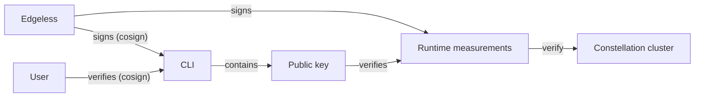

# Attestation

This page explains Constellation's attestation process and highlights the cornerstones of its trust model.

## Terms

The following lists important terms and concepts.

### Trusted Platform Module (TPM)

A TPM chip is a dedicated tamper-resistant crypto-processor.
It can securely store artifacts such as passwords, certificates, encryption keys, or *runtime measurements* (more on this below).
When a TPM is implemented in software, it's typically called a *virtual* TPM (vTPM).

### Runtime measurement

A runtime measurement is a cryptographic hash of the memory pages of a so called *runtime component*. Runtime components of interest typically include a system's bootloader or OS kernel.

### Platform Configuration Register (PCR)

A Platform Configuration Register (PCR) is a memory location in the TPM that has some unique properties. PCRs cannot be written, they can only be "extended". 
When a PCR is extended with a value, the PCR's new value `PCR[n]` is calculated as follows:

```
PCR[n] = Hash( PCR[n-1] || value )
```

Thus, the value of a PCR always depends on all previous values. PCRs are typically used to store runtime measurements. In that case, the value of a PCR uniquely reflects the sequence of runtime measurements it was extended with. 

### Measured boot

Measured boot builds on the concept of chained runtime measurements.
Each component in the boot chain loads and measures the next component and extends the measurements into the PCR.
By comparing the resulting PCR values against reference values, the integrity of the entire boot chain can be ensured.

### Remote attestation (RA)

Remote attestation is the process of verifying certain properties of an application or platform, such as integrity and confidentiality, from a remote location.
In the case of a measured boot, the goal is to obtain a signed attestation statement on the PCR values of the boot measurements.
The statement can then be verified and compared to a set of trusted reference values.
This way, the integrity of the platform can be ensured before sharing secrets with it.

### Confidential virtual machine (CVM)

Confidential computing (CC) is the protection of data in-use with hardware-based trusted execution environments (TEEs).
With CVMs, TEEs encapsulate entire virtual machines and isolate them against the hypervisor, other VMs, and direct memory access.
After loading the initial VM image into encrypted memory, the hypervisor calls for a secure processor to measure these initial memory pages.
The secure processor locks these pages and generates an attestation report on the initial page measurements.
CVM memory pages are encrypted with a key that resides inside the secure processor, which makes sure only the guest VM can access them.
The attestation report is signed by the secure processor and can be verified using remote attestation via the certificate authority of the hardware vendor.
Such an attestation statement guarantees the confidentiality and integrity of a CVM.

### Attested TLS (aTLS)

In a CC environment, attested TLS (aTLS) can be used to establish secure connections between two parties using the remote attestation features of the CC components.

aTLS modifies the TLS handshake by embedding an attestation statement into the TLS certificate.
Instead of relying on a certificate authority, aTLS uses this attestation statement to establish trust in the certificate.

The protocol can be used by clients to verify a server certificate, by a server to verify a client certificate, or for mutual verification (mutual aTLS).

## Overview

The challenge for Constellation is to lift a CVM's attestation statement to the Kubernetes software layer and make it end-to-end verifiable.
From there, Constellation needs to expand the attestation from a single CVM to the entire cluster.

The [*JoinService*](components.md#joinservice) and [*VerificationService*](components.md#verificationservice) are where all runs together.
Internally, the *JoinService* uses remote attestation to securely join CVM nodes to the cluster.
Externally, the *VerificationService* provides an attestation statement for the cluster's CVMs and configuration.

The following explains the details of both steps.

## Node attestation

The idea is that Constellation nodes should have verifiable integrity from the CVM hardware measurement up to the Kubernetes software layer.
The solution is a verifiable boot chain and an integrity-protected runtime environment.

Constellation uses measured boot within CVMs, measuring each component in the boot process before executing it.
Outside of CC, it's usually implemented via TPMs.
CVM technologies differ in how they implement runtime measurements, but the general concepts are similar to those of a TPM.
For simplicity, TPM terminology like *PCR* is used in the following.

When a Constellation node image boots inside a CVM, it uses measured boot for all stages and components of the boot chain.
This process goes up to the root filesystem.
The root filesystem is mounted read-only with integrity protection, guaranteeing forward integrity.
For the details on the image and boot stages see the [image architecture](../architecture/images.md) documentation.
Any changes to the image will inevitably also change the measured boot's PCR values.
To create a node attestation statement, the Constellation image obtains a CVM attestation statement from the hardware.
This includes the runtime measurements and thereby binds the measured boot results to the CVM hardware measurement.

In addition to the image measurements, Constellation extends a PCR during the [initialization phase](../workflows/create.md#the-init-step) that irrevocably marks the node as initialized.
The measurement is created using the [*clusterID*](../architecture/keys.md#cluster-identity), tying all future attestation statements to this ID.
Thereby, an attestation statement is unique for every cluster and a node can be identified unambiguously as being initialized.

To verify an attestation, the hardware's signature and a statement are verified first to establish trust in the contained runtime measurements.
If successful, the measurements are verified against the trusted values of the particular Constellation release version.
Finally, the measurement of the *clusterID* can be compared by calculating it with the [master secret](keys.md#master-secret).

### Runtime measurements

Constellation uses runtime measurements to implement the measured boot approach.
As stated above, the underlying hardware technology and guest firmware differ in their implementations of runtime measurements.
The following gives a detailed description of the available measurements in the different cloud environments.

The runtime measurements consist of two types of values:

* **Measurements produced by the cloud infrastructure and firmware of the CVM**:
These are measurements of closed-source firmware and other values controlled by the cloud provider.
While not being reproducible for the user, some of them can be compared against previously observed values.
Others may change frequently and aren't suitable for verification.
The [signed image measurements](#chain-of-trust) include measurements that are known, previously observed values.

* **Measurements produced by the Constellation bootloader and boot chain**:
The Constellation Bootloader takes over from the CVM firmware and [measures the rest of the boot chain](images.md).
The Constellation [Bootstrapper](components.md#bootstrapper) is the first user mode component that runs in a Constellation image.
It extends PCR registers with the [IDs](keys.md#cluster-identity) of the cluster marking a node as initialized.

Constellation allows to specify in the config which measurements should be enforced during the attestation process.
Enforcing non-reproducible measurements controlled by the cloud provider means that changes in these values require manual updates to the cluster's config.
By default, Constellation only enforces measurements that are stable values produced by the infrastructure or by Constellation directly.

<tabs groupId="csp">
<tabItem value="azure" label="Azure">

Constellation uses the [vTPM](https://docs.microsoft.com/en-us/azure/virtual-machines/trusted-launch#vtpm) feature of Azure CVMs for runtime measurements.
This vTPM adheres to the [TPM 2.0](https://trustedcomputinggroup.org/resource/tpm-library-specification/) specification.
It provides a [measured boot](https://docs.microsoft.com/en-us/azure/security/fundamentals/measured-boot-host-attestation#measured-boot) verification that's based on the trusted launch feature of [Trusted Launch VMs](https://docs.microsoft.com/en-us/azure/virtual-machines/trusted-launch).

The following table lists all PCR values of the vTPM and the measured components.
It also lists what components of the boot chain did the measurements and if the value is reproducible and verifiable.
The latter means that the value can be generated offline and compared to the one in the vTPM.

| PCR         | Components                                                       | Measured by                     | Reproducible and verifiable |
| ----------- | ---------------------------------------------------------------- | ------------------------------- | --------------------------- |
| 0           | Firmware                                                         | Azure                           | No                          |
| 1           | Firmware                                                         | Azure                           | No                          |
| 2           | Firmware                                                         | Azure                           | No                          |
| 3           | Firmware                                                         | Azure                           | No                          |
| 4           | Constellation Bootloader, Kernel, initramfs, Kernel command line | Azure, Constellation Bootloader | Yes                         |
| 5           | Reserved                                                         | Azure                           | No                          |
| 6           | VM Unique ID                                                     | Azure                           | No                          |
| 7           | Secure Boot State                                                | Azure, Constellation Bootloader | No                          |
| 8           | -                                                                | -                               | -                           |
| 9           | initramfs                                                        | Linux Kernel                    | Yes                         |
| 10          | Reserved                                                         | -                               | No                          |
| 11          | Reserved for Unified Kernel Image components                     | (Constellation Bootloader)      | Yes                         |
| 12          | Kernel command line                                              | Constellation Bootloader        | Yes                         |
| 13          | Reserved                                                         | (Constellation Bootloader)      | Yes                         |
| 14          | Secure Boot State                                                | Constellation Bootloader        | No                          |
| 15          | ClusterID                                                        | Constellation Bootstrapper      | Yes                         |
| 16&ndash;23 | Unused                                                           | -                               | -                           |

</tabItem>
<tabItem value="gcp" label="GCP">

Constellation uses the [vTPM](https://cloud.google.com/compute/confidential-vm/docs/about-cvm) feature of CVMs on GCP for runtime measurements.
Note that this vTPM doesn't run inside the hardware-protected CVM context, but is emulated by the hypervisor.

The vTPM adheres to the [TPM 2.0](https://trustedcomputinggroup.org/resource/tpm-library-specification/) specification.
It provides a [launch attestation report](https://cloud.google.com/compute/confidential-vm/docs/monitoring#about_launch_attestation_report_events) that's based on the measured boot feature of [Shielded VMs](https://cloud.google.com/compute/shielded-vm/docs/shielded-vm#measured-boot).

The following table lists all PCR values of the vTPM and the measured components.
It also lists what components of the boot chain did the measurements and if the value is reproducible and verifiable.
The latter means that the value can be generated offline and compared to the one in the vTPM.

| PCR         | Components                                                       | Measured by                   | Reproducible and verifiable |
| ----------- | ---------------------------------------------------------------- | ----------------------------- | --------------------------- |
| 0           | CVM constant string                                              | GCP                           | No                          |
| 1           | Firmware                                                         | GCP                           | No                          |
| 2           | Firmware                                                         | GCP                           | No                          |
| 3           | Firmware                                                         | GCP                           | No                          |
| 4           | Constellation Bootloader, Kernel, initramfs, Kernel command line | GCP, Constellation Bootloader | Yes                         |
| 5           | Disk GUID partition table                                        | GCP                           | No                          |
| 6           | Disk GUID partition table                                        | GCP                           | No                          |
| 7           | GCP Secure Boot Policy                                           | GCP, Constellation Bootloader | No                          |
| 8           | -                                                                | -                             | -                           |
| 9           | initramfs                                                        | Linux Kernel                  | Yes                         |
| 10          | Reserved                                                         | -                             | No                          |
| 11          | Reserved for Unified Kernel Image components                     | (Constellation Bootloader)    | Yes                         |
| 12          | Kernel command line                                              | Constellation Bootloader      | Yes                         |
| 13          | Reserved                                                         | (Constellation Bootloader)    | Yes                         |
| 14          | Secure Boot State                                                | Constellation Bootloader      | No                          |
| 15          | ClusterID                                                        | Constellation Bootstrapper    | Yes                         |
| 16&ndash;23 | Unused                                                           | -                             | -                           |

</tabItem>
<tabItem value="aws" label="AWS">

Constellation uses the [vTPM](https://docs.aws.amazon.com/AWSEC2/latest/UserGuide/nitrotpm.html) (NitroTPM) feature of the [AWS Nitro System](http://aws.amazon.com/ec2/nitro/) on AWS for runtime measurements.

The vTPM adheres to the [TPM 2.0](https://trustedcomputinggroup.org/resource/tpm-library-specification/) specification.
The VMs are attested by obtaining signed PCR values over the VM's boot configuration from the TPM and comparing them to a known, good state (measured boot).

The following table lists all PCR values of the vTPM and the measured components.
It also lists what components of the boot chain did the measurements and if the value is reproducible and verifiable.
The latter means that the value can be generated offline and compared to the one in the vTPM.

| PCR         | Components                                                       | Measured by                   | Reproducible and verifiable |
| ----------- | ---------------------------------------------------------------- | ----------------------------- | --------------------------- |
| 0           | Firmware                                                         | AWS                           | No                          |
| 1           | Firmware                                                         | AWS                           | No                          |
| 2           | Firmware                                                         | AWS                           | No                          |
| 3           | Firmware                                                         | AWS                           | No                          |
| 4           | Constellation Bootloader, Kernel, initramfs, Kernel command line | AWS, Constellation Bootloader | Yes                         |
| 5           | Firmware                                                         | AWS                           | No                          |
| 6           | Firmware                                                         | AWS                           | No                          |
| 7           | Secure Boot Policy                                               | AWS, Constellation Bootloader | No                          |
| 8           | -                                                                | -                             | -                           |
| 9           | initramfs                                                        | Linux Kernel                  | Yes                         |
| 10          | Reserved                                                         | -                             | No                          |
| 11          | Reserved for Unified Kernel Image components                     | (Constellation Bootloader)    | Yes                         |
| 12          | Kernel command line                                              | Constellation Bootloader      | Yes                         |
| 13          | Reserved                                                         | (Constellation Bootloader)    | Yes                         |
| 14          | Secure Boot State                                                | Constellation Bootloader      | No                          |
| 15          | ClusterID                                                        | Constellation Bootstrapper    | Yes                         |
| 16&ndash;23 | Unused                                                           | -                             | -                           |

</tabItem>
</tabs>

## Cluster attestation

Cluster-facing, Constellation's [*JoinService*](components.md#joinservice) verifies each node joining the cluster given the configured ground truth runtime measurements.
User-facing, the [*VerificationService*](components.md#verificationservice) provides an interface to verify a node using remote attestation.
By verifying the first node during the [initialization](components.md#bootstrapper) and configuring the ground truth measurements that are subsequently enforced by the *JoinService*, the whole cluster is verified in a transitive way.

### Cluster-facing attestation

The *JoinService* is provided with the runtime measurements of the whitelisted Constellation image version as the ground truth.
During the initialization and the cluster bootstrapping, each node connects to the *JoinService* using [aTLS](#attested-tls-atls).
During the handshake, the node transmits an attestation statement including its runtime measurements.
The *JoinService* verifies that statement and compares the measurements against the ground truth.
For details of the initialization process check the [component descriptions](components.md).

After the initialization, every node updates its runtime measurements with the *clusterID* value, marking it irreversibly as initialized.
When an initialized node tries to join another cluster, its measurements inevitably mismatch the measurements of an uninitialized node and it will be declined.

### User-facing attestation

The [*VerificationService*](components.md#verificationservice) provides an endpoint for obtaining its hardware-based remote attestation statement, which includes the runtime measurements.
A user can [verify](../workflows/verify-cluster.md) this statement and compare the measurements against the configured ground truth and, thus, verify the identity and integrity of all Constellation components and the cluster configuration. Subsequently, the user knows that the entire cluster is in the expected state and is trustworthy.

## Chain of trust

So far, this page described how an entire Constellation cluster can be verified using hardware attestation capabilities and runtime measurements.
The last missing link is how the ground truth in the form of runtime measurements can be securely distributed to the verifying party.

The build process of Constellation images also creates the ground truth runtime measurements. <!-- soon: The builds of Constellation images are reproducible and the measurements of an image can be recalculated and verified by everyone. -->
With every release, Edgeless Systems publishes signed runtime measurements.

The CLI executable is also signed by Edgeless Systems.
You can [verify its signature](../workflows/verify-cli.md).

The CLI contains the public key required to verify signed runtime measurements from Edgeless Systems.
When a cluster is [created](../workflows/create.md) or [upgraded](../workflows/upgrade.md), the CLI automatically verifies the measurements for the selected image.

Thus, there's a chain of trust based on cryptographic signatures, which goes from CLI to runtime measurements to images. This is illustrated in the following diagram.


