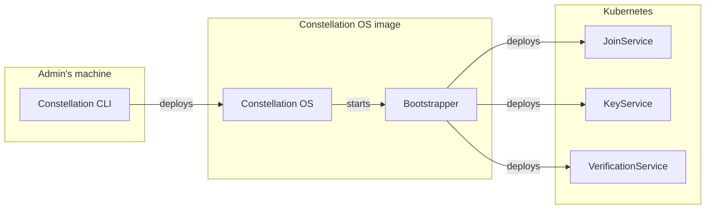
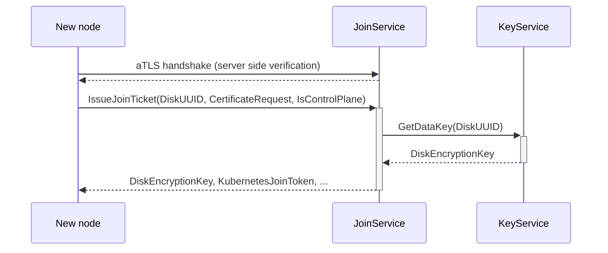

# Core services

Constellation takes care of bootstrapping and initializing a confidential Kubernetes cluster.
During the lifetime of the cluster, it handles day-2 operations such as **key management, remote attestation, and updates**.
These features are provided by several microservices:

- The [Bootstrapper](microservices.md#bootstrapper) initializes a Constellation node and bootstraps the cluster
- The [JoinService](microservices.md#joinservice) joins new nodes to an existing cluster
- The [VerificationService](microservices.md#verificationservice) provides remote attestation functionality
- The [KeyService](microservices.md#keyservice) manages Constellation-internal keys

The relations between microservices are shown in the following diagram:

An overview of how these services interact with each other when setting up a cluster is provided in the [Protocol overview](../overview.md#cluster-growth). Details about the role of each service are provided below.

## Bootstrapper

The _Bootstrapper_ is the first microservice launched after booting a Constellation node image.
It sets up that machine as a Kubernetes node and integrates that node into the Kubernetes cluster.
To this end, the _Bootstrapper_ first downloads and verifies the [Kubernetes components](https://kubernetes.io/docs/concepts/overview/components/) at the configured versions.
The _Bootstrapper_ tries to find an existing cluster and if successful, communicates with the [JoinService](microservices.md#joinservice) to join the node.
Otherwise, it waits for an initialization request to create a new Kubernetes cluster.

## JoinService

The _JoinService_ runs as [DaemonSet](https://kubernetes.io/docs/concepts/workloads/controllers/daemonset/) on each control-plane node.
New nodes (either at cluster start or later through autoscaling) send a request to the service over [attested TLS (aTLS)](../security/attestation.md#attested-tls-atls). This connection is established by verifying the attestation statement of the new node, which includes the public key used for the connection. Afterward, the new node communicates with the JoinService as descriped in [Protocol overview](../overview.md#cluster-growth).

## VerificationService

The _VerificationService_ runs as [DaemonSet](https://kubernetes.io/docs/concepts/workloads/controllers/daemonset/) on each node.
It provides user-facing functionality for remote attestation during the cluster's lifetime via an endpoint for [verifying the cluster](../security/attestation.md#cluster-attestation).
Read more about the hardware-based [attestation feature](../security/attestation.md) of Constellation and how to [verify](../../workflows/verify-cluster.md) a cluster on the client side.

## KeyService

The _KeyService_ runs as [DaemonSet](https://kubernetes.io/docs/concepts/workloads/controllers/daemonset/) on each control-plane node.
It implements the key management for the [storage encryption keys](../security/keys.md#storage-encryption) in Constellation. These keys are used for the [state disk](../components/node-images.md#state-disk) of each node and the [transparently encrypted storage](../security/encrypted-storage.md) for Kubernetes.
Depending on wether the [constellation-managed](../security/keys.md#constellation-managed-key-management) or [user-managed](../security/keys.md#user-managed-key-management) mode is used, the _KeyService_ holds the key encryption key (KEK) directly or calls an external key management service (KMS) for key derivation respectively.
