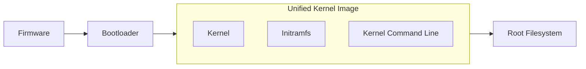

# Constellation images

Constellation uses a minimal version of Fedora as the operating system running inside confidential VMs. This Linux distribution is optimized for containers and designed to be stateless.
The Constellation images provide measured boot and an immutable filesystem.

## Measured boot

Measured boot uses a Trusted Platform Module (TPM) to measure every part of the boot process. This allows for verification of the integrity of a running system at any point in time. To ensure correct measurements of every stage, each stage is responsible to measure the next stage before transitioning.

### Firmware

With confidential VMs, the firmware is the root of trust and is measured automatically at boot. After initialization, the firmware will load and measure the bootloader before executing it.

### Bootloader

The bootloader is the first modifiable part of the boot chain. The bootloader is tasked with loading the kernel, initramfs and setting the kernel command line. The Constellation bootloader measures these components before starting the kernel.

### initramfs

The initramfs is a small filesystem loaded to prepare the actual root filesystem. The Constellation initramfs maps the block device containing the root filesystem with [dm-verity](https://www.kernel.org/doc/html/latest/admin-guide/device-mapper/verity.html). The initramfs then mounts the root filesystem from the mapped block device.

dm-verity provides integrity checking using a cryptographic hash tree. When a block is read, its integrity is checked by verifying the tree against a trusted root hash. The initramfs reads this root hash from the previously measured kernel command line. Thus, if any block of the root filesystem's device is modified on disk, trying to read the modified block will result in a kernel panic at runtime.

After mounting the root filesystem, the initramfs will switch over and start the `init` process of the integrity-protected root filesystem.

## State disk

In addition to the read-only root filesystem, each Constellation node has a disk for storing state data.
This disk is mounted readable and writable by the initramfs and contains data that should persist across reboots.
Such data can contain sensitive information and, therefore, must be stored securely.
To that end, the state disk is protected by authenticated encryption.
See the section on [keys and encryption](keys.md#storage-encryption) for more information on the cryptographic primitives in use.

## Kubernetes components

During initialization, the [*Bootstrapper*](microservices.md#bootstrapper) downloads and verifies the [Kubernetes components](https://kubernetes.io/docs/concepts/overview/components/) as configured by the user.
They're stored on the state partition and can be updated once new releases need to be installed.
