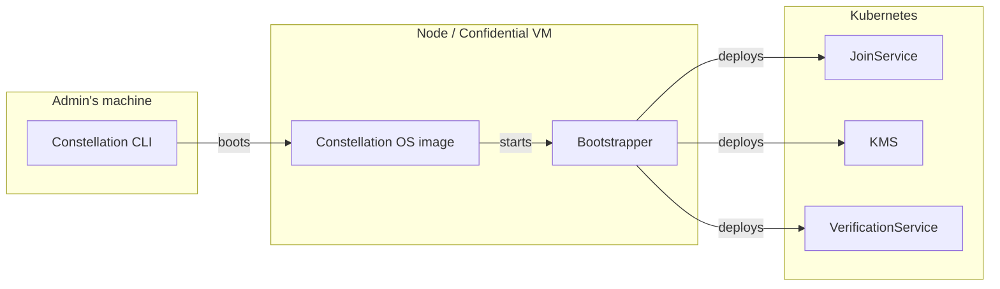
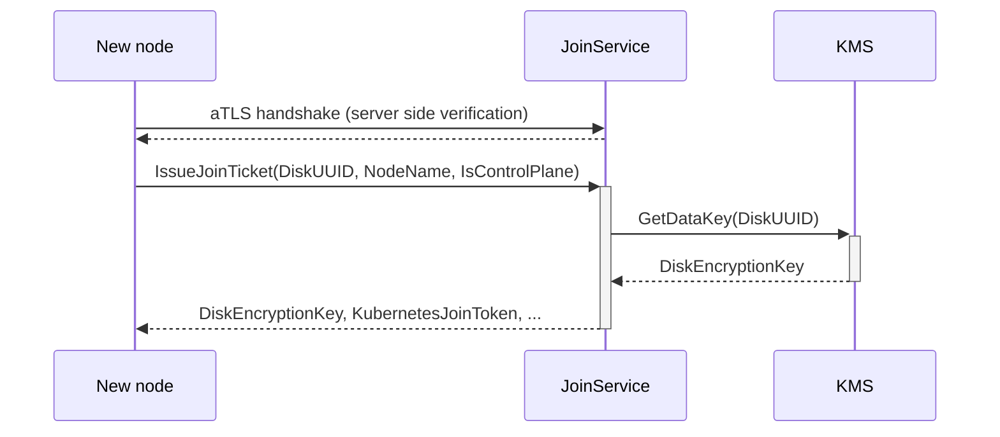

# Constellation services

Constellation takes care of bootstrapping and initializing a Confidential Kubernetes cluster. (**FS: weird**)
During the lifetime of the cluster, it handles day 2 operations such as key management, remote attestation, and updates. (**FS: features**)
These features are provided by several components:

* The [Bootstrapper](components.md#bootstrapper) initializes a Constellation node and bootstraps the cluster
* The [JoinService](components.md#joinservice) joins new nodes to an existing cluster
* The [VerificationService](components.md#verificationservice) provides remote attestation functionality
* The [Key Management Service (KMS)](components.md#kms) manages Constellation-internal keys

The relations between components are shown in the following diagram: (**FS: this is only the first node**)

## JoinService

The *JoinService* runs as [DaemonSet](https://kubernetes.io/docs/concepts/workloads/controllers/daemonset/) on each control-plane node (**FS: should we define control-plane somewhere?**).
New nodes (at cluster start, or later through autoscaling) send a request to the service over [attested TLS (aTLS)](attestation.md#attested-tls-atls).
The *JoinService* verifies the new node's certificate and attestation statement.
If attestation is successful, the new node is supplied with an encryption key from the [*KMS*](components.md#kms) (**FS: we should make clear that this is our own KMS**) for its state disk and a Kubernetes bootstrap token.

## VerificationService

The *VerificationService* runs as DaemonSet on each node.
It provides user-facing functionality for remote attestation during the cluster's lifetime via an endpoint for [verifying the cluster](attestation.md#cluster-attestation).
Read more about the hardware-based [attestation feature](attestation.md) of Constellation and how to [verify](../workflows/verify-cluster.md) a cluster on the client side.

## KMS

The *KMS* runs as DaemonSet on each control-plane node.
It implements the key management for the [storage encryption keys](keys.md#storage-encryption) in Constellation. These keys are used for the [state disk](images.md#state-disk) of each node and the [transparently encrypted storage](encrypted-storage.md) for Kubernetes.
Depending on wether the [constellation-managed](keys.md#constellation-managed-key-management) (**FS: this is an odd name.**)or [user-managed](keys.md#user-managed-key-management) mode is used, the *KMS* holds the key encryption key (KEK) directly or calls an external service for key derivation respectively.
