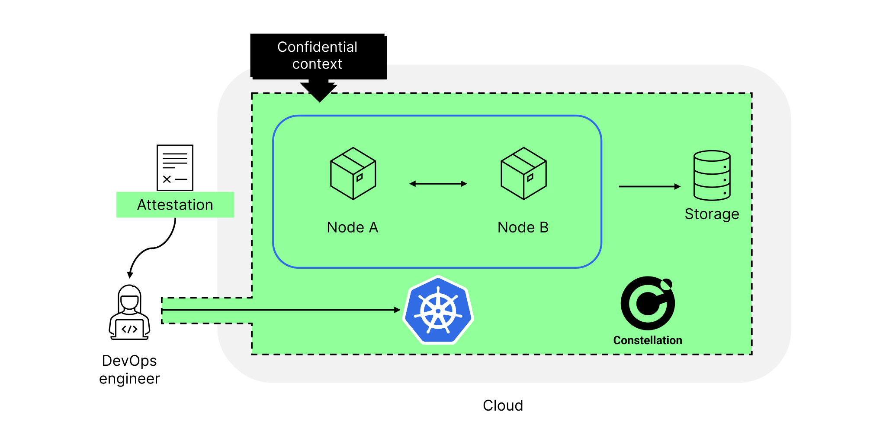
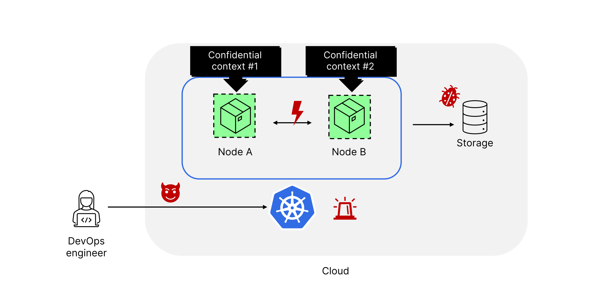

# Confidential Kubernetes

We use the term *Confidential Kubernetes* to refer to the concept of using confidential-computing technology to shield entire Kubernetes clusters from the infrastructure. The three defining properties of this concept are:

1. **Workload shielding**: the confidentiality and integrity of all workload-related data and code are enforced.
2. **Control plane shielding**: the confidentiality and integrity of the cluster's control plane, state, and workload configuration are enforced.
3. **Attestation and verifiability**: the two properties above can be verified remotely based on hardware-rooted cryptographic certificates.

Each of the above properties is equally important. Only with all three in conjunction, an entire cluster can be shielded without gaps.

## Constellation security features

Constellation implements the Confidential Kubernetes concept with the following security features.

* **Runtime encryption**: Constellation runs all Kubernetes nodes inside Confidential VMs (CVMs). This gives runtime encryption for the entire cluster.
* **Network and storage encryption**: Constellation augments this with transparent encryption of the [network](../architecture/networking.md), [persistent storage](../architecture/encrypted-storage.md), and other managed storage like [AWS S3](../architecture/encrypted-storage.md#encrypted-s3-object-storage). Thus, workloads and control plane are truly end-to-end encrypted: at rest, in transit, and at runtime.
* **Transparent key management**: Constellation manages the corresponding [cryptographic keys](../architecture/keys.md) inside CVMs.
* **Node attestation and verification**: Constellation verifies the integrity of each new CVM-based node using [remote attestation](../architecture/attestation.md). Only "good" nodes receive the cryptographic keys required to access the network and storage of a cluster.
* **Confidential computing-optimized images**: A node is "good" if it's running a signed Constellation [node image](../architecture/images.md) inside a CVM and is in the expected state. (Node images are hardware-measured during boot. The measurements are reflected in the attestation statements that are produced by nodes and verified by Constellation.)
* **"Whole cluster" attestation**: Towards the DevOps engineer, Constellation provides a single hardware-rooted certificate from which all of the above can be verified.

With the above, Constellation wraps an entire cluster into one coherent and verifiable *confidential context*. The concept is depicted in the following.

## Contrast: Managed Kubernetes with CVMs

In contrast, managed Kubernetes with CVMs, as it's for example offered in [AKS](https://azure.microsoft.com/en-us/services/kubernetes-service/) and [GKE](https://cloud.google.com/kubernetes-engine), only provides runtime encryption for certain worker nodes. Here, each worker node is a separate (and typically unverified) confidential context. This only provides limited security benefits as it only prevents direct access to a worker node's memory. The large majority of potential attacks through the infrastructure remain unaffected. This includes attacks through the control plane, access to external key management, and the corruption of worker node images. This leaves many problems unsolved. For instance, *Node A* has no means to verify if *Node B* is "good" and if it's OK to share data with it. Consequently, this approach leaves a large attack surface, as is depicted in the following.

The following table highlights the key differences in terms of features.

|                                     | Managed Kubernetes with CVMs | Confidential Kubernetes (Constellation✨) |
|-------------------------------------|------------------------------|--------------------------------------------|
|     Runtime encryption              |     Partial (data plane only)|     **Yes**                                |
|     Node image verification         |     No                       |     **Yes**                                |
|     Full cluster attestation        |     No                       |     **Yes**                                |
|     Transparent network encryption  |     No                       |     **Yes**                                |
|     Transparent storage encryption  |     No                       |     **Yes**                                |
|     Confidential key management     |     No                       |     **Yes**                                |
|     Cloud agnostic / multi-cloud    |     No                       |     **Yes**                                |
