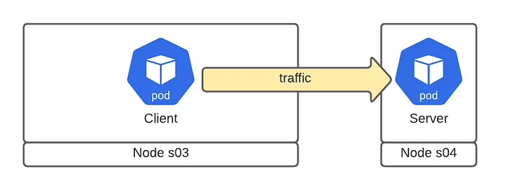
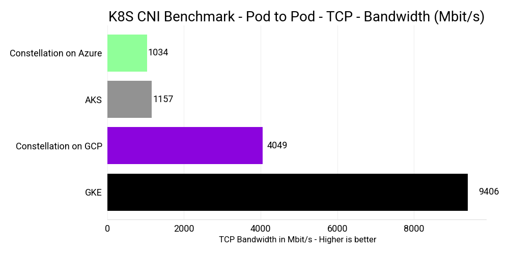
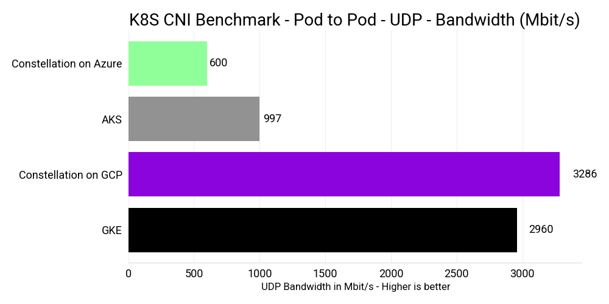
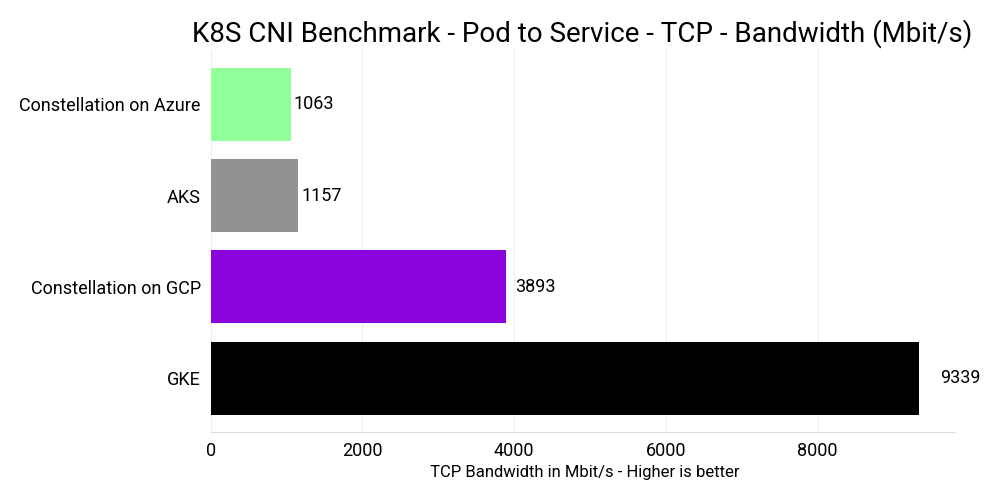
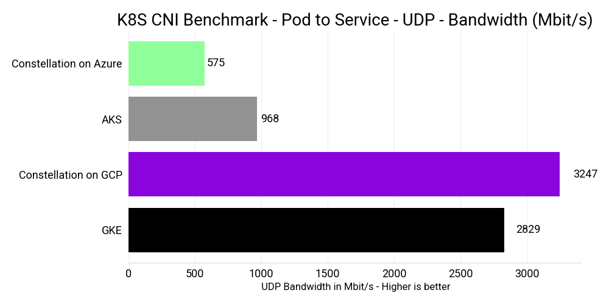
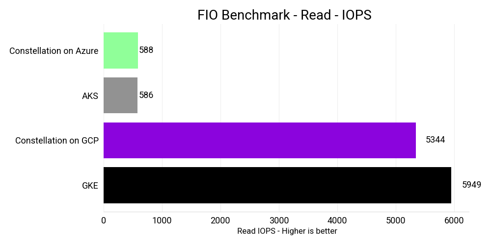
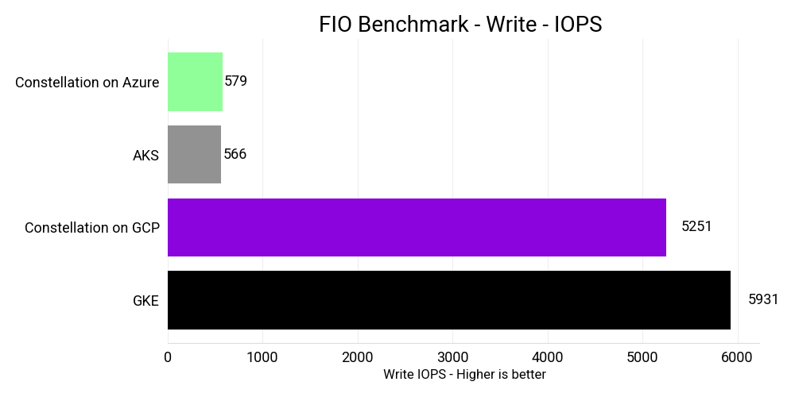
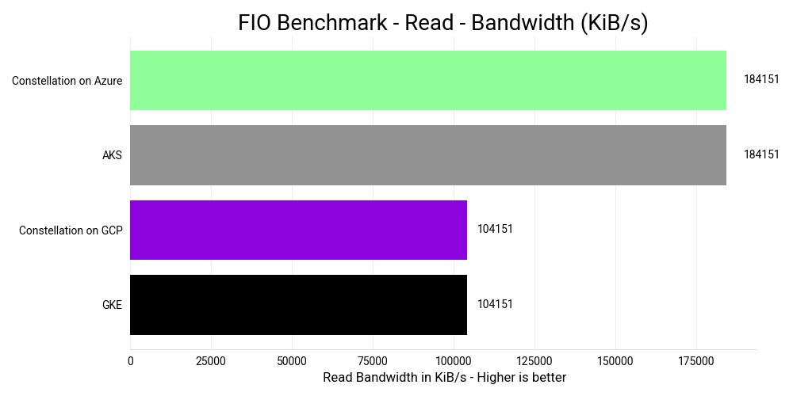
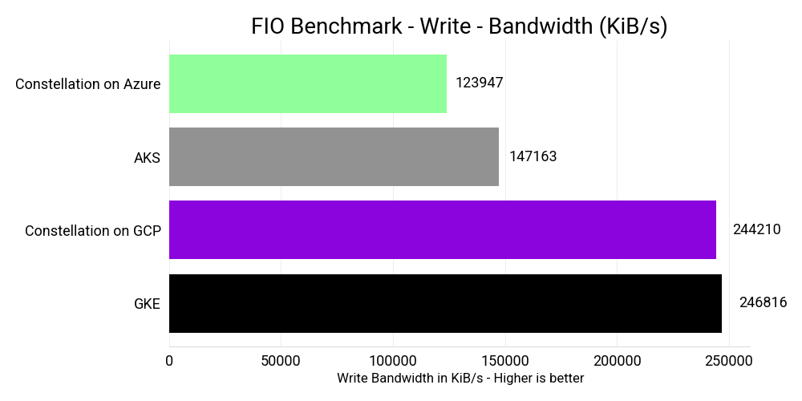

# Performance

This section analyzes the performance of Constellation.

## Performance impact from runtime encryption

All nodes in a Constellation cluster run inside Confidential VMs (CVMs). Thus, Constellation's performance is directly affected by the performance of CVMs.

AMD and Azure jointly released a [performance benchmark](https://community.amd.com/t5/business/microsoft-azure-confidential-computing-powered-by-3rd-gen-epyc/ba-p/497796) for CVMs based on 3rd Gen AMD EPYC processors (Milan) with SEV-SNP. With a range of mostly compute-intensive benchmarks like SPEC CPU 2017 and CoreMark, they found that CVMs only have a small (2%--8%) performance degradation compared to standard VMs. You can expect to see similar performance for compute-intensive workloads running with Constellation on Azure.

Similary, AMD and Google jointly released a [performance benchmark](https://www.amd.com/system/files/documents/3rd-gen-epyc-gcp-c2d-conf-compute-perf-brief.pdf) for CVMs based on 3rd Gen AMD EPYC processors (Milan) with SEV-SNP. With high performance computing workloads like WRF, NAMD, Ansys CFS, and Ansys LS_DYNA, they found similar results with only small (2%--4%) performance degradation compared to standard VMs. You can expect to see similar performance for compute-intensive workloads running with Constellation GCP.

## Performance analysis of I/O and network

To assess the overall performance of Constellation, we benchmarked Constellation v2.6.0 in terms of storage I/O using [FIO via Kubestr](https://github.com/kastenhq/kubestr), and network performance using the [Kubernetes Network Benchmark](https://github.com/InfraBuilder/k8s-bench-suite#knb--kubernetes-network-be)
### Configurations

We ran the benchmark with Constellation v2.6.0 and Kubernetes v1.25.7.
Cilium v1.12 was used for encrypted networking via eBPF and WireGuard.
For storage we utilized Constellation's [Azure Disk CSI driver with encryption](https://github.com/edgelesssys/constellation-azuredisk-csi-driver) v1.1.2 on Azure and Constellation's [GCP Persistent Disk CSI Driver with encryption](https://github.com/edgelesssys/constellation-gcp-compute-persistent-disk-csi-driver) v1.1.2 on GCP.

We ran the benchmark on AKS with Kubernetes `v1.24.9` and nodes with version `AKSUbuntu-1804gen2containerd-2023.02.15`.
On GKE we used Kubernetes `v1.24.9` and nodes with version `1.24.9-gke.3200`.

We used the following infrastructure configurations for the benchmarks.

#### Constellation Azure

- Nodes: 3 (1 Control-plane, 2 Worker)
- Machines: `DC4as_v5`: 3rd Generation AMD EPYC 7763v (Milan) processor with 4 Cores, 16 GiB memory
- CVM: `true`
- Region: `West US`
- Zone: `2`

#### Constellation and GKE on GCP

- Nodes: 3 (1 Control-plane, 2 Worker)
- Machines: `n2d-standard-4` 2nd Generation AMD EPYC (Rome) processor with 4 Cores, 16 GiB of memory
- CVM: `true`
- Zone: `europe-west3-b`

#### AKS

- Nodes: 2 (2 Worker)
- Machines: `D4as_v5`: 3rd Generation AMD EPYC 7763v (Milan) processor with 4 Cores, 16 GiB memory
- CVM: `false`
- Region: `West US`
- Zone: `2`

#### GKE

- Nodes: 2 (2 Worker)
- Machines: `n2d-standard-4` 2nd Generation AMD EPYC (Rome) processor with 4 Cores, 16 GiB of memory
- CVM: `false`
- Zone: `europe-west3-b`

### Results

#### Network

We conducted a thorough analysis of the network performance of Constellation, specifically focusing on measuring the bandwidth of TCP and UDP over a 10Gbit/s network.
The benchmark measured the bandwidth of pod to pod as well as pod to service connections between two different nodes.
The tests use [`iperf`](https://iperf.fr/) to measure the bandwidth.

Constellation on Azure and AKS used an MTU of 1500.
Constellation GCP and GKE used an MTU of 8896.

The difference can largely be attributed to two factos.

1. Constellation's [network encryption](../architecture/networking.md) via Cilium and WireGuard that protects data in-transit.
2. [AMD SEV using SWIOTLB bounce buffers](https://lore.kernel.org/all/20200204193500.GA15564@ashkalra_ubuntu_server/T/) for all DMA including network I/O.

##### Pod-to-Pod

In this scenario, the client Pod connects directly to the server pod in its IP address.

The results for "Pod-to-Pod" TCP are as follows:

The results for "Pod-to-Pod" UDP are as follows:

##### Pod-to-Service

In this section, the client Pod connects to the server Pod via a ClusterIP service. This is more relevant to real-world use cases.

The results for “Pod-to-Service” TCP are as follows:

The results for “Pod-to-Service” UDP are as follows:

#### Storage I/O

Azure and GCP offer persistent storage for their Kubernetes services AKS and GKE via the Container Storage Interface (CSI). CSI storage in Kubernetes is available via `PersistentVolumes` (PV) and consumed via `PersistentVolumeClaims` (PVC).
Upon requesting persistent storage through a PVC, GKE and AKS will provision a PV as defined by a default [storage class](https://kubernetes.io/docs/concepts/storage/storage-classes/).
Constellation provides persistent storage on Azure and GCP [that's encrypted on the CSI layer](../architecture/encrypted-storage.md).
Similarly, Constellation will provision a PV via a default storage class upon a PVC request.

For Constellation on Azure and AKS we ran the benchmark with Azure Disk Storage [Standard SSD](https://learn.microsoft.com/en-us/azure/virtual-machines/disks-types#standard-ssds) of 400GB size.
With our DC4as machine type with 4 cores standard-ssd provides the following maximum performance:
- 500 (600 burst) IOPS
- 60 MB/s (150 MB/s burst) throughput

For Constellation on GCP and GKE we ran the benchmark with Google Persistent Disk Storage [pd-standard](https://cloud.google.com/compute/docs/disks) of 400GB size.
With our N2D machine type with 4 cores pd-standard provides the following [maximum performance](https://cloud.google.com/compute/docs/disks/performance#n2d_vms):
- 15,000 write IOPS
- 3,000 read IOPS
- 240 MB/s write throughput
- 240 MB/s read throughput

The [`fio`](https://fio.readthedocs.io/en/latest/fio_doc.html) benchmark consists of several tests.
We selected a tests that performs asynchronous access patterns because we believe they most accurately depict real-world I/O access for most applications.
We measured IOPS, read, and write bandwidth.

The results for "Async Read" IOPS are as follows:

The results for "Async Write" IOPS are as follows:

The results for "Async Read" bandwidth are as follows:

The results for "Async Write" bandwidth are as follows:

Comparing Constellation on GCP with GKE, you see that Constellation offers similar read/write speeds in all scenarios.

Constellation on Azure and AKS, however, partially differ. In read-write mixes, Constellation on Azure outperforms AKS in terms of I/O. On full-write access, Constellation and AKS have the same speed.

## Conclusion

Despite providing substantial [security benefits](./security-benefits.md), Constellation overall only has a slight performance overhead over the managed Kubernetes offerings AKS and GKE. Constellation is on par in most benchmarks, but is slightly slower in certain scenarios due to network and storage encryption. When it comes to API latencies, Constellation even outperforms the less security-focused competition.
