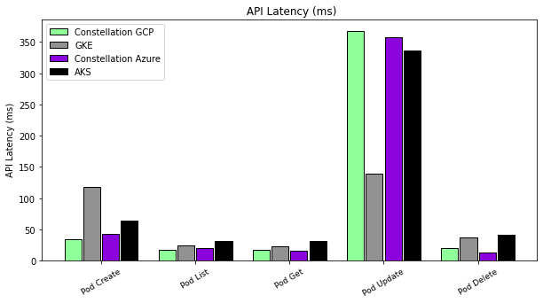
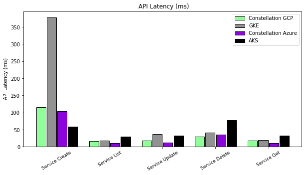
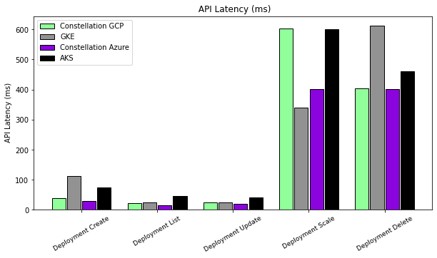
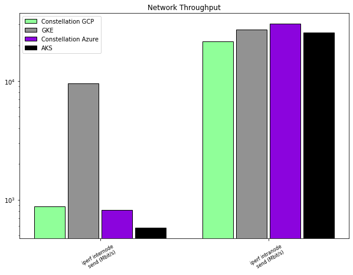
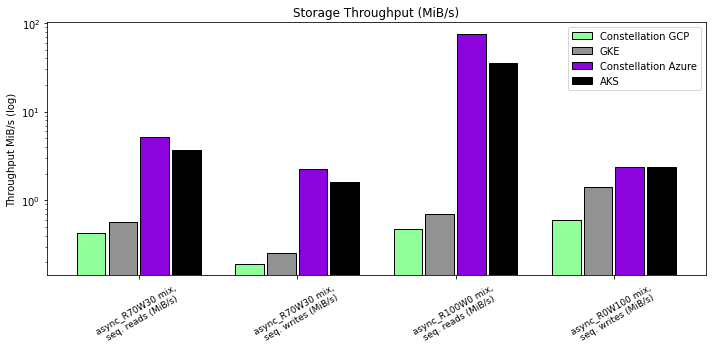

# Performance

This section analyzes the performance of Constellation.

## Performance impact from runtime encryption

All nodes in a Constellation cluster run inside Confidential VMs (CVMs). Thus, Constellation's performance is directly affected by the performance of CVMs.

AMD and Azure jointly released a [performance benchmark](https://community.amd.com/t5/business/microsoft-azure-confidential-computing-powered-by-3rd-gen-epyc/ba-p/497796) for CVMs based on 3rd Gen AMD EPYC processors (Milan) with SEV-SNP. With a range of mostly compute-intensive benchmarks like SPEC CPU 2017 and CoreMark, they found that CVMs only have a small (2%--8%) performance degradation compared to standard VMs. You can expect to see similar performance for compute-intensive workloads running on Constellation.

## Performance analysis with K-Bench

To assess the overall performance of Constellation, we benchmarked Constellation v2.0.0 using [K-Bench](https://github.com/vmware-tanzu/k-bench). K-Bench is a configurable framework to benchmark Kubernetes clusters in terms of storage I/O, network performance, and creating/scaling resources.

As a baseline, we compare Constellation with the non-confidential managed Kubernetes offerings on Microsoft Azure and Google Cloud Platform (GCP). These are AKS on Azure and GKE on GCP.

### Configurations

We used the following configurations for the benchmarks.

#### Constellation and GKE on GCP

- Nodes: 3
- Machines: `n2d-standard-4`
- CVM: `true`
- Zone: `europe-west3-b`

#### Constellation and AKS on Azure

- Nodes: 3
- Machines: `DC4as_v5`
- CVM: `true`
- Region: `West Europe`
- Zone: `2`

#### K-Bench

Using the default [K-Bench test configurations](https://github.com/vmware-tanzu/k-bench/tree/master/config), we ran the following tests on the clusters:

- `default`
- `dp_network_internode`
- `dp_network_intranode`
- `dp_fio`

### Results

#### Kubernetes API Latency

At its core, the Kubernetes API is the way to query and modify a cluster's state. Latency matters here. Hence, it's vital that even with the additional level of security from Constellation's network the API latency doesn't spike.
K-Bench's `default` test performs calls to the API to create, update, and delete cluster resources.

The three graphs below compare the API latencies (lower is better) in milliseconds for pods, services, and deployments.

Pods: Except for the `Pod Update` call, Constellation is faster than AKS and GKE in terms of API calls.

Services: Constellation has lower latencies than AKS and GKE except for service creation on AKS.

Deployments: Constellation has the lowest latency for all cases except for scaling deployments on GKE and creating deployments on AKS.

#### Network

There are two main indicators for network performance: intra-node and inter-node transmission speed.
K-Bench provides benchmark tests for both, configured as `dp_network_internode` and `dp_network_intranode`. The tests use [`iperf`](https://iperf.fr/) to measure the bandwidth available.

##### Inter-node

Inter-node communication is the network transmission between different Kubernetes nodes.

The first test (`dp_network_internode`) measures the throughput between nodes. Constellation has an inter-node throughput of around 816 Mbps on Azure to 872 Mbps on GCP. While that's faster than the average throughput of AKS at 577 Mbps, GKE provides faster networking at 9.55 Gbps.
The difference can largely be attributed to Constellation's [network encryption](../architecture/networking.md) that protects data in-transit.

##### Intra-node

Intra-node communication happens between pods running on the same node.
The connections directly pass through the node's OS layer and never hit the network.
The benchmark evaluates how the [Constellation's node OS image](../architecture/images.md) and runtime encryption influence the throughput.

Constellation's bandwidth for both sending and receiving is at 31 Gbps on Azure and 22 Gbps on GCP. AKS achieves 26 Gbps and GKE achieves about 27 Gbps in the tests.

#### Storage I/O

Azure and GCP offer persistent storage for their Kubernetes services AKS and GKE via the Container Storage Interface (CSI). CSI storage in Kubernetes is available via `PersistentVolumes` (PV) and consumed via `PersistentVolumeClaims` (PVC).
Upon requesting persistent storage through a PVC, GKE and AKS will provision a PV as defined by a default [storage class](https://kubernetes.io/docs/concepts/storage/storage-classes/).
Constellation provides persistent storage on Azure and GCP [that's encrypted on the CSI layer](../architecture/encrypted-storage.md).
Similarly, Constellation will provision a PV via a default storage class upon a PVC request.

The K-Bench [`fio`](https://fio.readthedocs.io/en/latest/fio_doc.html) benchmark consists of several tests.
We selected four different tests that perform asynchronous access patterns because we believe they most accurately depict real-world I/O access for most applications.

The following graph shows I/O throughput in MiB/s (higher is better).

Comparing Constellation on GCP with GKE, you see that Constellation offers similar read/write speeds in all scenarios.

Constellation on Azure and AKS, however, partially differ. In read-write mixes, Constellation on Azure outperforms AKS in terms of I/O. On full-write access, Constellation and AKS have the same speed.

## Conclusion

Despite providing substantial [security benefits](./security-benefits.md), Constellation overall only has a slight performance overhead over the managed Kubernetes offerings AKS and GKE. Constellation is on par in most benchmarks, but is slightly slower in certain scenarios due to network and storage encryption. When it comes to API latencies, Constellation even outperforms the less security-focused competition.
