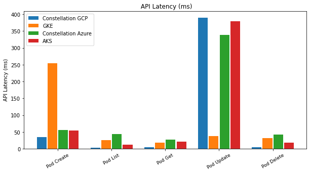
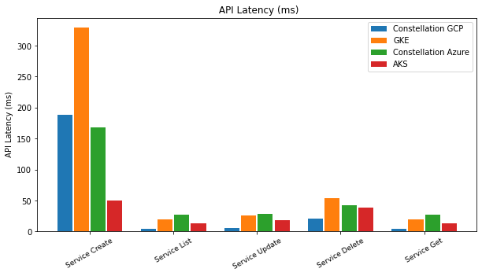
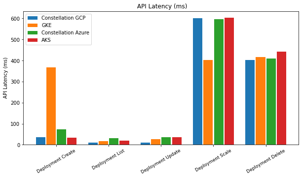
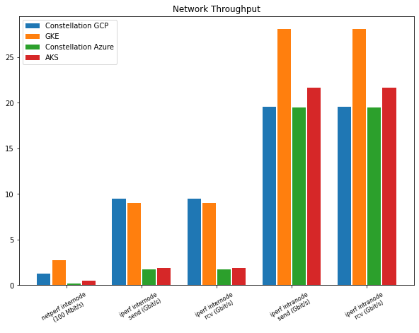
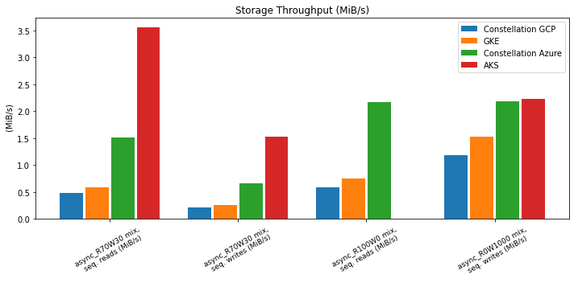

# Performance

Security and performance are generally considered to be in a tradeoff relationship.
A tradeoff is a situation that involves losing one quality or aspect of something in return for gaining another quality or aspect.
Encryption is one of the common suspects for such a tradeoff that's inevitable for upholding the confidentiality and privacy of data during cloud transformation.
Constellation provides encryption [of data at rest](../architecture/encrypted-storage.md), [in-cluster transit](../architecture/networking.md), and [in-use](confidential-kubernetes.md) of a Kubernetes cluster.
This article elaborates on the performance impact for applications deployed in Constellation versus standard Kubernetes clusters.

AMD and Azure have collaboratively released a [performance benchmark](https://community.amd.com/t5/business/microsoft-azure-confidential-computing-powered-by-3rd-gen-epyc/ba-p/497796) for the runtime encryption of the 3rd Gen AMD EPYC processors with its SEV-SNP capability enabled.
They found that Confidential VMs have minimal performance differences on common benchmarks as compared with general-purpose VMs.
The overhead being in the single digits, runtime memory encryption will affect only the compute-heavy applications in their performance.
Confidential VMs such as AMD SEV-SNP are the foundation for Constellation, hence, the same performance results can be expected in terms of runtime overhead.

We performed additional benchmarking tests on Constellation clusters to assess more Kubernetes-specific intra-cluster network throughput, storage I/O, and Kubernetes API latencies.

## Test Setup

We benchmarked Constellation release v1.3.0 using [K-Bench](https://github.com/vmware-tanzu/k-bench). K-Bench is a configurable framework to benchmark Kubernetes clusters in terms of storage I/O, network performance, and creating/scaling resources.

As a baseline, we compared Constellation with the Constellation-supported cloud providers' managed Kubernetes offerings.

Throughout this article, you will find the comparison of Constellation on GCP with GKE and on Azure with AKS.
We can't provide an accurate intercloud meta-comparison at this point due to different Confidential VM machine types.

The benchmark ran with the following machines and configurations:

### Constellation on GCP / GKE

- Nodes: 3
- Machines: `n2d-standard-2`
- Kubernetes version: `1.23.6-gke.2200`
- Zone: `europe-west3-b`

### Constellation on Azure / AKS

- Nodes: 3
- Machines: `D2a_v4`
- Kubernetes version: `1.23.5`
- Region: `North Europe`
- Zone: `2`

### K-Bench

Using the default [K-Bench test configurations](https://github.com/vmware-tanzu/k-bench/tree/master/config), we ran the following tests on the clusters:

- `default`
- `dp_netperf_internode`
- `dp_network_internode`
- `dp_network_intranode`
- `dp_fio`

## Results

### Kubernetes API Latency

At its core, the Kubernetes API is the way to query and modify a cluster's state. Latency matters here. Hence, it's vital that even with the additional level of security from Constellation's network the API latency doesn't spike.
K-Bench's `default` test performs calls to the API to create, update and delete cluster resources.

The three graphs below compare the API latencies (lower is better) in milliseconds for pods, services, and deployments.

Pods: Except for the `Pod Update` call, Constellation is faster than AKS and GKE in terms of API calls.

Services: Constellation has lower latencies than AKS and GKE except for service creation on AKS.

Deployments: Constellation has the lowest latency for all cases except for scaling deployments on GKE and creating deployments on AKS.

### Network

When it comes to network performance, there are two main indicators we need to differentiate: intra-node and inter-node transmission speed.
K-Bench provides benchmark tests for both, configured as `dp_netperf_internode`, `dp_network_internode`, `dp_network_intranode`.

#### Inter-node

K-Bench has two benchmarks to evaluate the network performance between different nodes.

The first test (`dp_netperf_internode`) uses [`netperf`](https://hewlettpackard.github.io/netperf/) to measure the throughput. Constellation has a slightly lower network throughput than AKS and GKE.
This can largely be attributed to [Constellation's network encryption](../architecture/networking.md).

#### Intra-node

Intra-node communication happens between pods running on the same node.
The connections directly pass through the node's OS layer and never hit the network.
The benchmark evaluates how the [Constellation's node OS image](../architecture/images.md) and runtime encryption influence the throughput.

The K-Bench tests `dp_network_internode` and `dp_network_intranode`. The tests use [`iperf`](https://iperf.fr/) to measure the bandwidth available.
Constellation's bandwidth for both sending and receiving is at 20 Gbps while AKS achieves slightly higher numbers and GKE achieves about 30 Gbps in our tests.

### Storage I/O

Azure and GCP offer persistent storage for their Kubernetes services AKS and GKE via the Container Storage Interface (CSI). CSI storage in Kubernetes is available via `PersistentVolumes` (`PV`) and consumed via `PersistentVolumeClaims` (`PVC`).
Upon requesting persistent storage through a PVC, GKE and AKS will provision a PV as defined by a default [storage class](https://kubernetes.io/docs/concepts/storage/storage-classes/).
Constellation provides persistent storage on Azure and GCP that's encrypted on the CSI layer. Read more about this in [how Constellation encrypts data at rest](../architecture/encrypted-storage.md).
Similarly, Constellation will provision a PV via a default storage class upon a PVC request.

The K-Bench [`fio`](https://fio.readthedocs.io/en/latest/fio_doc.html) benchmark consists of several tests.
We selected four different tests that perform asynchronous access patterns because we believe they most accurately depict real-world I/O access for most applications.

In the graph below, you will find the I/O throughput in `MiB/s` - where higher is better.

Comparing Constellation on GCP with GKE, we see that Constellation offers similar read/write speeds in all scenarios.

Constellation on Azure and AKS, however, differ in sometimes. As you can see, only for the full write mix, Constellation and AKS have similar storage access speeds. In the 70/30 mix, AKS outperforms Constellation.

Note: For the sequential reads with a 0/100 read-write mix, no data could be measured on AKS, hence the missing data bar.

## Conclusion

Constellation can help transform the way organizations process data in the cloud by delivering high-performance Kubernetes while preserving confidentiality and privacy.
As demonstrated in our tests above, Constellation provides a Kubernetes cluster with minimal performance impact compared to the managed Kubernetes offerings AKS and GKE.
While enabling always encrypted processing of data, the network and storage encryption comes at a minimal price.
Constellation holds up in most benchmarks but in certain scenarios can be slightly lower in terms of storage and network throughput.
Kubernetes API latencies aren’t affected, and Constellation even outperforms AKS and GKE in this aspect.
