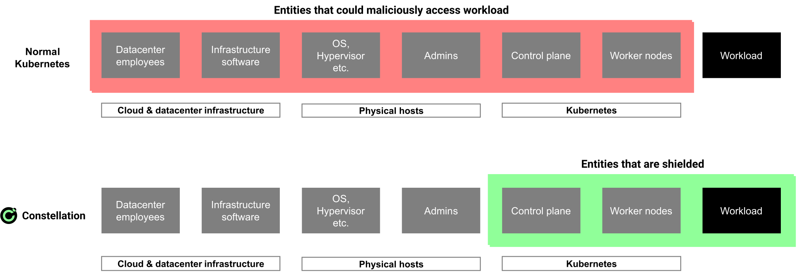

# Security benefits and threat model

Constellation implements the [Confidential Kubernetes](confidential-kubernetes.md) concept and shields entire Kubernetes deployments from the infrastructure. More concretely, Constellation decreases the size of the trusted computing base (TCB) of a Kubernetes deployment. The TCB is the totality of elements in a computing environment that must be trusted not to be compromised. A smaller TCB results in a smaller attack surface. The following diagram shows how Constellation removes the *cloud & datacenter infrastructure* and the *physical hosts*, including the hypervisor, the host OS, and other components, from the TCB (red). Inside the confidential context (green), Kubernetes remains part of the TCB, but its integrity is attested and can be [verified](../workflows/verify-cluster.md).

Given this background, the following describes the concrete threat classes that Constellation addresses.

## Insider access

Employees and third-party contractors of cloud service providers (CSPs) have access to different layers of the cloud infrastructure.
This opens up a large attack surface where workloads and data can be read, copied, or manipulated. With Constellation, Kubernetes deployments are shielded from the infrastructure and thus such accesses are prevented.

## Infrastructure-based attacks

Malicious cloud users ("hackers") may break out of their tenancy and access other tenants' data. Advanced attackers may even be able to establish a permanent foothold within the infrastructure and access data over a longer period. Analogously to the *insider access* scenario, Constellation also prevents access to a deployment's data in this scenario.

## Supply chain attacks

Supply chain security is receiving lots of attention recently due to an [increasing number of recorded attacks](https://www.enisa.europa.eu/news/enisa-news/understanding-the-increase-in-supply-chain-security-attacks). For instance, a malicious actor could attempt to tamper Constellation node images (including Kubernetes and other software) before they're loaded in the confidential VMs of a cluster. Constellation uses [remote attestation](../architecture/attestation.md) in conjunction with public [transparency logs](../workflows/verify-cli.md) to prevent this.

In the future, Constellation will extend this feature to customer workloads. This will enable cluster owners to create auditable policies that precisely define which containers can run in a given deployment.
