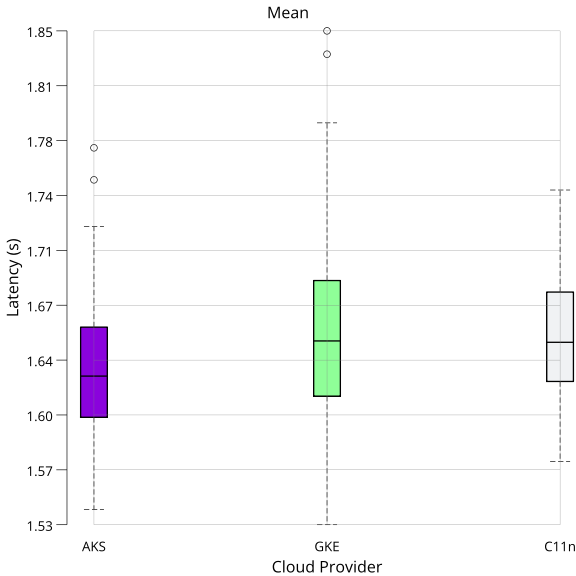
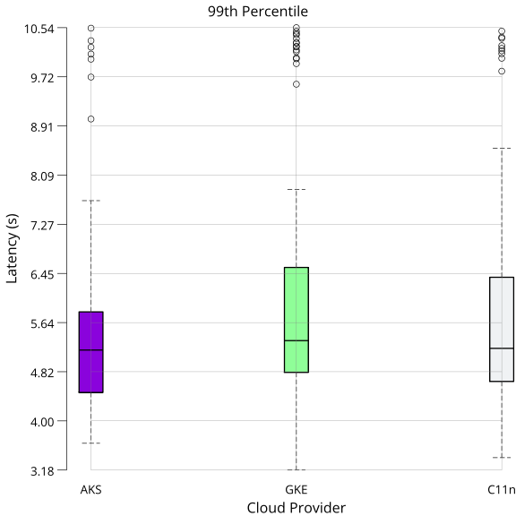
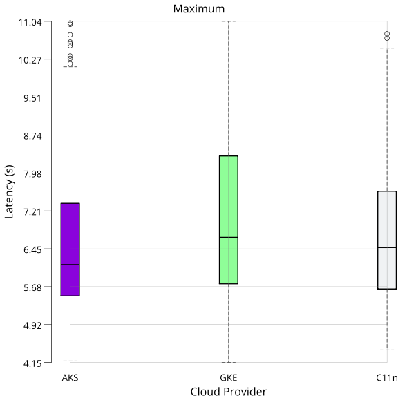
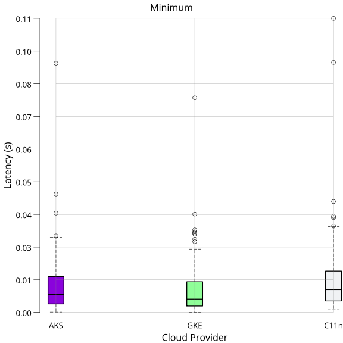

# Application benchmarks

## HashiCorp Vault

[HashiCorp Vault](https://www.vaultproject.io/) is a distributed secrets management software that can be deployed to Kubernetes.
HashiCorp maintains a benchmarking tool for vault, [vault-benchmark](https://github.com/hashicorp/vault-benchmark/).
Vault-benchmark generates load on a Vault deployment and measures response times.

This article describes the results from running vault-benchmark on Constellation, AKS, and GKE.
You can find the setup for producing the data discussed in this article in the [vault-benchmarks](https://github.com/edgelesssys/vault-benchmarks) repository.

The Vault API used during benchmarking is the [transits secret engine](https://developer.hashicorp.com/vault/docs/secrets/transit).
This allows services to send data to Vault for encryption, decryption, signing, and verification.

## Results

On each run, vault-benchmark sends requests and measures the latencies.
The measured latencies are aggregated through various statistical features.
After running the benchmark n times, the arithmetic mean over a subset of the reported statistics is calculated.
The selected features are arithmetic mean, 99th percentile, minimum, and maximum.

Arithmetic mean gives a general sense of the latency on each target.
The 99th percentile shows performance in (most likely) erroneous states.
Minimum and maximum mark the range within which latency varies each run.

The benchmark was configured with 1300 workers and 10 seconds per run.
Those numbers were chosen empirically.
The latency was stabilizing at 10 seconds runtime, not changing with further increase.
Increasing the number of workers beyond 1300 leads to request failures, marking the limit Vault was able to handle in this setup.
All results are based on 100 runs.

The following data was generated while running five replicas, one primary, and four standby nodes.
All numbers are in seconds if not indicated otherwise.
```
========== Results AKS ==========
Mean:   mean: 1.632200, variance: 0.002057
P99:    mean: 5.480679, variance: 2.263700
Max:    mean: 6.651001, variance: 2.808401
Min:    mean: 0.011415, variance: 0.000133
========== Results GKE ==========
Mean:   mean: 1.656435, variance: 0.003615
P99:    mean: 6.030807, variance: 3.955051
Max:    mean: 7.164843, variance: 3.300004
Min:    mean: 0.010233, variance: 0.000111
========== Results C11n ==========
Mean:   mean: 1.651549, variance: 0.001610
P99:    mean: 5.780422, variance: 3.016106
Max:    mean: 6.942997, variance: 3.075796
Min:    mean: 0.013774, variance: 0.000228
========== AKS vs C11n ==========
Mean:   +1.171577 %  (AKS is faster)
P99:    +5.185495 %  (AKS is faster)
Max:    +4.205618 %  (AKS is faster)
Min:    +17.128781 % (AKS is faster)
========== GKE vs C11n ==========
Mean:   -0.295851 %  (GKE is slower)
P99:    -4.331603 %  (GKE is slower)
Max:    -3.195248 %  (GKE is slower)
Min:    +25.710886 % (GKE is faster)
```

**Interpretation**: Latencies are all within ~5% of each other.
AKS performs slightly better than GKE and Constellation (C11n) in all cases except minimum latency.
Minimum latency is the lowest for GKE.
Compared to GKE, Constellation had slightly lower peak latencies (99th percentile and maximum), indicating that Constellation could have handled slightly more concurrent accesses than GKE.
Overall, performance is at comparable levels across all three distributions.
Based on these numbers, you can use a similarly sized Constellation cluster to run your existing Vault deployment.

### Visualization

The following plots visualize the data presented above as [box plots](https://en.wikipedia.org/wiki/Box_plot).
The whiskers denote the minimum and maximum.
The box stretches from the 25th to the 75th percentile, with the dividing bar marking the 50th percentile.
The circles outside the whiskers denote outliers.

<details>
<summary>Mean Latency</summary>



</details>

<details>
<summary>99th Percentile Latency</summary>



</details>

<details>
<summary>Maximum Latency</summary>



</details>

<details>
<summary>Minimum Latency</summary>



</details>
