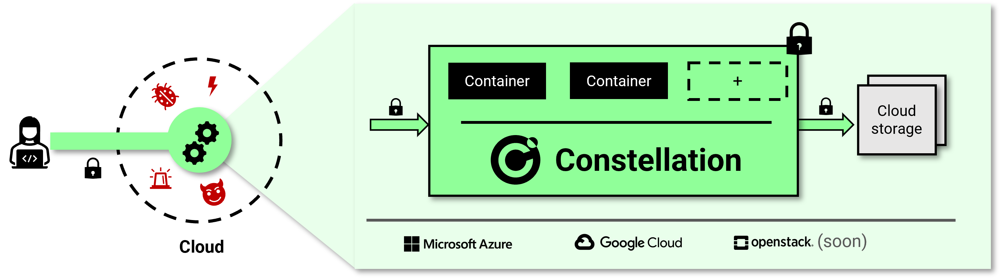

# Welcome to Constellation! 🎉

Constellation is the first Confidential Kubernetes platform!
Constellation leverages confidential computing to isolate entire Kubernetes clusters and all workloads from the rest of the cloud infrastructure.
From the inside, it's a fully-featured, [certified](https://www.cncf.io/certification/software-conformance/), Kubernetes engine.
From the outside, it's an end to end isolated, always encrypted stronghold. A Confidential Cloud in the public cloud.
Constellation is open source and enterprise-ready, tailored for unleashing the power of confidential computing for all your workloads at scale.

For a brief introduction to the Confidential Kubernetes concept, read the [introduction](overview/confidential-kubernetes.md).
For more elaborate overviews of Constellation's, see the [architecture](architecture/overview.md) section.

## Features

Constellation's main features are:

* The only cloud agnostic Confidential Kubernetes platform
* Verifiable integrity and confidentiality protection of the entire Kubernetes cluster
* High-available, enterprise-ready Kubernetes engine
* Memory runtime encryption of all Kubernetes nodes
* Network encryption for the node to node traffic. Including the pod network.
* [Persistent volume](https://kubernetes.io/docs/concepts/storage/persistent-volumes/) encryption for block storage
* Key management for transparent network and storage encryption
* CC-optimized, fully measured, and integrity-protected node OS
* Kubernetes node attestation
* Dynamic cluster autoscaling with autonomous node attestation
* Supply chain protection with [sigstore](https://www.sigstore.dev/)

## Getting started

Sounds great, how can I try this?

Constellation can be [deployed](getting-started/install.md) in minutes to your favorite infrastructure provider :rocket:

## Where does it fit

Constellation is the Kubernetes platform for secure, confidential cloud computing.
When moving workloads to the cloud most enterprises are facing the following challenges:

* How to **prevent unauthorized access** from hackers, cloud administrators, or governments?
* How to **ensure compliance** with privacy laws (e.g. GDPR) and industry-specific regulation (e.g. HIPAA)?
* How to **implement cloud security at the root** -- without simply adding "yet another tool"?

Constellation is designed to fundamentally change the playing field when it comes to cloud migration.
By leveraging confidential computing hardware capabilities it solves these challenges at the root.
