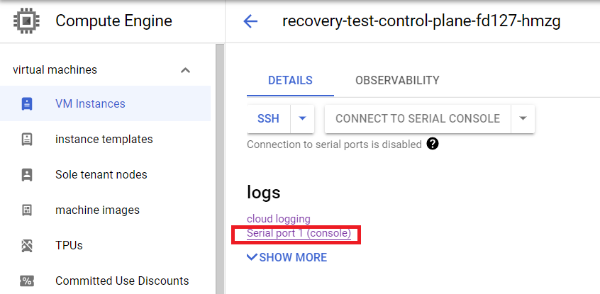

# Recovery

Recovery of a Constellation cluster means getting a cluster back into a healthy state after it became unhealthy due to the underlying infrastructure.
Reasons for an unhealthy cluster can vary from a power outage, or planned reboot, to migration of nodes and regions.
Constellation keeps all stateful data protected and encrypted in a [stateful disk](../architecture/images.md#stateful-disk) attached to each node.
The stateful disk will be persisted across reboots.
The data restored from that disk contains the entire Kubernetes state including the application deployments.
Meaning after a successful recovery procedure the applications can continue operating without redeploying everything from scratch.

Recovery events are rare because Constellation is built for high availability and contains mechanisms to automatically replace and join nodes to the cluster.
Once a node reboots, the [*Bootstrapper*](../architecture/components.md#bootstrapper) will try to authenticate to the cluster's [*JoinService*](../architecture/components.md#joinservice) using remote attestation.
If successful the *JoinService* will return the encryption key for the stateful disk as part of the initialization response.
This process ensures that Constellation nodes can securely recover and rejoin a cluster autonomously.

In case of a disaster, where the control plane itself becomes unhealthy, Constellation provides a mechanism to recover that cluster and bring it back into a healthy state.
The `constellation recover` command connects to a node, establishes a secure connection using [attested TLS](../architecture/attestation.md#attested-tls-atls), and provides that node with the key to decrypt its stateful disk and continue booting.
This process has to be repeated until enough nodes are back running for establishing a [member quorum for etcd](https://etcd.io/docs/v3.5/faq/#what-is-failure-tolerance) and the Kubernetes state can be recovered.

## Identify unhealthy clusters

The first step to recovery is identifying when a cluster becomes unhealthy.
Usually, that's first observed when the Kubernetes API server becomes unresponsive.
The causes can vary but are often related to issues in the underlying infrastructure.
Recovery in Constellation becomes necessary if not enough control-plane nodes are in a healthy state to keep the control plane operational.

The health status of the Constellation nodes can be checked and monitored via the cloud service provider.
Constellation provides logging information on the boot process and status via [cloud logging](troubleshooting.md#cloud-logging).
In the following, you'll find detailed descriptions for identifying clusters stuck in recovery for each cloud environment.
Once you've identified that your cluster is in an unhealthy state you can use the [recovery](recovery.md#recover-your-cluster) command of the Constellation CLI to restore it.

<tabs groupId="csp">
<tabItem value="azure" label="Azure" default>

In the Azure cloud portal find the cluster's resource group `<cluster-name>-<suffix>`
Inside the resource group check that the control plane *Virtual machine scale set* `constellation-scale-set-controlplanes-<suffix>` has enough members in a *Running* state.
Open the scale set details page, on the left go to `Settings -> Instances` and check the *Status* field.

Second, check the boot logs of these *Instances*.
In the scale set's *Instances* view, open the details page of the desired instance.
Check the serial console output of that instance.
On the left open the *"Support + troubleshooting" -> "Serial console"* page:

In the serial console output search for `Waiting for decryption key`.
Similar output to the following means your node was restarted and needs to decrypt the [state disk](../architecture/images.md#state-disk):

```shell
{"level":"INFO","ts":"2022-09-08T09:56:41Z","caller":"cmd/main.go:55","msg":"Starting disk-mapper","version":"2.0.0","cloudProvider":"azure"}
{"level":"INFO","ts":"2022-09-08T09:56:43Z","logger":"setupManager","caller":"setup/setup.go:72","msg":"Preparing existing state disk"}
{"level":"INFO","ts":"2022-09-08T09:56:43Z","logger":"recoveryServer","caller":"recoveryserver/server.go:59","msg":"Starting RecoveryServer"}
{"level":"INFO","ts":"2022-09-08T09:56:43Z","logger":"rejoinClient","caller":"rejoinclient/client.go:65","msg":"Starting RejoinClient"}
```

The node will then try to connect to the [*JoinService*](../architecture/components.md#joinservice) and obtain the decryption key.
If that fails, because the control plane is unhealthy, you will see log messages similar to the following:

```shell
{"level":"INFO","ts":"2022-09-08T09:56:43Z","logger":"rejoinClient","caller":"rejoinclient/client.go:77","msg":"Received list with JoinService endpoints","endpoints":["10.9.0.5:30090","10.9.0.6:30090"]}
{"level":"INFO","ts":"2022-09-08T09:56:43Z","logger":"rejoinClient","caller":"rejoinclient/client.go:96","msg":"Requesting rejoin ticket","endpoint":"10.9.0.5:30090"}
{"level":"WARN","ts":"2022-09-08T09:57:03Z","logger":"rejoinClient","caller":"rejoinclient/client.go:101","msg":"Failed to rejoin on endpoint","error":"rpc error: code = Unavailable desc = connection error: desc = \"transport: Error while dialing dial tcp 10.9.0.5:30090: i/o timeout\"","endpoint":"10.9.0.5:30090"}
{"level":"INFO","ts":"2022-09-08T09:57:03Z","logger":"rejoinClient","caller":"rejoinclient/client.go:96","msg":"Requesting rejoin ticket","endpoint":"10.9.0.6:30090"}
{"level":"WARN","ts":"2022-09-08T09:57:23Z","logger":"rejoinClient","caller":"rejoinclient/client.go:101","msg":"Failed to rejoin on endpoint","error":"rpc error: code = Unavailable desc = connection error: desc = \"transport: Error while dialing dial tcp 10.9.0.6:30090: i/o timeout\"","endpoint":"10.9.0.6:30090"}
{"level":"ERROR","ts":"2022-09-08T09:57:23Z","logger":"rejoinClient","caller":"rejoinclient/client.go:110","msg":"Failed to rejoin on all endpoints"}
```

That means you have to recover that node manually.
Before you continue with the [recovery process](#recover-your-cluster) you need to know the node's IP address.
For the IP address, return to the instances *Overview* page and find the *Private IP address*.

</tabItem>
<tabItem value="gcp" label="GCP" default>

First, check that the control plane *Instance Group* has enough members in a *Ready* state.
Go to *Instance Groups* and check the group for the cluster's control plane `<cluster-name>-control-plane-<suffix>`.

Second, check the status of the *VM Instances*.
Go to *VM Instances* and open the details of the desired instance.
Check the serial console output of that instance by opening the *logs -> "Serial port 1 (console)"* page:



In the serial console output search for `Waiting for decryption key`.
Similar output to the following means your node was restarted and needs to decrypt the [state disk](../architecture/images.md#state-disk):

```shell
{"level":"INFO","ts":"2022-09-08T10:21:53Z","caller":"cmd/main.go:55","msg":"Starting disk-mapper","version":"2.0.0","cloudProvider":"gcp"}
{"level":"INFO","ts":"2022-09-08T10:21:53Z","logger":"setupManager","caller":"setup/setup.go:72","msg":"Preparing existing state disk"}
{"level":"INFO","ts":"2022-09-08T10:21:53Z","logger":"rejoinClient","caller":"rejoinclient/client.go:65","msg":"Starting RejoinClient"}
{"level":"INFO","ts":"2022-09-08T10:21:53Z","logger":"recoveryServer","caller":"recoveryserver/server.go:59","msg":"Starting RecoveryServer"}

```

The node will then try to connect to the [*JoinService*](../architecture/components.md#joinservice) and obtain the decryption key.
If that fails, because the control plane is unhealthy, you will see log messages similar to the following:

```shell
{"level":"INFO","ts":"2022-09-08T10:21:53Z","logger":"rejoinClient","caller":"rejoinclient/client.go:77","msg":"Received list with JoinService endpoints","endpoints":["192.168.178.4:30090","192.168.178.2:30090"]}
{"level":"INFO","ts":"2022-09-08T10:21:53Z","logger":"rejoinClient","caller":"rejoinclient/client.go:96","msg":"Requesting rejoin ticket","endpoint":"192.168.178.4:30090"}
{"level":"WARN","ts":"2022-09-08T10:21:53Z","logger":"rejoinClient","caller":"rejoinclient/client.go:101","msg":"Failed to rejoin on endpoint","error":"rpc error: code = Unavailable desc = connection error: desc = \"transport: Error while dialing dial tcp 192.168.178.4:30090: connect: connection refused\"","endpoint":"192.168.178.4:30090"}
{"level":"INFO","ts":"2022-09-08T10:21:53Z","logger":"rejoinClient","caller":"rejoinclient/client.go:96","msg":"Requesting rejoin ticket","endpoint":"192.168.178.2:30090"}
{"level":"WARN","ts":"2022-09-08T10:22:13Z","logger":"rejoinClient","caller":"rejoinclient/client.go:101","msg":"Failed to rejoin on endpoint","error":"rpc error: code = Unavailable desc = connection error: desc = \"transport: Error while dialing dial tcp 192.168.178.2:30090: i/o timeout\"","endpoint":"192.168.178.2:30090"}
{"level":"ERROR","ts":"2022-09-08T10:22:13Z","logger":"rejoinClient","caller":"rejoinclient/client.go:110","msg":"Failed to rejoin on all endpoints"}
```

That means you have to recover that node manually.
Before you continue with the [recovery process](#recover-your-cluster) you need to know the node's IP address.
For the IP address go to the *"VM Instance" -> "network interfaces"* page and take the address from *"Primary internal IP address."*

</tabItem>
</tabs>

## Recover your cluster

Depending on the size of your cluster and the number of unhealthy control plane nodes the following process needs to be repeated until a [member quorum for etcd](https://etcd.io/docs/v3.5/faq/#what-is-failure-tolerance) is established.
For example, assume you have 5 control-plane nodes in your cluster and 4 of them have been rebooted due to a maintenance downtime in the cloud environment.
You have to run through the following process for 2 of these nodes and recover them manually to recover the quorum.
From there, your cluster will auto heal the remaining 2 control-plane nodes and the rest of your cluster.

Recovering a node requires the following parameters:

* The node's IP address
* Access to the master secret of the cluster

See the [Identify unhealthy clusters](#identify-unhealthy-clusters) description of how to obtain the node's IP address.
Note that the recovery command needs to connect to the recovering nodes.
Nodes only have private IP addresses in the VPC of the cluster, hence, the command needs to be issued from within the VPC network of the cluster.
The easiest approach is to set up a jump host connected to the VPC network and perform the recovery from there.
For Azure you can find a script that does this for you in the repo at `/hack/azure-jump-host/jump-host-create`.

Given these prerequisites a node can be recovered like this:

```bash
$ constellation recover -e 34.107.89.208 --master-secret constellation-mastersecret.json
Pushed recovery key.
```

In the serial console output of the node you'll see a similar output to the following:

```shell
{"level":"INFO","ts":"2022-09-08T10:26:59Z","logger":"recoveryServer","caller":"recoveryserver/server.go:93","msg":"Received recover call"}
{"level":"INFO","ts":"2022-09-08T10:26:59Z","logger":"recoveryServer","caller":"recoveryserver/server.go:125","msg":"Received state disk key and measurement secret, shutting down server"}
{"level":"INFO","ts":"2022-09-08T10:26:59Z","logger":"recoveryServer.gRPC","caller":"zap/server_interceptors.go:61","msg":"finished streaming call with code OK","grpc.start_time":"2022-09-08T10:26:59Z","system":"grpc","span.kind":"server","grpc.service":"recoverproto.API","grpc.method":"Recover","peer.address":"192.0.2.3:41752","grpc.code":"OK","grpc.time_ms":15.701}
{"level":"INFO","ts":"2022-09-08T10:27:13Z","logger":"rejoinClient","caller":"rejoinclient/client.go:87","msg":"RejoinClient stopped"}
```

After enough control plane nodes have been recovered and the Kubernetes cluster becomes healthy again, the rest of the cluster will start auto healing using the mechanism described above.
