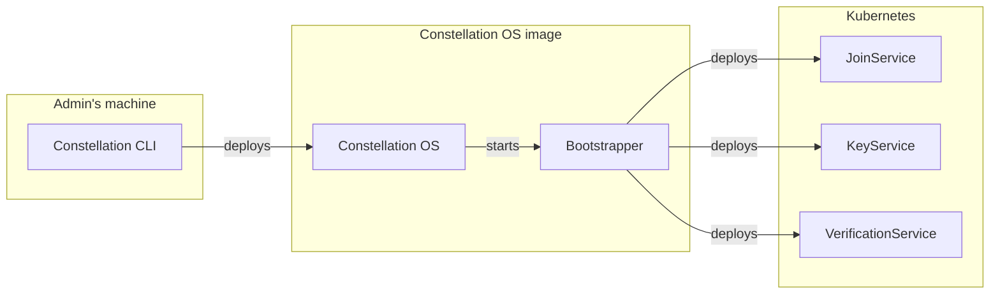
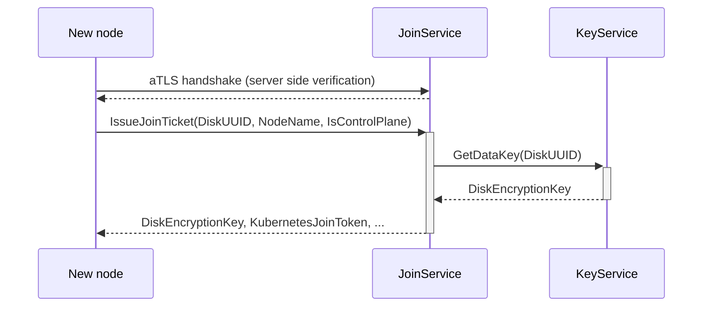

# Microservices

Constellation takes care of bootstrapping and initializing a Confidential Kubernetes cluster.
During the lifetime of the cluster, it handles day 2 operations such as key management, remote attestation, and updates.
These features are provided by several microservices:

* The [Bootstrapper](microservices.md#bootstrapper) initializes a Constellation node and bootstraps the cluster
* The [JoinService](microservices.md#joinservice) joins new nodes to an existing cluster
* The [VerificationService](microservices.md#verificationservice) provides remote attestation functionality
* The [KeyService](microservices.md#keyservice) manages Constellation-internal keys

The relations between microservices are shown in the following diagram:

## Bootstrapper

The *Bootstrapper* is the first microservice launched after booting a Constellation node image.
It sets up that machine as a Kubernetes node and integrates that node into the Kubernetes cluster.
To this end, the *Bootstrapper* first downloads and verifies the [Kubernetes components](https://kubernetes.io/docs/concepts/overview/components/) at the configured versions.
The *Bootstrapper* tries to find an existing cluster and if successful, communicates with the [JoinService](microservices.md#joinservice) to join the node.
Otherwise, it waits for an initialization request to create a new Kubernetes cluster.

## JoinService

The *JoinService* runs as [DaemonSet](https://kubernetes.io/docs/concepts/workloads/controllers/daemonset/) on each control-plane node.
New nodes (at cluster start, or later through autoscaling) send a request to the service over [attested TLS (aTLS)](attestation.md#attested-tls-atls).
The *JoinService* verifies the new node's certificate and attestation statement.
If attestation is successful, the new node is supplied with an encryption key from the [*KeyService*](microservices.md#keyservice) for its state disk, and a Kubernetes bootstrap token.

## VerificationService

The *VerificationService* runs as DaemonSet on each node.
It provides user-facing functionality for remote attestation during the cluster's lifetime via an endpoint for [verifying the cluster](attestation.md#cluster-attestation).
Read more about the hardware-based [attestation feature](attestation.md) of Constellation and how to [verify](../workflows/verify-cluster.md) a cluster on the client side.

## KeyService

The *KeyService* runs as DaemonSet on each control-plane node.
It implements the key management for the [storage encryption keys](keys.md#storage-encryption) in Constellation. These keys are used for the [state disk](images.md#state-disk) of each node and the [transparently encrypted storage](encrypted-storage.md) for Kubernetes.
Depending on wether the [constellation-managed](keys.md#constellation-managed-key-management) or [user-managed](keys.md#user-managed-key-management) mode is used, the *KeyService* holds the key encryption key (KEK) directly or calls an external key management service (KMS) for key derivation respectively.
