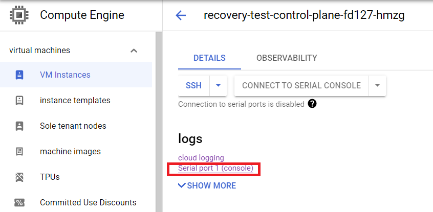

# Recover your cluster

Recovery of a Constellation cluster means getting it back into a healthy state after too many concurrent node failures in the control plane.
Reasons for an unhealthy cluster can vary from a power outage, or planned reboot, to migration of nodes and regions.
Recovery events are rare, because Constellation is built for high availability and automatically and securely replaces failed nodes. When a node is replaced, Constellation's control plane first verifies the new node before it sends the node the cryptographic keys required to decrypt its [state disk](../architecture/images.md#state-disk).

Constellation provides a recovery mechanism for cases where the control plane has failed and is unable to replace nodes.
The `constellation recover` command securely connects to all nodes in need of recovery using [attested TLS](../architecture/attestation.md#attested-tls-atls) and provides them with the keys to decrypt their state disks and continue booting.

## Identify unhealthy clusters

The first step to recovery is identifying when a cluster becomes unhealthy.
Usually, this can be first observed when the Kubernetes API server becomes unresponsive.

You can check the health status of the nodes via the cloud service provider (CSP).
Constellation provides logging information on the boot process and status via serial console output.
In the following, you'll find detailed descriptions for identifying clusters stuck in recovery for each CSP.

<Tabs groupId="csp">
<TabItem value="azure" label="Azure">

In the Azure portal, find the cluster's resource group.
Inside the resource group, open the control plane *Virtual machine scale set* `constellation-scale-set-controlplanes-<suffix>`.
On the left, go to **Settings** > **Instances** and check that enough members are in a *Running* state.

Second, check the boot logs of these *Instances*.
In the scale set's *Instances* view, open the details page of the desired instance.
On the left, go to **Support + troubleshooting** > **Serial console**.

In the serial console output, search for `Waiting for decryption key`.
Similar output to the following means your node was restarted and needs to decrypt the [state disk](../architecture/images.md#state-disk):

```json
{"level":"INFO","ts":"2022-09-08T09:56:41Z","caller":"cmd/main.go:55","msg":"Starting disk-mapper","version":"2.0.0","cloudProvider":"azure"}
{"level":"INFO","ts":"2022-09-08T09:56:43Z","logger":"setupManager","caller":"setup/setup.go:72","msg":"Preparing existing state disk"}
{"level":"INFO","ts":"2022-09-08T09:56:43Z","logger":"recoveryServer","caller":"recoveryserver/server.go:59","msg":"Starting RecoveryServer"}
{"level":"INFO","ts":"2022-09-08T09:56:43Z","logger":"rejoinClient","caller":"rejoinclient/client.go:65","msg":"Starting RejoinClient"}
```

The node will then try to connect to the [*JoinService*](../architecture/microservices.md#joinservice) and obtain the decryption key.
If this fails due to an unhealthy control plane, you will see log messages similar to the following:

```json
{"level":"INFO","ts":"2022-09-08T09:56:43Z","logger":"rejoinClient","caller":"rejoinclient/client.go:77","msg":"Received list with JoinService endpoints","endpoints":["10.9.0.5:30090","10.9.0.6:30090"]}
{"level":"INFO","ts":"2022-09-08T09:56:43Z","logger":"rejoinClient","caller":"rejoinclient/client.go:96","msg":"Requesting rejoin ticket","endpoint":"10.9.0.5:30090"}
{"level":"WARN","ts":"2022-09-08T09:57:03Z","logger":"rejoinClient","caller":"rejoinclient/client.go:101","msg":"Failed to rejoin on endpoint","error":"rpc error: code = Unavailable desc = connection error: desc = \"transport: Error while dialing dial tcp 10.9.0.5:30090: i/o timeout\"","endpoint":"10.9.0.5:30090"}
{"level":"INFO","ts":"2022-09-08T09:57:03Z","logger":"rejoinClient","caller":"rejoinclient/client.go:96","msg":"Requesting rejoin ticket","endpoint":"10.9.0.6:30090"}
{"level":"WARN","ts":"2022-09-08T09:57:23Z","logger":"rejoinClient","caller":"rejoinclient/client.go:101","msg":"Failed to rejoin on endpoint","error":"rpc error: code = Unavailable desc = connection error: desc = \"transport: Error while dialing dial tcp 10.9.0.6:30090: i/o timeout\"","endpoint":"10.9.0.6:30090"}
{"level":"ERROR","ts":"2022-09-08T09:57:23Z","logger":"rejoinClient","caller":"rejoinclient/client.go:110","msg":"Failed to rejoin on all endpoints"}
```

This means that you have to recover the node manually.

</TabItem>
<TabItem value="gcp" label="GCP">

First, check that the control plane *Instance Group* has enough members in a *Ready* state.
In the GCP Console, go to **Instance Groups** and check the group for the cluster's control plane `<cluster-name>-control-plane-<suffix>`.

Second, check the status of the *VM Instances*.
Go to **VM Instances** and open the details of the desired instance.
Check the serial console output of that instance by opening the **Logs** > **Serial port 1 (console)** page:



In the serial console output, search for `Waiting for decryption key`.
Similar output to the following means your node was restarted and needs to decrypt the [state disk](../architecture/images.md#state-disk):

```json
{"level":"INFO","ts":"2022-09-08T10:21:53Z","caller":"cmd/main.go:55","msg":"Starting disk-mapper","version":"2.0.0","cloudProvider":"gcp"}
{"level":"INFO","ts":"2022-09-08T10:21:53Z","logger":"setupManager","caller":"setup/setup.go:72","msg":"Preparing existing state disk"}
{"level":"INFO","ts":"2022-09-08T10:21:53Z","logger":"rejoinClient","caller":"rejoinclient/client.go:65","msg":"Starting RejoinClient"}
{"level":"INFO","ts":"2022-09-08T10:21:53Z","logger":"recoveryServer","caller":"recoveryserver/server.go:59","msg":"Starting RecoveryServer"}
```

The node will then try to connect to the [*JoinService*](../architecture/microservices.md#joinservice) and obtain the decryption key.
If this fails due to an unhealthy control plane, you will see log messages similar to the following:

```json
{"level":"INFO","ts":"2022-09-08T10:21:53Z","logger":"rejoinClient","caller":"rejoinclient/client.go:77","msg":"Received list with JoinService endpoints","endpoints":["192.168.178.4:30090","192.168.178.2:30090"]}
{"level":"INFO","ts":"2022-09-08T10:21:53Z","logger":"rejoinClient","caller":"rejoinclient/client.go:96","msg":"Requesting rejoin ticket","endpoint":"192.168.178.4:30090"}
{"level":"WARN","ts":"2022-09-08T10:21:53Z","logger":"rejoinClient","caller":"rejoinclient/client.go:101","msg":"Failed to rejoin on endpoint","error":"rpc error: code = Unavailable desc = connection error: desc = \"transport: Error while dialing dial tcp 192.168.178.4:30090: connect: connection refused\"","endpoint":"192.168.178.4:30090"}
{"level":"INFO","ts":"2022-09-08T10:21:53Z","logger":"rejoinClient","caller":"rejoinclient/client.go:96","msg":"Requesting rejoin ticket","endpoint":"192.168.178.2:30090"}
{"level":"WARN","ts":"2022-09-08T10:22:13Z","logger":"rejoinClient","caller":"rejoinclient/client.go:101","msg":"Failed to rejoin on endpoint","error":"rpc error: code = Unavailable desc = connection error: desc = \"transport: Error while dialing dial tcp 192.168.178.2:30090: i/o timeout\"","endpoint":"192.168.178.2:30090"}
{"level":"ERROR","ts":"2022-09-08T10:22:13Z","logger":"rejoinClient","caller":"rejoinclient/client.go:110","msg":"Failed to rejoin on all endpoints"}
```

This means that you have to recover the node manually.

</TabItem>
<TabItem value="aws" label="AWS">

First, open the AWS console to view all Auto Scaling Groups (ASGs) in the region of your cluster. Select the ASG of the control plane `<cluster-name>-<UID>-control-plane` and check that enough members are in a *Running* state.

Second, check the boot logs of these *Instances*. In the ASG's *Instance management* view, select each desired instance. In the upper right corner, select **Action > Monitor and troubleshoot > Get system log**.

In the serial console output, search for `Waiting for decryption key`.
Similar output to the following means your node was restarted and needs to decrypt the [state disk](../architecture/images.md#state-disk):

```json
{"level":"INFO","ts":"2022-09-08T10:21:53Z","caller":"cmd/main.go:55","msg":"Starting disk-mapper","version":"2.0.0","cloudProvider":"gcp"}
{"level":"INFO","ts":"2022-09-08T10:21:53Z","logger":"setupManager","caller":"setup/setup.go:72","msg":"Preparing existing state disk"}
{"level":"INFO","ts":"2022-09-08T10:21:53Z","logger":"rejoinClient","caller":"rejoinclient/client.go:65","msg":"Starting RejoinClient"}
{"level":"INFO","ts":"2022-09-08T10:21:53Z","logger":"recoveryServer","caller":"recoveryserver/server.go:59","msg":"Starting RecoveryServer"}
```

The node will then try to connect to the [*JoinService*](../architecture/microservices.md#joinservice) and obtain the decryption key.
If this fails due to an unhealthy control plane, you will see log messages similar to the following:

```json
{"level":"INFO","ts":"2022-09-08T10:21:53Z","logger":"rejoinClient","caller":"rejoinclient/client.go:77","msg":"Received list with JoinService endpoints","endpoints":["192.168.178.4:30090","192.168.178.2:30090"]}
{"level":"INFO","ts":"2022-09-08T10:21:53Z","logger":"rejoinClient","caller":"rejoinclient/client.go:96","msg":"Requesting rejoin ticket","endpoint":"192.168.178.4:30090"}
{"level":"WARN","ts":"2022-09-08T10:21:53Z","logger":"rejoinClient","caller":"rejoinclient/client.go:101","msg":"Failed to rejoin on endpoint","error":"rpc error: code = Unavailable desc = connection error: desc = \"transport: Error while dialing dial tcp 192.168.178.4:30090: connect: connection refused\"","endpoint":"192.168.178.4:30090"}
{"level":"INFO","ts":"2022-09-08T10:21:53Z","logger":"rejoinClient","caller":"rejoinclient/client.go:96","msg":"Requesting rejoin ticket","endpoint":"192.168.178.2:30090"}
{"level":"WARN","ts":"2022-09-08T10:22:13Z","logger":"rejoinClient","caller":"rejoinclient/client.go:101","msg":"Failed to rejoin on endpoint","error":"rpc error: code = Unavailable desc = connection error: desc = \"transport: Error while dialing dial tcp 192.168.178.2:30090: i/o timeout\"","endpoint":"192.168.178.2:30090"}
{"level":"ERROR","ts":"2022-09-08T10:22:13Z","logger":"rejoinClient","caller":"rejoinclient/client.go:110","msg":"Failed to rejoin on all endpoints"}
```

This means that you have to recover the node manually.

</TabItem>
</Tabs>

## Recover a cluster

Recovering a cluster requires the following parameters:

* The `constellation-state.yaml` file in your working directory or the cluster's endpoint
* The master secret of the cluster

A cluster can be recovered like this:

```bash
$ constellation recover --master-secret constellation-mastersecret.json
Pushed recovery key.
Pushed recovery key.
Pushed recovery key.
Recovered 3 control-plane nodes.
```

In the serial console output of the node you'll see a similar output to the following:

```json
{"level":"INFO","ts":"2022-09-08T10:26:59Z","logger":"recoveryServer","caller":"recoveryserver/server.go:93","msg":"Received recover call"}
{"level":"INFO","ts":"2022-09-08T10:26:59Z","logger":"recoveryServer","caller":"recoveryserver/server.go:125","msg":"Received state disk key and measurement secret, shutting down server"}
{"level":"INFO","ts":"2022-09-08T10:26:59Z","logger":"recoveryServer.gRPC","caller":"zap/server_interceptors.go:61","msg":"finished streaming call with code OK","grpc.start_time":"2022-09-08T10:26:59Z","system":"grpc","span.kind":"server","grpc.service":"recoverproto.API","grpc.method":"Recover","peer.address":"192.0.2.3:41752","grpc.code":"OK","grpc.time_ms":15.701}
{"level":"INFO","ts":"2022-09-08T10:27:13Z","logger":"rejoinClient","caller":"rejoinclient/client.go:87","msg":"RejoinClient stopped"}
```
