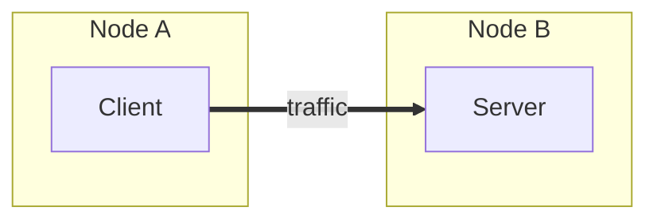
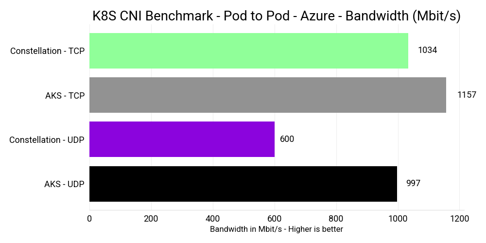
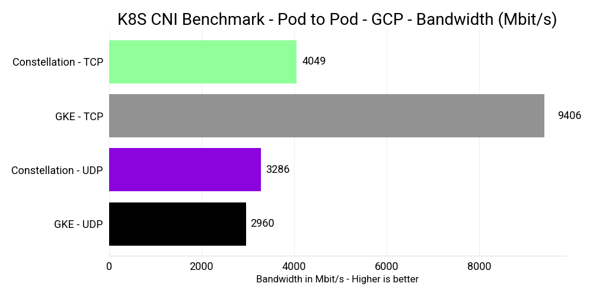
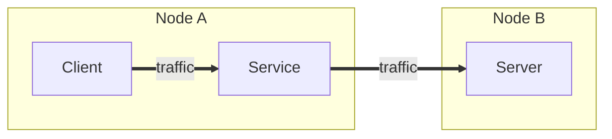
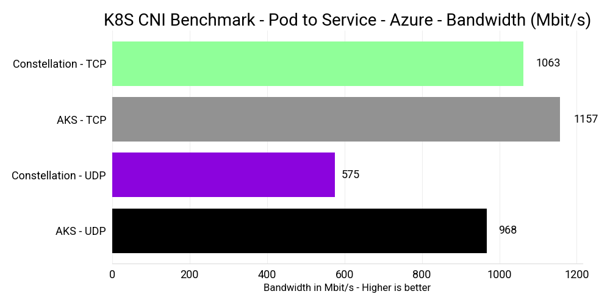
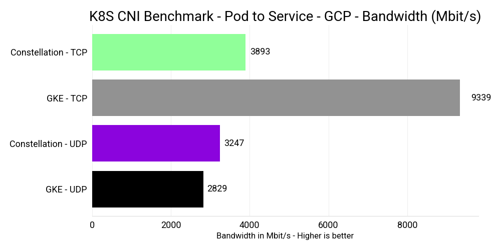
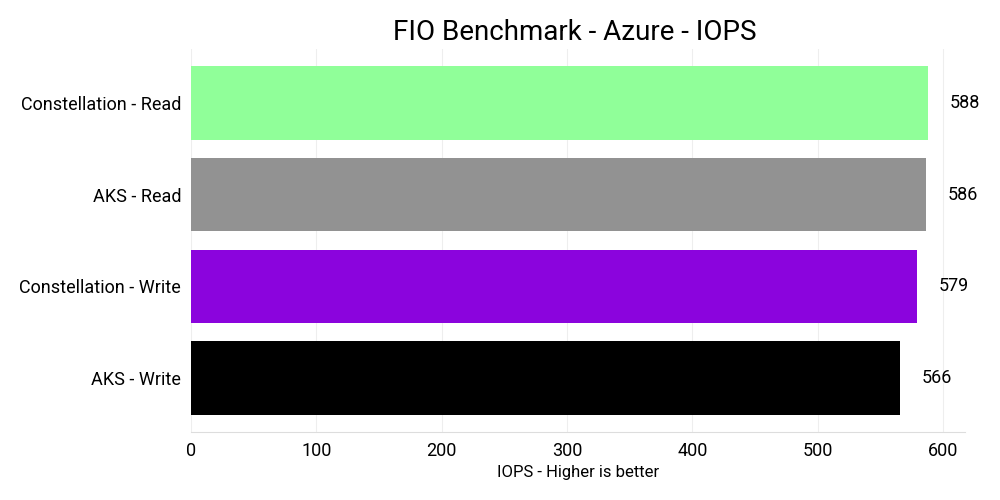
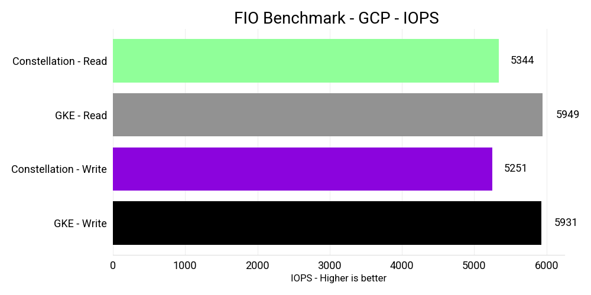
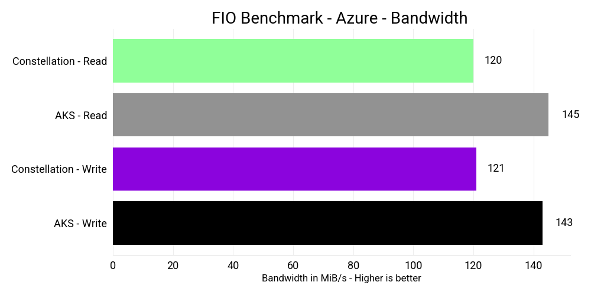
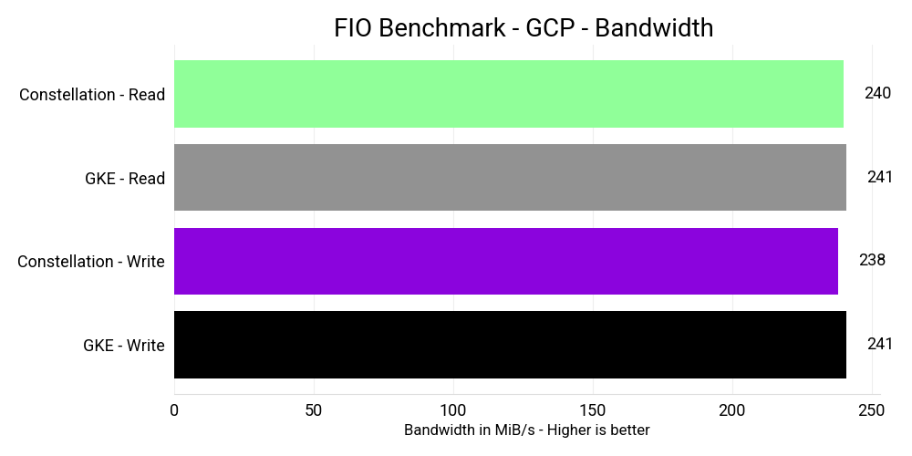

# I/O performance benchmarks

To assess the overall performance of Constellation, this benchmark evaluates Constellation v2.6.0 in terms of storage I/O using [`fio`](https://fio.readthedocs.io/en/latest/fio_doc.html) and network performance using the [Kubernetes Network Benchmark](https://github.com/InfraBuilder/k8s-bench-suite#knb--kubernetes-network-be).

This benchmark tested Constellation on Azure and GCP and compared the results against the managed Kubernetes offerings AKS and GKE.

## Configurations

### Constellation

The benchmark was conducted with Constellation v2.6.0, Kubernetes v1.25.7, and Cilium v1.12.
It ran on the following infrastructure configurations.

Constellation on Azure:

- Nodes: 3 (1 Control-plane, 2 Worker)
- Machines: `DC4as_v5`: 3rd Generation AMD EPYC 7763v (Milan) processor with 4 Cores, 16 GiB memory
- CVM: `true`
- Region: `West US`
- Zone: `2`

Constellation on GCP:

- Nodes: 3 (1 Control-plane, 2 Worker)
- Machines: `n2d-standard-4`: 2nd Generation AMD EPYC (Rome) processor with 4 Cores, 16 GiB of memory
- CVM: `true`
- Zone: `europe-west3-b`

### AKS

On AKS, the benchmark used Kubernetes `v1.24.9` and nodes with version `AKSUbuntu-1804gen2containerd-2023.02.15`.
AKS ran with the [`kubenet`](https://learn.microsoft.com/en-us/azure/aks/concepts-network#kubenet-basic-networking) CNI and the [default CSI driver](https://learn.microsoft.com/en-us/azure/aks/azure-disk-csi) for Azure Disk.

The following infrastructure configurations was used:

- Nodes: 2 (2 Worker)
- Machines: `D4as_v5`: 3rd Generation AMD EPYC 7763v (Milan) processor with 4 Cores, 16 GiB memory
- CVM: `false`
- Region: `West US`
- Zone: `2`

### GKE

On GKE, the benchmark used Kubernetes `v1.24.9` and nodes with version `1.24.9-gke.3200`.
GKE ran with the [`kubenet`](https://cloud.google.com/kubernetes-engine/docs/concepts/network-overview) CNI and the [default CSI driver](https://cloud.google.com/kubernetes-engine/docs/how-to/persistent-volumes/gce-pd-csi-driver) for Compute Engine persistent disk.

The following infrastructure configurations was used:

- Nodes: 2 (2 Worker)
- Machines: `n2d-standard-4` 2nd Generation AMD EPYC (Rome) processor with 4 Cores, 16 GiB of memory
- CVM: `false`
- Zone: `europe-west3-b`

## Results

### Network

This section gives a thorough analysis of the network performance of Constellation, specifically focusing on measuring TCP and UDP bandwidth.
The benchmark measured the bandwidth of pod-to-pod and pod-to-service connections between two different nodes using [`iperf`](https://iperf.fr/).

GKE and Constellation on GCP had a maximum network bandwidth of [10 Gbps](https://cloud.google.com/compute/docs/general-purpose-machines#n2d_machines).
AKS with `Standard_D4as_v5` machines a maximum network bandwidth of [12.5 Gbps](https://learn.microsoft.com/en-us/azure/virtual-machines/dasv5-dadsv5-series#dasv5-series).
The Confidential VM equivalent `Standard_DC4as_v5` currently  has a network bandwidth of [1.25 Gbps](https://learn.microsoft.com/en-us/azure/virtual-machines/dcasv5-dcadsv5-series#dcasv5-series-products).
Therefore, to make the test comparable, both AKS and Constellation on Azure were running with `Standard_DC4as_v5` machines and 1.25 Gbps bandwidth.

Constellation on Azure and AKS used an MTU of 1500.
Constellation on GCP used an MTU of 8896. GKE used an MTU of 1450.

The difference in network bandwidth can largely be attributed to two factors.

- Constellation's [network encryption](../../architecture/networking.md) via Cilium and WireGuard, which protects data in-transit.
- [AMD SEV using SWIOTLB bounce buffers](https://lore.kernel.org/all/20200204193500.GA15564@ashkalra_ubuntu_server/T/) for all DMA including network I/O.

#### Pod-to-Pod

In this scenario, the client Pod connects directly to the server pod via its IP address.

The results for "Pod-to-Pod" on Azure are as follows:

The results for "Pod-to-Pod" on GCP are as follows:

#### Pod-to-Service

In this scenario, the client Pod connects to the server Pod via a ClusterIP service. This is more relevant to real-world use cases.

The results for "Pod-to-Pod" on Azure are as follows:

The results for "Pod-to-Pod" on GCP are as follows:

In our recent comparison of Constellation on GCP with GKE, Constellation has 58% less TCP bandwidth. However, UDP bandwidth was slightly better with Constellation, thanks to its higher MTU.

Similarly, when comparing Constellation on Azure with AKS using CVMs, Constellation achieved approximately 10% less TCP and 40% less UDP bandwidth.

### Storage I/O

Azure and GCP offer persistent storage for their Kubernetes services AKS and GKE via the Container Storage Interface (CSI). CSI storage in Kubernetes is available via `PersistentVolumes` (PV) and consumed via `PersistentVolumeClaims` (PVC).
Upon requesting persistent storage through a PVC, GKE and AKS will provision a PV as defined by a default [storage class](https://kubernetes.io/docs/concepts/storage/storage-classes/).
Constellation provides persistent storage on Azure and GCP [that's encrypted on the CSI layer](../../architecture/encrypted-storage.md).
Similarly, upon a PVC request, Constellation will provision a PV via a default storage class.

For Constellation on Azure and AKS, the benchmark ran with Azure Disk storage [Standard SSD](https://learn.microsoft.com/en-us/azure/virtual-machines/disks-types#standard-ssds) of 400 GiB size.
The [DC4as machine type](https://learn.microsoft.com/en-us/azure/virtual-machines/dasv5-dadsv5-series#dasv5-series) with four cores provides the following maximum performance:

- 6400 (20000 burst) IOPS
- 144 MB/s (600 MB/s burst) throughput

However, the performance is bound by the capabilities of the [512 GiB Standard SSD size](https://learn.microsoft.com/en-us/azure/virtual-machines/disks-types#standard-ssds) (the size class of 400 GiB volumes):

- 500 (600 burst) IOPS
- 60 MB/s (150 MB/s burst) throughput

For Constellation on GCP and GKE, the benchmark ran with Compute Engine Persistent Disk Storage [pd-balanced](https://cloud.google.com/compute/docs/disks) of 400 GiB size.
The N2D machine type with four cores and pd-balanced provides the following [maximum performance](https://cloud.google.com/compute/docs/disks/performance#n2d_vms):

- 3,000 read IOPS
- 15,000 write IOPS
- 240 MB/s read throughput
- 240 MB/s write throughput

However, the performance is bound by the capabilities of a [`Zonal balanced PD`](https://cloud.google.com/compute/docs/disks/performance#zonal-persistent-disks) with 400 GiB size:

- 2400 read IOPS
- 2400 write IOPS
- 112 MB/s read throughput
- 112 MB/s write throughput

The [`fio`](https://fio.readthedocs.io/en/latest/fio_doc.html) benchmark consists of several tests.
The benchmark used [`Kubestr`](https://github.com/kastenhq/kubestr) to run `fio` in Kubernetes.
The default test performs randomized access patterns that accurately depict worst-case I/O scenarios for most applications.

The following `fio` settings were used:

- No Cloud caching
- No OS caching
- Single CPU
- 60 seconds runtime
- 10 seconds ramp-up time
- 10 GiB file
- IOPS: 4 KB blocks and 128 iodepth
- Bandwidth: 1024 KB blocks and 128 iodepth

For more details, see the [`fio` test configuration](https://github.com/edgelesssys/constellation/blob/main/.github/actions/e2e_benchmark/fio.ini).

The results for IOPS on Azure are as follows:

The results for IOPS on GCP are as follows:

The results for bandwidth on Azure are as follows:

The results for bandwidth on GCP are as follows:

On GCP, the results exceed the maximum performance guarantees of the chosen disk type. There are two possible explanations for this. The first is that there may be cloud caching in place that isn't configurable. Alternatively, the underlying provisioned disk size may be larger than what was requested, resulting in higher performance boundaries.

When comparing Constellation on GCP with GKE, Constellation has similar bandwidth but about 10% less IOPS performance. On Azure, Constellation has similar IOPS performance compared to AKS, where both likely hit the maximum storage performance. However, Constellation has approximately 15% less read and write bandwidth.

## Conclusion

Despite the added [security benefits](../security-benefits.md) that Constellation provides, it only incurs a slight performance overhead when compared to managed Kubernetes offerings such as AKS and GKE. In most compute benchmarks, Constellation is on par with it's alternatives.
While it may be slightly slower in certain I/O scenarios due to network and storage encryption, there is ongoing work to reduce this overhead to single digits.

For instance, storage encryption only adds between 10% to 15% overhead in terms of bandwidth and IOPS.
Meanwhile, the biggest performance impact that Constellation currently faces is network encryption, which can incur up to 58% overhead on a 10 Gbps network.
However, the Cilium team has conducted [benchmarks with Cilium using WireGuard encryption](https://docs.cilium.io/en/latest/operations/performance/benchmark/#encryption-wireguard-ipsec) on a 100 Gbps network that yielded over 15 Gbps.
We're confident that Constellation will provide a similar level of performance with an upcoming release.

Overall, Constellation strikes a great balance between security and performance, and we're continuously working to improve its performance capabilities while maintaining its high level of security.
