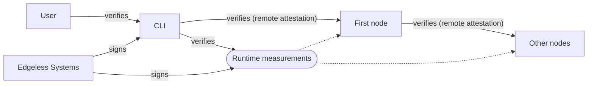

# Attestation

This page explains Constellation's attestation process and highlights the cornerstones of its trust model.

## Terms

The following lists terms and concepts that help to understand the attestation concept of Constellation.

### Trusted Platform Module (TPM)

A TPM chip is a dedicated tamper-resistant crypto-processor.
It can securely store artifacts such as passwords, certificates, encryption keys, or *runtime measurements* (more on this below).
When a TPM is implemented in software, it's typically called a *virtual* TPM (vTPM).

### Runtime measurement

A runtime measurement is a cryptographic hash of the memory pages of a so called *runtime component*. Runtime components of interest typically include a system's bootloader or OS kernel.

### Platform Configuration Register (PCR)

A Platform Configuration Register (PCR) is a memory location in the TPM that has some unique properties.
To store a new value in a PCR, the existing value is extended with a new value as follows:

```
PCR[N] = HASHalg( PCR[N] || ArgumentOfExtend )
```

The PCRs are typically used to store runtime measurements.
The new value of a PCR is always an extension of the existing value.
Thus, storing the measurements of multiple components into the same PCR irreversibly links them together.

### Measured boot

Measured boot builds on the concept of chained runtime measurements.
Each component in the boot chain loads and measures the next component into the PCR before executing it.
By comparing the resulting PCR values against trusted reference values, the integrity of the entire boot chain and thereby the running system can be ensured.

### Remote attestation (RA)

Remote attestation is the process of verifying certain properties of an application or platform, such as integrity and confidentiality, from a remote location.
In the case of a measured boot, the goal is to obtain a signed attestation statement on the PCR values of the boot measurements.
The statement can then be verified and compared to a set of trusted reference values.
This way, the integrity of the platform can be ensured before sharing secrets with it.

### Confidential virtual machine (CVM)

Confidential computing (CC) is the protection of data in-use with hardware-based trusted execution environments (TEEs).
With CVMs, TEEs encapsulate entire virtual machines and isolate them against the hypervisor, other VMs, and direct memory access.
After loading the initial VM image into encrypted memory, the hypervisor calls for a secure processor to measure these initial memory pages.
The secure processor locks these pages and generates an attestation report on the initial page measurements.
CVM memory pages are encrypted with a key that resides inside the secure processor, which makes sure only the guest VM can access them.
The attestation report is signed by the secure processor and can be verified using remote attestation via the certificate authority of the hardware vendor.
Such an attestation statement guarantees the confidentiality and integrity of a CVM.

### Attested TLS (aTLS)

In a CC environment, attested TLS (aTLS) can be used to establish secure connections between two parties using the remote attestation features of the CC components.

aTLS modifies the TLS handshake by embedding an attestation statement into the TLS certificate.
Instead of relying on a certificate authority, aTLS uses this attestation statement to establish trust in the certificate.

The protocol can be used by clients to verify a server certificate, by a server to verify a client certificate, or for mutual verification (mutual aTLS).

## Overview

The challenge for Constellation is to lift a CVM's attestation statement to the Kubernetes software layer and make it end-to-end verifiable.
From there, Constellation needs to expand the attestation from a single CVM to the entire cluster.

The [*JoinService*](microservices.md#joinservice) and [*VerificationService*](microservices.md#verificationservice) are where all runs together.
Internally, the *JoinService* uses remote attestation to securely join CVM nodes to the cluster.
Externally, the *VerificationService* provides an attestation statement for the cluster's CVMs and configuration.

The following explains the details of both steps.

## Node attestation

The idea is that Constellation nodes should have verifiable integrity from the CVM hardware measurement up to the Kubernetes software layer.
The solution is a verifiable boot chain and an integrity-protected runtime environment.

Constellation uses measured boot within CVMs, measuring each component in the boot process before executing it.
Outside of CC, this is usually implemented via TPMs.
CVM technologies differ in how they implement runtime measurements, but the general concepts are similar to those of a TPM.
For simplicity, TPM terminology like *PCR* is used in the following.

When a Constellation node image boots inside a CVM, measured boot is used for all stages and components of the boot chain.
This process goes up to the root filesystem.
The root filesystem is mounted read-only with integrity protection.
For the details on the image and boot stages see the [image architecture](../architecture/images.md) documentation.
Any changes to the image will inevitably also change the corresponding PCR values.
To create a node attestation statement, the Constellation image obtains a CVM attestation statement from the hardware.
This includes the runtime measurements and thereby binds the measured boot results to the CVM hardware measurement.

In addition to the image measurements, Constellation extends a PCR during the [initialization phase](../workflows/create.md) that irrevocably marks the node as initialized.
The measurement is created using the [*clusterID*](../architecture/keys.md#cluster-identity), tying all future attestation statements to this ID.
Thereby, an attestation statement is unique for every cluster and a node can be identified unambiguously as being initialized.

To verify an attestation, the hardware's signature and a statement are verified first to establish trust in the contained runtime measurements.
If successful, the measurements are verified against the trusted values of the particular Constellation release version.
Finally, the measurement of the *clusterID* can be compared by calculating it with the [master secret](keys.md#master-secret).

### Runtime measurements

Constellation uses runtime measurements to implement the measured boot approach.
As stated above, the underlying hardware technology and guest firmware differ in their implementations of runtime measurements.
The following gives a detailed description of the available measurements in the different cloud environments.

The runtime measurements consist of two types of values:

* **Measurements produced by the cloud infrastructure and firmware of the CVM**:
These are measurements of closed-source firmware and other values controlled by the cloud provider.
While not being reproducible for the user, some of them can be compared against previously observed values.
Others may change frequently and aren't suitable for verification.
The [signed image measurements](#chain-of-trust) include measurements that are known, previously observed values.

* **Measurements produced by the Constellation bootloader and boot chain**:
The Constellation Bootloader takes over from the CVM firmware and [measures the rest of the boot chain](images.md).
The Constellation [Bootstrapper](microservices.md#bootstrapper) is the first user mode component that runs in a Constellation image.
It extends PCR registers with the [IDs](keys.md#cluster-identity) of the cluster marking a node as initialized.

Constellation allows to specify in the config which measurements should be enforced during the attestation process.
Enforcing non-reproducible measurements controlled by the cloud provider means that changes in these values require manual updates to the cluster's config.
By default, Constellation only enforces measurements that are stable values produced by the infrastructure or by Constellation directly.

<Tabs groupId="csp">
<TabItem value="aws" label="AWS">

Constellation uses the [vTPM](https://docs.aws.amazon.com/AWSEC2/latest/UserGuide/nitrotpm.html) (NitroTPM) feature of the [AWS Nitro System](http://aws.amazon.com/ec2/nitro/) on AWS for runtime measurements.

The vTPM adheres to the [TPM 2.0](https://trustedcomputinggroup.org/resource/tpm-library-specification/) specification.
The VMs are attested by obtaining signed PCR values over the VM's boot configuration from the TPM and comparing them to a known, good state (measured boot).

The following table lists all PCR values of the vTPM and the measured components.
It also lists what components of the boot chain did the measurements and if the value is reproducible and verifiable.
The latter means that the value can be generated offline and compared to the one in the vTPM.

| PCR         | Components                                                       | Measured by                            | Reproducible and verifiable |
| ----------- | ---------------------------------------------------------------- | -------------------------------------- | --------------------------- |
| 0           | Firmware                                                         | AWS                                    | No                          |
| 1           | Firmware                                                         | AWS                                    | No                          |
| 2           | Firmware                                                         | AWS                                    | No                          |
| 3           | Firmware                                                         | AWS                                    | No                          |
| 4           | Constellation Bootloader, Kernel, initramfs, Kernel command line | AWS, Constellation Bootloader          | Yes                         |
| 5           | Firmware                                                         | AWS                                    | No                          |
| 6           | Firmware                                                         | AWS                                    | No                          |
| 7           | Secure Boot Policy                                               | AWS, Constellation Bootloader          | No                          |
| 8           | -                                                                | -                                      | -                           |
| 9           | initramfs, Kernel command line                                   | Linux Kernel                           | Yes                         |
| 10          | User space                                                       | Linux IMA                              | No[^1]                      |
| 11          | Unified Kernel Image components                                  | Constellation Bootloader               | Yes                         |
| 12          | Reserved                                                         | (User space, Constellation Bootloader) | Yes                         |
| 13          | Reserved                                                         | (Constellation Bootloader)             | Yes                         |
| 14          | Secure Boot State                                                | Constellation Bootloader               | No                          |
| 15          | ClusterID                                                        | Constellation Bootstrapper             | Yes                         |
| 16&ndash;23 | Unused                                                           | -                                      | -                           |

</TabItem>
<TabItem value="azure" label="Azure">

Constellation uses the [vTPM](https://docs.microsoft.com/en-us/azure/virtual-machines/trusted-launch#vtpm) feature of Azure CVMs for runtime measurements.
This vTPM adheres to the [TPM 2.0](https://trustedcomputinggroup.org/resource/tpm-library-specification/) specification.
It provides a [measured boot](https://docs.microsoft.com/en-us/azure/security/fundamentals/measured-boot-host-attestation#measured-boot) verification that's based on the trusted launch feature of [Trusted Launch VMs](https://docs.microsoft.com/en-us/azure/virtual-machines/trusted-launch).

The following table lists all PCR values of the vTPM and the measured components.
It also lists what components of the boot chain did the measurements and if the value is reproducible and verifiable.
The latter means that the value can be generated offline and compared to the one in the vTPM.

| PCR         | Components                                                       | Measured by                            | Reproducible and verifiable |
| ----------- | ---------------------------------------------------------------- | -------------------------------------- | --------------------------- |
| 0           | Firmware                                                         | Azure                                  | No                          |
| 1           | Firmware                                                         | Azure                                  | No                          |
| 2           | Firmware                                                         | Azure                                  | No                          |
| 3           | Firmware                                                         | Azure                                  | No                          |
| 4           | Constellation Bootloader, Kernel, initramfs, Kernel command line | Azure, Constellation Bootloader        | Yes                         |
| 5           | Reserved                                                         | Azure                                  | No                          |
| 6           | VM Unique ID                                                     | Azure                                  | No                          |
| 7           | Secure Boot State                                                | Azure, Constellation Bootloader        | No                          |
| 8           | -                                                                | -                                      | -                           |
| 9           | initramfs, Kernel command line                                   | Linux Kernel                           | Yes                         |
| 10          | User space                                                       | Linux IMA                              | No[^1]                      |
| 11          | Unified Kernel Image components                                  | Constellation Bootloader               | Yes                         |
| 12          | Reserved                                                         | (User space, Constellation Bootloader) | Yes                         |
| 13          | Reserved                                                         | (Constellation Bootloader)             | Yes                         |
| 14          | Secure Boot State                                                | Constellation Bootloader               | No                          |
| 15          | ClusterID                                                        | Constellation Bootstrapper             | Yes                         |
| 16&ndash;23 | Unused                                                           | -                                      | -                           |

</TabItem>
<TabItem value="gcp" label="GCP">

Constellation uses the [vTPM](https://cloud.google.com/compute/confidential-vm/docs/about-cvm) feature of CVMs on GCP for runtime measurements.
Note that this vTPM doesn't run inside the hardware-protected CVM context, but is emulated by the hypervisor.

The vTPM adheres to the [TPM 2.0](https://trustedcomputinggroup.org/resource/tpm-library-specification/) specification.
It provides a [launch attestation report](https://cloud.google.com/compute/confidential-vm/docs/monitoring#about_launch_attestation_report_events) that's based on the measured boot feature of [Shielded VMs](https://cloud.google.com/compute/shielded-vm/docs/shielded-vm#measured-boot).

The following table lists all PCR values of the vTPM and the measured components.
It also lists what components of the boot chain did the measurements and if the value is reproducible and verifiable.
The latter means that the value can be generated offline and compared to the one in the vTPM.

| PCR         | Components                                                       | Measured by                            | Reproducible and verifiable |
| ----------- | ---------------------------------------------------------------- | -------------------------------------- | --------------------------- |
| 0           | CVM version and technology                                       | GCP                                    | No                          |
| 1           | Firmware                                                         | GCP                                    | No                          |
| 2           | Firmware                                                         | GCP                                    | No                          |
| 3           | Firmware                                                         | GCP                                    | No                          |
| 4           | Constellation Bootloader, Kernel, initramfs, Kernel command line | GCP, Constellation Bootloader          | Yes                         |
| 5           | Disk GUID partition table                                        | GCP                                    | No                          |
| 6           | Disk GUID partition table                                        | GCP                                    | No                          |
| 7           | GCP Secure Boot Policy                                           | GCP, Constellation Bootloader          | No                          |
| 8           | -                                                                | -                                      | -                           |
| 9           | initramfs, Kernel command line                                   | Linux Kernel                           | Yes                         |
| 10          | User space                                                       | Linux IMA                              | No[^1]                      |
| 11          | Unified Kernel Image components                                  | Constellation Bootloader               | Yes                         |
| 12          | Reserved                                                         | (User space, Constellation Bootloader) | Yes                         |
| 13          | Reserved                                                         | (Constellation Bootloader)             | Yes                         |
| 14          | Secure Boot State                                                | Constellation Bootloader               | No                          |
| 15          | ClusterID                                                        | Constellation Bootstrapper             | Yes                         |
| 16&ndash;23 | Unused                                                           | -                                      | -                           |

</TabItem>
<TabItem value="stackit" label="STACKIT">

Constellation uses a hypervisor-based vTPM for runtime measurements.

The vTPM adheres to the [TPM 2.0](https://trustedcomputinggroup.org/resource/tpm-library-specification/) specification.
The VMs are attested by obtaining signed PCR values over the VM's boot configuration from the TPM and comparing them to a known, good state (measured boot).

The following table lists all PCR values of the vTPM and the measured components.
It also lists what components of the boot chain did the measurements and if the value is reproducible and verifiable.
The latter means that the value can be generated offline and compared to the one in the vTPM.

| PCR         | Components                                                       | Measured by                            | Reproducible and verifiable |
| ----------- | ---------------------------------------------------------------- | -------------------------------------- | --------------------------- |
| 0           | Firmware                                                         | STACKIT                                | No                          |
| 1           | Firmware                                                         | STACKIT                                | No                          |
| 2           | Firmware                                                         | STACKIT                                | No                          |
| 3           | Firmware                                                         | STACKIT                                | No                          |
| 4           | Constellation Bootloader, Kernel, initramfs, Kernel command line | STACKIT, Constellation Bootloader      | Yes                         |
| 5           | Firmware                                                         | STACKIT                                | No                          |
| 6           | Firmware                                                         | STACKIT                                | No                          |
| 7           | Secure Boot Policy                                               | STACKIT, Constellation Bootloader      | No                          |
| 8           | -                                                                | -                                      | -                           |
| 9           | initramfs, Kernel command line                                   | Linux Kernel                           | Yes                         |
| 10          | User space                                                       | Linux IMA                              | No[^1]                      |
| 11          | Unified Kernel Image components                                  | Constellation Bootloader               | Yes                         |
| 12          | Reserved                                                         | (User space, Constellation Bootloader) | Yes                         |
| 13          | Reserved                                                         | (Constellation Bootloader)             | Yes                         |
| 14          | Secure Boot State                                                | Constellation Bootloader               | No                          |
| 15          | ClusterID                                                        | Constellation Bootstrapper             | Yes                         |
| 16&ndash;23 | Unused                                                           | -                                      | -                           |

</TabItem>
</Tabs>

### CVM verification

To verify the integrity of the received attestation statement, a chain of trust from the CVM technology to the interface providing the statement has to be established.
For verification of the CVM technology, Constellation may expose additional options in its config file.

<Tabs groupId="csp">
<TabItem value="aws" label="AWS">

On AWS, AMD SEV-SNP is used to provide runtime encryption to the VMs.
An SEV-SNP attestation report is used to establish trust in the VM.
You may customize certain parameters for verification of the attestation statement using the Constellation config file.

* TCB versions

  You can set the minimum version numbers of components in the SEV-SNP TCB.
  Use the latest versions to enforce that only machines with the most recent firmware updates are allowed to join the cluster.
  Alternatively, you can set a lower minimum version to allow slightly out-of-date machines to still be able to join the cluster.

* AMD Root Key Certificate

  This certificate is the root of trust for verifying the SEV-SNP certificate chain.

* AMD Signing Key Certificate

  This is the intermediate certificate for verifying the SEV-SNP report's signature.
  If it's not specified, the CLI fetches it from the AMD key distribution server.

</TabItem>
<TabItem value="azure" label="Azure SEV-SNP">

On Azure, AMD SEV-SNP is used to provide runtime encryption to the VMs.
An SEV-SNP attestation report is used to establish trust in the vTPM running inside the VM.
You may customize certain parameters for verification of the attestation statement using the Constellation config file.

* TCB versions

  You can set the minimum version numbers of components in the SEV-SNP TCB.
  Use the latest versions to enforce that only machines with the most recent firmware updates are allowed to join the cluster.
  Alternatively, you can set a lower minimum version to allow slightly out-of-date machines to still be able to join the cluster.

* AMD Root Key Certificate

  This certificate is the root of trust for verifying the SEV-SNP certificate chain.

* Firmware Signer

  This config option allows you to specify how the firmware signer should be verified.
  More explicitly, it controls the verification of the `IDKeyDigest` value in the SEV-SNP attestation report.
  You can provide a list of accepted key digests and specify a policy on how this list is compared against the reported `IDKeyDigest`.

</TabItem>
<TabItem value="gcp" label="GCP">

On GCP, AMD SEV-SNP is used to provide runtime encryption to the VMs.
An SEV-SNP attestation report is used to establish trust in the VM.
You may customize certain parameters for verification of the attestation statement using the Constellation config file.

* TCB versions

  You can set the minimum version numbers of components in the SEV-SNP TCB.
  Use the latest versions to enforce that only machines with the most recent firmware updates are allowed to join the cluster.
  Alternatively, you can set a lower minimum version to allow slightly out-of-date machines to still be able to join the cluster.

* AMD Root Key Certificate

  This certificate is the root of trust for verifying the SEV-SNP certificate chain.

* AMD Signing Key Certificate

  This is the intermediate certificate for verifying the SEV-SNP report's signature.
  If it's not specified, the CLI fetches it from the AMD key distribution server.

</TabItem>
<TabItem value="stackit" label="STACKIT">

On STACKIT, AMD SEV-ES is used to provide runtime encryption to the VMs.
The hypervisor-based vTPM is used to establish trust in the VM via [runtime measurements](#runtime-measurements).
There is no additional configuration available for STACKIT.

</TabItem>
</Tabs>

## Cluster attestation

Cluster-facing, Constellation's [*JoinService*](microservices.md#joinservice) verifies each node joining the cluster given the configured ground truth runtime measurements.
User-facing, the [*VerificationService*](microservices.md#verificationservice) provides an interface to verify a node using remote attestation.
By verifying the first node during the [initialization](microservices.md#bootstrapper) and configuring the ground truth measurements that are subsequently enforced by the *JoinService*, the whole cluster is verified in a transitive way.

### Cluster-facing attestation

The *JoinService* is provided with the runtime measurements of the whitelisted Constellation image version as the ground truth.
During the initialization and the cluster bootstrapping, each node connects to the *JoinService* using [aTLS](#attested-tls-atls).
During the handshake, the node transmits an attestation statement including its runtime measurements.
The *JoinService* verifies that statement and compares the measurements against the ground truth.
For details of the initialization process check the [microservice descriptions](microservices.md).

After the initialization, every node updates its runtime measurements with the *clusterID* value, marking it irreversibly as initialized.
When an initialized node tries to join another cluster, its measurements inevitably mismatch the measurements of an uninitialized node and it will be declined.

### User-facing attestation

The [*VerificationService*](microservices.md#verificationservice) provides an endpoint for obtaining its hardware-based remote attestation statement, which includes the runtime measurements.
A user can [verify](../workflows/verify-cluster.md) this statement and compare the measurements against the configured ground truth and, thus, verify the identity and integrity of all Constellation components and the cluster configuration. Subsequently, the user knows that the entire cluster is in the expected state and is trustworthy.

## Putting it all together

This section puts the aforementioned concepts together and illustrate how trust into a Constellation cluster is established and maintained.

### CLI and node images

It all starts with the CLI executable. The CLI is signed by Edgeless Systems. To ensure non-repudiability for CLI releases, Edgeless Systems publishes corresponding signatures to the public ledger of the [sigstore project](https://www.sigstore.dev/). There's a [step-by-step guide](../workflows/verify-cli.md) on how to verify CLI signatures based on sigstore.

The CLI contains the latest runtime measurements of the Constellation node image for all supported cloud platforms. In case a different version of the node image is to be used, the corresponding runtime measurements can be fetched using the CLI's [fetch-measurements command](../reference/cli.md#constellation-config-fetch-measurements). This command downloads the runtime measurements and the corresponding signature from cdn.confidential.cloud. See for example the following files corresponding to node image v2.16.3:

* [Measurements](https://cdn.confidential.cloud/constellation/v2/ref/-/stream/stable/v2.16.3/image/measurements.json)
* [Signature](https://cdn.confidential.cloud/constellation/v2/ref/-/stream/stable/v2.16.3/image/measurements.json.sig)

The CLI contains the long-term public key of Edgeless Systems to verify the signature of downloaded runtime measurements.

### Cluster creation

When a cluster is [created](../workflows/create.md), the CLI automatically verifies the runtime measurements of the *first node* using remote attestation. Based on this, the CLI and the first node set up a temporary TLS connection. This [aTLS](#attested-tls-atls) connection is used for two things:

1. The CLI sends the [master secret](../architecture/keys.md#master-secret) of the to-be-created cluster to the CLI. The master secret is generated by the first node.
2. The first node sends a [kubeconfig file](https://www.redhat.com/sysadmin/kubeconfig) with Kubernetes credentials to the CLI.

After this, the aTLS connection is closed and the first node bootstraps the Kubernetes cluster. All subsequent interactions between the CLI and the cluster go via the [Kubernetes API](https://kubernetes.io/docs/concepts/overview/kubernetes-api/) server running inside the cluster. The CLI (and other tools like kubectl) use the credentials referenced by the kubeconfig file to authenticate themselves towards the Kubernetes API server and to establish a mTLS connection.

The CLI connects to the Kubernetes API to write the runtime measurements for the applicable node image to etcd. The JoinService uses these runtime measurements to verify all nodes that join the cluster subsequently.

### Chain of trust

In summary, there's a chain of trust based on cryptographic signatures that goes from the user to the cluster via the CLI. This is illustrated in the following diagram.



### Upgrades

Whenever a cluster is [upgraded](../workflows/upgrade.md) to a new version of the node image, the CLI sends the corresponding runtime measurements via the Kubernetes API server. The new runtime measurements are stored in etcd within the cluster and replace any previous runtime measurements. The new runtime measurements are then used automatically by the JoinService for the verification of new nodes.

## References

[^1]: Linux IMA produces runtime measurements of user-space binaries.
However, these measurements aren't deterministic and thus, PCR\[10] can't be compared to a constant value.
Instead, a policy engine must be used to verify the TPM event log against a policy.
