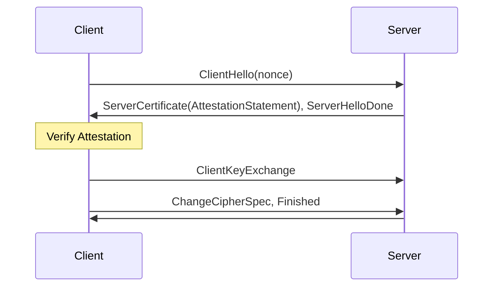
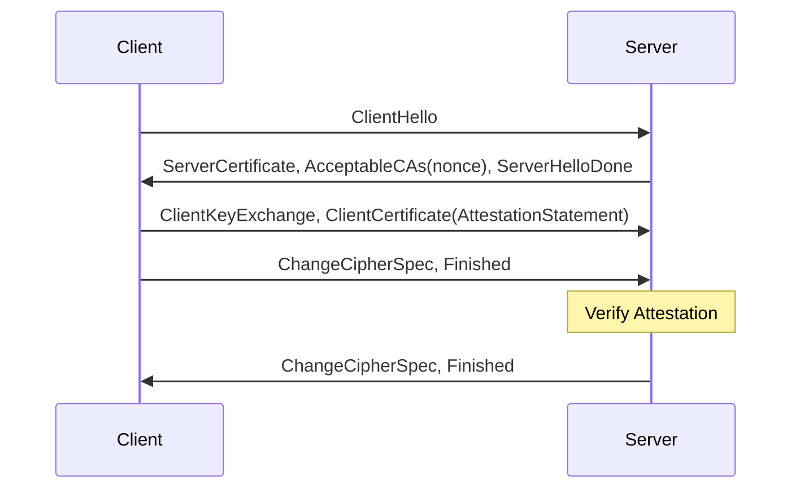
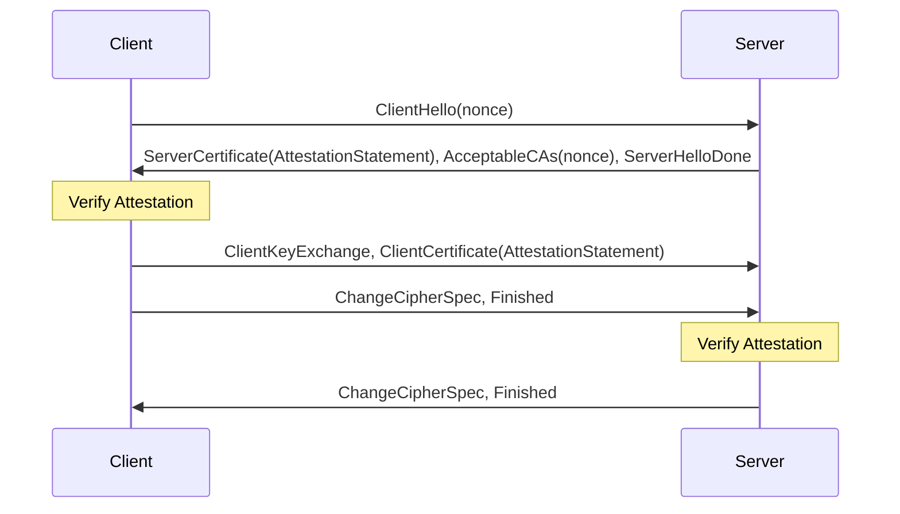

# Attested TLS (aTLS)

In a confidential computing (CC) environment, attested TLS (aTLS) can be used to establish secure connections between two parties utilizing the remote attestation features of the CC components.

aTLS modifies the TLS handshake by embedding an attestation statement into the TLS certificate.
Instead of relying on a Certificate Authority, aTLS uses this attestation statement to establish trust in the certificate.

The protocol can be used by clients to verify a server certificate, by a server to verify a client certificate, or for mutual verification (mutual aTLS).

## Client side verification

1. The client sends a ClientHello message, setting ServerName to a random nonce.

2. The server generates an attestation statement using the clients nonce and its CC capabilities.
    * The attestation is embedded in the server certificate using x509 certificate extensions with an object identifier (OID) to identify the CC attestation type. Take a look at the [`variant`](../attestation/variant/variant.go) package for implementation details.

3. The client verifies the attestation statement.

4. If successful the client can trust the server to be running the expected configuration, and finish the TLS handshake.

## Server side verification

1. The client sends a ClientHello message

2. The server sends back a certificate and a random nonce. The nonce is encoded as the Distinguished Name of an acceptable CA.

3. The client does not verify the servers certificate, but uses the nonce to generate an attestation based on its CC capabilities.
    * The attestation is embedded in the client certificate using x509 certificate extensions with an OID to identify the CC attestation type.

4. The server verifies the client's attestation statement.

5. If successful the server can trust the client to be running the expected configuration, and finish the TLS handshake.

## Mutual aTLS

1. The client sends a ClientHello message, setting ServerName to a random nonce.

2. The server generates an attestation statement using the clients nonce and its CC capabilities.
    * The attestation is embedded in the server certificate using x509 certificate extensions with an OID to identify the attestation type.
    * A nonce is encoded as the Distinguished Name of an acceptable CA.

3. The client verifies the attestation statement.

4. The client uses the nonce to generate an attestation based on its CC capabilities.
    * The attestation is embedded in the client certificate using x509 certificate extensions with an OID to identify the CC attestation type.

5. The server verifies the client's attestation statement.

6. If all verifications were successful, mutual trust in each others configuration is established, and the TLS handshake can be finished.

