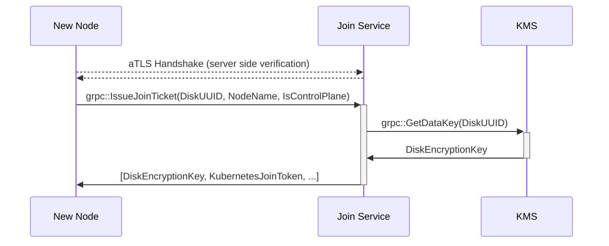

# Join Service

Implementation for Constellation's node flow to join an existing cluster.

The join service runs on each control-plane node of the Kubernetes cluster.
New nodes (at cluster start, or later through autoscaling) send an IssueJoinTicket request to the service over [aTLS](../internal/atls/).
The join service verifies the new nodes certificate and attestation statement.
If attestation is successful, the new node is supplied with a disk encryption key for its state disk, and a Kubernetes bootstrap token, so it may join the cluster.

## Packages

### [joinproto](./joinproto/)

Proto definitions for the join service.

### [internal/server](./internal/server/)

The `server` implements gRPC endpoints for joining the cluster and holds the main application logic.

Connections between the join service and joining nodes are secured using [aTLS](../internal/atls/README.md)



### [internal/kms](./internal/kms/)

Implements interaction with Constellation's keyservice.
This is needed for fetching data encryption keys for joining nodes.

### [internal/kubeadm](./internal/kubeadm/)

Implements interaction with the Kubernetes API to create join tokens for new nodes.

## Docker image

Build the image:

```shell
bazel build //joinservice/cmd:joinservice
bazel build //bazel/release:joinservice_sum
bazel build //bazel/release:joinservice_tar
bazel run //bazel/release:joinservice_push
```
