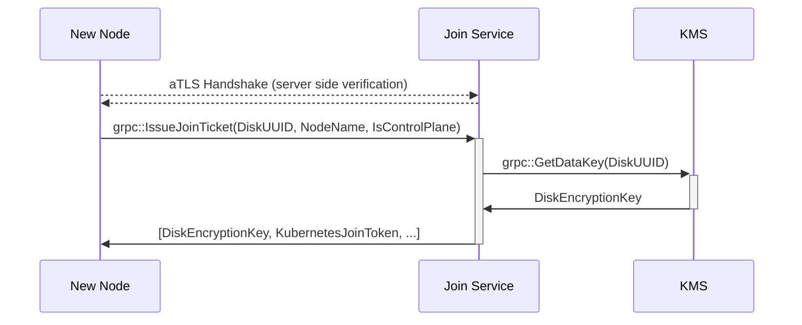

# Join Service

Implementation for Constellation's node flow to join an existing cluster.

The join service runs on each control-plane node of the Kubernetes cluster.
New nodes (at cluster start, or later through autoscaling) send an IssueJoinTicket request to the service over [aTLS](../coordinator/atls/).
The join service verifies the new nodes certificate and attestation statement.
If attestation is successful, the new node is supplied with a disk encryption key for its state disk, and a Kubernetes bootstrap token, so it may join the cluster.

The join service uses klog v2 for logging.
Use the `-v` flag to set the log verbosity level.
Use different verbosity levels during development depending on the information:

* 2 for information that should always be logged. Examples: server starting, new gRPC request.

* 4 for general logging. If you are unsure what log level to use, use 4.

* 6 for low level information logging. Example: values of new expected measurements

* Potentially sensitive information, such as return values of functions should never be logged.

## Packages

### [joinproto](./joinproto/)

Proto definitions for the join service.

### [internal/server](./internal/server/)

The `server` implements gRPC endpoints for joining the cluster and holds the main application logic.

Connections between the join service and joining nodes are secured using [aTLS](../internal/atls/README.md)



### [internal/kms](./internal/kms/)

Implements interaction with Constellation's key management service.
This is needed for fetching data encryption keys for joining nodes.

### [internal/kubeadm](./internal/kubeadm/)

Implements interaction with the Kubernetes API to create join tokens for new nodes.

### [internal/validator](./internal/validator/)

A wrapper for the more generic `atls.Validator`, allowing for updates to the underlying validator without having to restart the service.

## [Dockerfile](./Dockerfile)

```shell
export VERSION=1.0.0
DOCKER_BUILDKIT=1 docker build --build-arg PROJECT_VERSION=${VERSION} -t ghcr.io/edgelesssys/constellation/join-service:v${VERSION} -f joinservice/Dockerfile .
```
