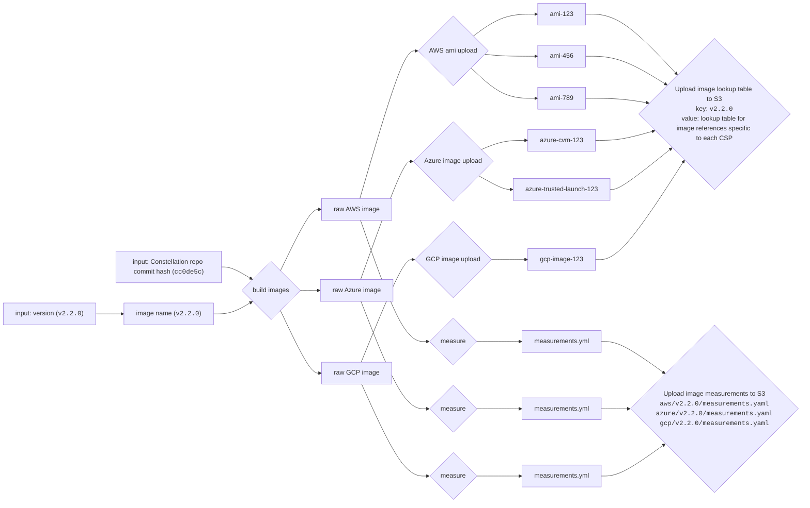

# OS image & measurement discovery

The Constellation OS image build pipeline generates a set of images using a chosen commit of the Constellation monorepo and and a desired release version number.



## Inputs and outputs of the build pipeline

The build pipeline takes as inputs:

- a version number that is one of
  - a release version number (e.g. `v2.2.0`) for release images
  - a pseudo-version number (e.g. `v2.3.0-pre.0.`) for other images
- a branch name of the Constellation monorepo that is used to build the images
- a commit hash of the Constellation monorepo that is used to build the images (e.g. `cc0de5c68d41f31dd0b284d574f137e0b0ad106b`)
- a commit timestamp of the Constellation monorepo that is used to build the images (e.g. `20221115082220`)

The build pipeline produces as outputs:

- a raw OS image for every CSP
- a set of measurements for each raw OS image
- one or more images uploaded to each CSP (e.g. AWS AMIs, Azure images, GCP images)
- a lookup table that maps the image name to the CSP-specific image references

The lookup table is uploaded to S3 and is used to identify the CSP specific references that belong to a given image.
Measurements are uploaded to S3 and can be looked up for each cloud service provider and image name.

## Image API Endpoints

The build pipeline produces artifacts that are uploaded to S3 and can be accessed via HTTP.
The artifacts are organized in a directory structure that allows to look up the artifacts for a given image name.

Where applicable, the API uses the following CSP names:

- `aws` for Amazon Web Services
- `azure` for Microsoft Azure
- `gcp` for Google Cloud Platform
- `qemu` for QEMU

The following HTTP endpoints are available:

- `GET /constellation/v1/ref/<REF>/stream/<STREAM>/image/<VERSION>/`
  - [`info.json` returns the lookup table for the given image version.](#image-lookup-table)
  - `sbom.<format>.json` contains SBOM files for the given image version. The exact formats and file names are TBD.
- `GET /constellation/v1/ref/<REF>/stream/<STREAM>/<VERSION>/csp/<csp>/` contains files with measurements and signatures for the given image version and CSP.
  - `measurements.json` contains the final measurements for the given image version and CSP.
  - `measurements.json.sig` returns the signature of the measurements file.
  - `measurements.image.json` returns the measurements generated statically from the image.
  - `image.raw` returns the raw image for the given image version and CSP.


## Image lookup table

The image lookup table is a JSON file that maps the image name consisting of `ref`, `stream` and `version` to the CSP-specific image references:

```
/constellation/v1/ref/<REF>/stream/<STREAM>/image/<VERSION>/info.json
```

```json
{
  "version": "<VERSION>",
  "ref": "<REF>",
  "stream": "<STREAM>",
  "debug": true,
  "aws": {
    "us-east-1": "ami-123",
    "us-west-2": "ami-456",
    "eu-west-1": "ami-789"
  },
  "azure": {
    "cvm": "azure-cvm-123",
    "trustedlaunch": "azure-trusted-launch-123"
  },
  "gcp": {
    "sev-es": "gcp-image-123"
  },
  "qemu": {
    "default": "https://cdn.confidential.cloud/constellation/v1/ref/<REF>/stream/<STREAM>/image/<VERSION>/csp/qemu/image.raw"
  }
}
```

- For AWS, the image lookup table contains the AMI IDs for each region
- For Azure, the image lookup table contains the image IDs for the CVM and Trusted Launch images
- For GCP, the image lookup table contains the image ID
- For QEMU, the image lookup table contains a URL to the QEMU image

This document is not signed and can be extended in the future to include more image references (e.g. if an image is replicated to a new AWS region).
The same document can be used to identify old images that are no longer used and can be deleted for cost optimization.

## CLI image discovery

The CLI needs to be able to discover the image references for a given image name.
By default, the CLI will prefill the `image` field of the `constellation-conf.yaml` when `constellation config generate <CSP>` is run with a hardcoded name (e.g. `v2.2.0`).
The `image` field is independent of the CSP and is a used to discover the CSP-specific image reference as needed for the following operations:

- `constellation create`
- `constellation upgrade apply`

The CLI can find a CSP- and region specific image reference by looking up the image name in the following order:

- if a local file `<IMAGE NAME>.json` exists, use the lookup table in that file
- otherwise, load the image lookup table from a well known URL (e.g. `https://cdn.confidential.cloud/constellation/v1/ref/<REF>/stream/<STREAM>/image/<VERSION>/info.json`) and use the lookup table in that file
- choose the CSP-specific image reference for the current region and security type:
  - On AWS, use the AMI ID for the current region (e.g. `.aws.us-east-1`)
  - On Azure, use the image ID for the security type (CVM or Trusted Launch) (e.g. `.azure.cvm`)
  - On GCP, use the only image ID (e.g. `.gcp.sev-es`)
  - On QEMU, use the only image ID (e.g. `.qemu.default`)

This allows customers to upload images to their own cloud subscription and use them with the CLI by providing the image lookup table as a local file.

## Future extensions

This is a list of possible future extensions that are not part of this RFC.
Their implementation is not guaranteed.
They are listed here to ensure that the design of this RFC is flexible enough to support them.

- The lookup table can be signed using a signing key that is only used for that purpose.
- User managed repositories can be added in the future. This would allow users to reupload Constellation OS images to their cloud subscription and host their own lookup tables that resolve the same image versions to image references pointing to self managed images. An optional `repository` field could be added to the configuration file to allow users to specify the repository to use for image discovery.
