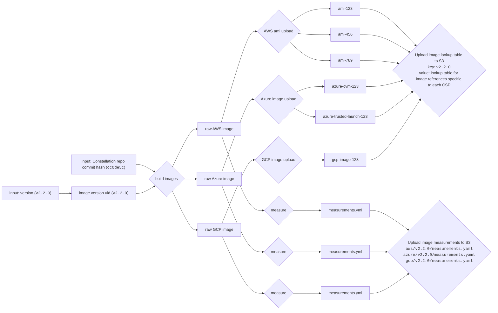

# OS image & measurement discovery

The Constellation OS image build pipeline generates a set of images using a chosen commit of the Constellation monorepo and and a desired release version number.



## Inputs and outputs of the build pipeline

The build pipeline takes as inputs:

- a version number that is one of
  - a release version number (e.g. `v2.2.0`) for release images
  - a pseudo-version number (e.g. `debug-v2.3.0-pre.0.`) for development images
  - a pseudo-version number (e.g. `branch-name-v2.3.0-pre.0.`) for branch images
- a commit hash of the Constellation monorepo that is used to build the images (e.g. `cc0de5c68d41f31dd0b284d574f137e0b0ad106b`)
- a commit timestamp of the Constellation monorepo that is used to build the images (e.g. `20221115082220`)

To identify images belonging to one invocation of the build pipeline, the pipeline uses a unique identifier for the set of images, referred to as `image version uid`.
This is either the release version number (e.g. `v2.2.0`) or a pseudo version that combines the version number, commit timestamp and the commit hash (e.g. `debug-v2.3.0-pre.0.20221115082220-cc0de5c68d41f31dd0b284d574f137e0b0ad106b`).

The build pipeline produces as outputs:

- a raw OS image for every CSP
- a set of measurements for each raw OS image
- one or more images uploaded to each CSP (e.g. AWS AMIs, Azure images, GCP images)
- a lookup table that maps the `image version uid` to the CSP-specific image references

The lookup table is uploaded to S3 and is used to identify the images that belong to a given `image version uid`.
Measurements are uploaded to S3 and can be looked up for each cloud service provider and `image version uid`.

## Image API

The build pipeline produces artifacts that are uploaded to S3 and can be accessed via HTTP.
The artifacts are organized in a directory structure that allows to look up the artifacts for a given `image version uid`.

Where applicable, the API uses the following CSP names:

- `aws` for Amazon Web Services
- `azure` for Microsoft Azure
- `gcp` for Google Cloud Platform
- `qemu` for QEMU

The following HTTP endpoints are available:

- `GET /constellation/v1/ref/<ref>/stream<stream>/image/<version>/`
  - `info.json` returns the lookup table for the given image version.
  - `sbom.<format>.json` contains SBOM files for the given image version. The exact formats and file names are TBD.
- `GET /constellation/v1/ref/<ref>/stream<stream>/<version>/csp/<csp>/` contains files with measurements and signatures for the given image version and CSP.
  - `measurements.json` contains the final measurements for the given image version and CSP.
  - `measurements.json.sig` returns the signature of the measurements file.
  - `measurements.image.json` returns the measurements generated statically from the image.
  - `image.raw` returns the raw image for the given image version and CSP.

## Image names

An image can be identified by `ref/<ref>/stream/<stream>/<version>` and allows for short form encoding as explained above.

### Meaning of `ref` and `stream` for images

The special value `-` (dash) for images is used for releases. They are always built from the corresponding release branch (and tag).
Every other value refers to a normalized branch name.

For the `ref` `-` (dash), the `stream` value can be one of the following constants:

- `stable`: Built with default settings (non-debug), for end users and with all security features enabled
- `console`: Built with default settings (non-debug), allows access to the serial console
- `debug`: Image containing the debugd, allows access to the serial console

For other `ref` values, the `stream` value can be one of the following constants:

- `nightly`: Built with default settings (non-debug), with all security features enabled
- `console`: Built with default settings (non-debug), allows access to the serial console
- `debug`: Image containing the debugd, allows access to the serial console

### Examples

Release v2.3.0 would use the following image name for the default, end-user image:

```
 short form:                     v2.3.0
  long form: ref/-/stream/stable/v2.3.0
```

A debug image created from the same release:

```
 short form:       stream/debug/v2.3.0
  long form: ref/-/stream/debug/v2.3.0
```

A debug image on the branch `feat/xyz`:

```
ref/feat-xyz/stream/debug/v2.4.0-pre.0.20230922011244-0744d001aa84
```

A nightly image on `main`:

```
ref/main/stream/nightly/v2.4.0-pre.0.20230922011244-0744d001aa84
```

A debug image on `main`:

```
ref/main/stream/debug/v2.4.0-pre.0.20230922011244-0744d001aa84
```

## Image lookup table

The image lookup table is a JSON file that maps the `image version uid` to the CSP-specific image references. It uses the `image version uid` as file name.

```
s3://<BUCKET-NAME>/constellation/v1/ref/<REF>/stream/<STREAM>/image/<VERSION-UID>/info.json
```

```json
{
  "version": "<VERSION-UID>",
  "ref": "<REF>",
  "stream": "<STREAM>",
  "debug": true,
  "aws": {
    "us-east-1": "ami-123",
    "us-west-2": "ami-456",
    "eu-west-1": "ami-789"
  },
  "azure": {
    "cvm": "azure-cvm-123",
    "trustedlaunch": "azure-trusted-launch-123"
  },
  "gcp": {
    "sev-es": "gcp-image-123"
  },
  "qemu": {
    "default": "https://cdn.confidential.cloud/constellation/v1/raw/v2.2.0/qemu/image.raw"
  }
}
```

- For AWS, the image lookup table contains the AMI IDs for each region
- For Azure, the image lookup table contains the image IDs for the CVM and Trusted Launch images
- For GCP, the image lookup table contains the image ID
- For QEMU, the image lookup table contains a URL to the QEMU image

This document is not signed and can be extended in the future to include more image references (e.g. if an image is replicated to a new AWS region).
The same document can be used to identify old images that are no longer used and can be deleted for cost optimization.

## Image measurements

This RFC is not about the image measurements themselves, but about how they are stored and looked up.
The format of the image measurements is described in the [secure software distribution RFC](secure-software-distribution.md).

The image measurements are stored in a folder structure in S3 that is organized by CSP and `image version uid`.

```
s3://<BUCKET-NAME>/constellation/v1//ref/<REF>/stream/<STREAM>/<VERSION-UID>/csp/<CSP>/measurements.json
s3://<BUCKET-NAME>/constellation/v1//ref/<REF>/stream/<STREAM>/<VERSION-UID>/csp/<CSP>/measurements.json.sig
s3://<BUCKET-NAME>/constellation/v1//ref/<REF>/stream/<STREAM>/<VERSION-UID>/csp/<CSP>/measurements.image.json
```

## CLI image discovery

The CLI needs to be able to discover the image references for a given `image version uid`.
By default, the CLI will prefill the `image` field of the `constellation-conf.yaml` when `constellation config generate <CSP>` is run with a hardcoded `image version uid` (e.g. `v2.2.0`).
The `image` field is independent of the CSP and is a used to discover the CSP-specific image reference as needed for the following operations:

- `constellation create`
- `constellation upgrade apply`

The CLI can find a CSP- and region specific image reference by looking up the `image version uid` in the following order:

- if a local file `<VERSION-UID>.json` exists, use the lookup table in that file
- otherwise, load the image lookup table from a well known URL (e.g. `https://cdn.confidential.cloud/constellation/v1/images/<VERSION-UID>.json`) and use the lookup table in that file
- choose the CSP-specific image reference for the current region and security type:
  - On AWS, use the AMI ID for the current region (e.g. `.aws.us-east-1`)
  - On Azure, use the image ID for the security type (CVM or Trusted Launch) (e.g. `.azure.cvm`)
  - On GCP, use the only image ID (e.g. `.gcp.sev-es`)
  - On QEMU, use the only image ID (e.g. `.qemu.default`)

This allows customers to upload images to their own cloud subscription and use them with the CLI by providing the image lookup table as a local file.

## Future extensions

This is a list of possible future extensions that are not part of this RFC.
Their implementation is not guaranteed.
They are listed here to ensure that the design of this RFC is flexible enough to support them.

- A lookup table for available image versions might be added in the future.
- The lookup table can be signed using a signing key that is only used for that purpose.
- User managed repositories can be added in the future. This would allow users to reupload Constellation OS images to their cloud subscription and host their own lookup tables that resolve the same image versions to image references pointing to self managed images. An optional `repository` field could be added to the configuration file to allow users to specify the repository to use for image discovery.
