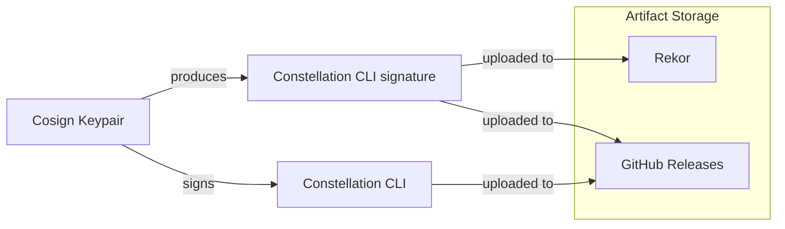
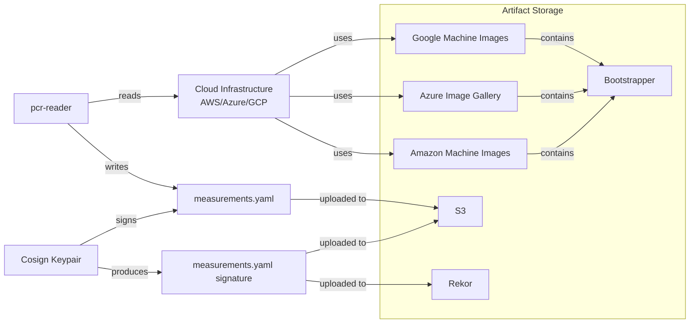

# Secure Distribution of CLI & Measurements

## Goal / Motivation

We need a mechanism to provide trusted measurements, for a specific version,
to users of `constellation` CLI, when verifying a Constellation cluster.

Since `constellation` CLI is responsible for carrying out the verification,
we also enable users to verify the CLI they are using.

## Limitations

+ We only support a single measurement per image.
  Updating measurements (e.g. when cloud provider replaced firmware) will be solved later.
+ First implementation only supports GitHub as "KMS" for our cosign key.
  Later on, we can support a proper KMS with key rotation, derivation, revocation & TEE.
+ In future, we might support multi-party-signatures for measurements.
  This would allow customers to explicitly trust a measurement.
+ This implementation will not protect against downgrade attacks. For a full
  implementation we should check how we can integrate with [TUF](https://theupdateframework.io/)
  & [in-toto](https://in-toto.io/).

## Alternative Solutions

+ We could enable users to reproduce measurements.
  This way users do not need to trust our signed measurements,
  but are able to generate this data themselves.
+ We could also enable users to build CLI themselves from source (open source).

We might support some or all alternative solutions in future.

## High Level Solution

We will create a single `cosign` key `Signer` in GitHub:

1. `Signer` signs `constellation` CLI
    + `Signer`'s public key is part of each CLI release
    + Customer verify CLI **before** first use
2. `constellation` CLI contains public key of `Signer`
    + By verifying integrity of CLI, user can trust this public key and do not need to supply it
    + `constellation config fetch-measurements` downloads measurements for current image
    version from a known (or configurable) place
      + CLI uses `Signer`'s public key to verify downloaded measurements
      + CLI stores verified measurements in local `constellation-config.yaml`
3. `constellation verify` reads measurements from config & compares to cluster's measurements
    + No changes necessary here.

## Detailed Solution

### Key Generation

#### Generate locally

```sh
COSIGN_PASSWORD=$(openssl rand --hex 32)
cosign generate-key-pair
```

Generates a password protected keypair locally.
This keypair can be configured manually to GitHub.

This keypair could also be backed-up onto USB stick / SD card.

### Sign & Verify CLI

```sh
# Set these beforehand!
# COSIGN_PASSWORD=
# COSIGN_PRIVATE_KEY=
# COSIGN_PUBLIC_KEY=
go build constellation
COSIGN_EXPERIMENTAL=1 cosign sign-blob --key env://COSIGN_PRIVATE_KEY constellation > constellation.sig
# We provide: cosign.pub, constellation.sig, constellation
echo "$COSIGN_PUBLIC_KEY" > cosign.pub
cosign verify-blob --key cosign.pub --signature constellation.sig constellation
# We provide: cosign.pub, constellation (requires access to rekor.dev, but no signature to be distributed)
uuid=$(rekor-cli search --artifact constellation | tail -n 1)
sig=$(rekor-cli get --uuid=$uuid --format=json | jq -r .Body.HashedRekordObj.signature.content)
cosign verify-blob --key cosign.pub --signature <(echo $sig) constellation
```



### Sign Measurements

We regularly spin up a Constellation cluster in our pipeline, store the observed
measurements and keep them in a file (`measurements.yaml`) compatible with our config file.

Comments should be omitted in final file. They show why certain values might be missing.

Those measurements are signed and uploaded to AWS S3. Stored at a path matching the configured image (see [image API](image-api.md)).

```yaml
csp: azure
image: v2.2.0-cc0de5c68d41f31dd0b284d574f137e0b0ad106b
measurements:
    # 0: q27iAZeXGAiCPdu1bqRA2gAoyMO2KrXWY4YkTCQowc4=   # Unstable: UEFI on Azure
    1: 0GqVBBcu78dlLW03pON6OJbjQTMsKZmN+SV88kWHPss=
    2: PUWM/lXMA+ofRD8VYr7sjfUcdeFKn8+acjShPxmOeWk=
    3: PUWM/lXMA+ofRD8VYr7sjfUcdeFKn8+acjShPxmOeWk=
    4: Mnl6y16fHWpwSGWZsSFiLc4NYXRhQ39UqkClHcDbJ2s=
    5: qJ2QqWHIFfV9UILu76d3fGXdZz/RpZ/TcFyw7kPHzj4=
    # 6: glvMCHop3keeyU2xBHJTpYmEuqKqXJqCRQuQi8C3n4w=   # Unstable: VM Name Encoded on Azure
    7: DnCqTk4YKN60heuvyzPoPH9uJ3yn3SgjaK1w59xmvvg=
    8: hcLg6uP27lj28A+TExXlsv34EOmOh1jzdCofrBZS5gU=
    9: hwxFDmhNROlS7oBh4dG3jzB4OeQAGhcZD9f6bwBtK/k=
    # 10: PPiSI1eZHs+S/BgVWqewZAXDhkVgtIW8/PPgpR9Sr2o=  # Unstable: Linux IMA records on Azure
    # 11: AAAAAAAAAAAAAAAAAAAAAAAAAAAAAAAAAAAAAAAAAAA=  # Set by us
    # 12: AAAAAAAAAAAAAAAAAAAAAAAAAAAAAAAAAAAAAAAAAAA=  # Set by us
    # 13..23 are all unused
```

```sh
# Set these beforehand!
# COSIGN_PASSWORD=
# COSIGN_PRIVATE_KEY=
COSIGN_EXPERIMENTAL=1 cosign sign-blob --key cosign.key measurements.yaml > measurements.yaml.sig
```



### Verify Measurements

`constellation config fetch-measurements`
1. Read `.image` and used `provider` from `constellation-conf.yaml`
2. Fetch measurements for this image from S3
   + Alternatively: Use rekor to fetch signature for this artifact
3. Use embedded public key to verify signature.
4. Write measurements to local config

No changes required for `constellation verify`.

## Next Increments

### Key Management

#### Trust Public Key

Upload our public key to public places controlled by us, e.g.,
+ Twitter
+ Website

Users can check that public keys are the same in all those places, and therefore have not been tampered with.

#### Local Build Agent

Instead of using a GitHub managed runner when building and signing our release, we should use the one we have in the office. We also re-generate the key pair and store it locally on the build runner, as well as a back up on a USB stick.

The goal is to remove GitHub from the TCB.

#### Confidential Build Agent

We should investigate if an Enclave could be used as a confidential build agent for building and signing the CLI.

Private signing key can be stored encrypted anywhere and is only ever decrypted in TEE.

## Potential Problems

### How do we handle, if one of our private signing keys is leaked?

We will investigate how [TUF](https://theupdateframework.io/) can be used to improve key life cycle management. A [TUF / cosing integration](https://github.com/sigstore/cosign/issues/86) is still being worked on.

## Roads Not Taken

### Fulcio / OIDC Based Identities

Sigstore supports creating ephemeral keys and trusting in OIDC identities.

We could use our @edgeless.systems Office365 accounts, but in order to trust
these identities we would need to prove our Office365 subscription is secure and
trustworthy.

Additionally our TCB would increase and include Microsoft & Sigstore Root CA.

Therefore we decided to manage our own signing keys.
